View this email in your browser.

Welcome to the latest Python on Microcontrollers newsletter! There is a lot of news to get to this week!

We're on [Discord](https://discord.gg/HYqvREz), [Twitter](https://twitter.com/search?q=circuitpython&src=typed_query&f=live), and for past newsletters - [view them all here](https://www.adafruitdaily.com/category/circuitpython/). If you're reading this on the web, [subscribe here](https://www.adafruitdaily.com/). 

## Happy 8th Birthday MicroPython!

MicroPython turned 8 years old on April 29th. That day in 2013 was when Damien wrote the first line of code (in private, before anyone knew about it, before it was even called MicroPython). Now MicroPython is used on many different types of microcontrollers and single board computers (SBC) in both educational and commercial platforms. [Version 1.15](https://github.com/micropython/micropython/releases/tag/v1.15) was just released two weeks ago with some great new features.

Adafruit has stocked the [official MicroPython PyBoards](https://www.adafruit.com/?q=pyboard&sort=BestMatch) from Damien for a while. They have also made direct donations to MicroPython to support Damien’s work, as well as make and share contributions based on the CircuitPython core on MicroPython. Now, with GitHub sponsors, Adafruit just provided a $5k sponsorship. The MicroPython goal is $5k a month in sponsors, so 1 full month is on Adafruit. If you use MicroPython, [please consider sponsoring](https://github.com/sponsors/micropython) a monthly or one-time gift as well. Companies / orgs can now sponsor, so this was Adafruit sponsoring.

## The Python Software Foundation Welcomes Microsoft as a Visionary Sponsor

Microsoft has been a long-time supporter of the Python Software Foundation, starting in 2006. Today, Microsoft employs several core developers working part-time on CPython and the Python Steering Council, making significant contributions as PEP authors. Python creator Guido van Rossum has recently joined Microsoft as a Distinguished Engineer and is exploring performance improvements to CPython.

Aside from helping advance the Python tooling and ecosystem, Microsoft has shown strong involvement with the Python community and has been a long-time sponsor of PyCon US, including four years at the top tier Keystone level. Microsoft’s support for the community extends to sponsorships of regional and international Python events including in emerging regions.

This year, Microsoft is increasing their contributions to the PSF even further as a Visionary Sponsor. Microsoft’s sponsorship funds will be used to support the PSF with a focus on working with the Packaging Working Group on improving PyPI and the packaging ecosystem  - [PSF Blog](https://pyfound.blogspot.com/2021/04/welcoming-microsoft-as-visionary-sponsor.html) and the [Microsoft Blog](https://devblogs.microsoft.com/python/supporting-the-python-community/).

## Tom's Hardware Reviews the Adafruit ItsyBitsy RP2040

Tom's Hardware last week reviewed the Adafruit ItsyBitsy RP2040 - [Tom's Hardware](https://www.tomshardware.com/reviews/adafruit-itsybitsy-rp2040-review)

## CircuitPython Deep Dive Stream with Scott Shawcroft

[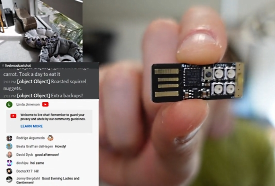](https://youtu.be/3t8Ul10KmUw)

[This week](https://youtu.be/3t8Ul10KmUw), Scott streams his work on additional merging of MicroPython into CircuitPython.

You can see the latest video and past videos on the Adafruit YouTube channel under the Deep Dive playlist - [YouTube](https://www.youtube.com/playlist?list=PLjF7R1fz_OOXBHlu9msoXq2jQN4JpCk8A).

## News from around the web!

[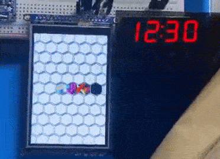](https://twitter.com/darianbjohnson/status/1388549568049160193)

Progress making a Black Panther smart display/alarm clock. Using an ⁦Adafruit⁩ ESP32-S2 Metro to get a comic cover with the Marvel⁩ APIs (every hour). Using MQTT to get weather, calendar, health, etc., coded in ⁦CircuitPython - [Twitter](https://twitter.com/darianbjohnson/status/1388549568049160193).

A MIDI controller UI for pico8enc. Hitting the Raspberry Pi Pico's limit trying to do 8 encoders AND NeoPixels in CircuitPython - [Twitter](https://twitter.com/todbot/status/1388235861540556804) and [GitHub](https://github.com/todbot/pico8enc).

[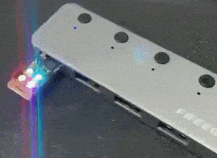](https://twitter.com/todbot/status/1387883943932817408)

Trinkey Dance Party: fun pulsing colors for the Adafruit NeoTrinkey in CircuitPython - [Twitter](https://twitter.com/todbot/status/1387883943932817408) and [GitHub](https://gist.github.com/todbot/8c31150b373c8d2eb5d6c5f8fcafca12).

[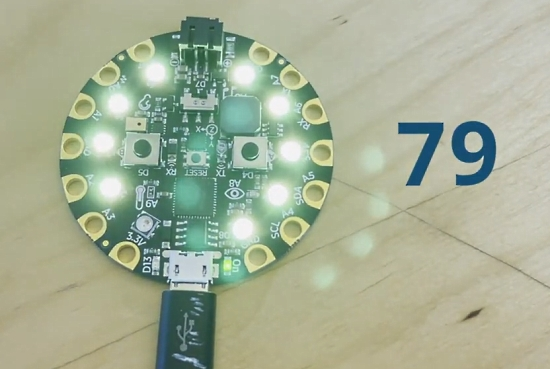](https://stephencross.com/2021/04/30/visual-thermometer-circuit-playground-express/)

A visual thermometer using Circuit Playground Express and CircuitPython - [stephencross.com](https://stephencross.com/2021/04/30/visual-thermometer-circuit-playground-express/).

> A Trinkey Theramin!  In lady bug format with big wire antennae. Here to make all your synths go bwowoowww. Thx CircuitPython & Adafruit - [Twitter](https://twitter.com/todbot/status/1388659716717309952).

A pool temperature display using Adafruit IO - [hackaday.io](https://hackaday.io/project/178540-pool-temperature-monitor) and [Hackaday](https://hackaday.com/2021/05/02/pool-temperature-monitor-mollifies-fortunate-but-frustrated-children/).

[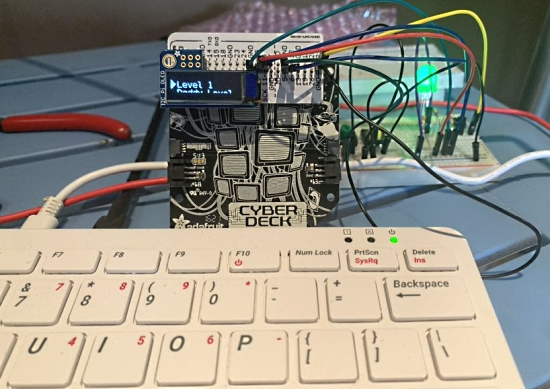](https://twitter.com/moynes/status/1388935413218353157)

> New cyberdeck from Adafruit via Elmwood Elec to make my Minecraft world selector and start/stop server via buttons complete - [Twitter](https://twitter.com/moynes/status/1388935413218353157).

Piunora is a compact carrier board for the Raspberry Pi Compute Module 4 (CM4). A Qwiic/Stemma-QT-compatible connector makes it quick and easy to use I²C sensors from Adafruit and others. The board is CircuitPython compatible using the Blinka compatibility layer - [Crowd Supply](https://www.crowdsupply.com/diodes-delight/piunora) and [Twitter](https://twitter.com/jasoncoon_/status/1388143008676261891).

Using a MLX90640 thermal camera to produce a scaled image on a FeatherWing Keyboard in CircuitPython - [Twitter](https://twitter.com/DavidGlaude/status/1388993353191145472) and [GitHub](https://gist.github.com/dglaude/335763acb310746008b85e8a83b4df01).

The ATMegaZero ESP32-S2 is an ESP32-S2 based board in a Raspberry Pi Zero form factor. The boards will ship with CircuitPython - [GroupGets](https://groupgets.com/campaigns/936-atmegazero-esp32-s2) and [Hackaday](https://hackaday.com/2021/04/30/looks-like-a-pi-zero-is-actually-an-esp32-development-board/).

A Python script to make connecting to the CircuitPython REPL in the Mac Terminal quick and easy - [andywarburton.co.uk](https://andywarburton.co.uk/python-script-to-make-connecting-to-the-circuit-python-repl-quick-and-easy/).

[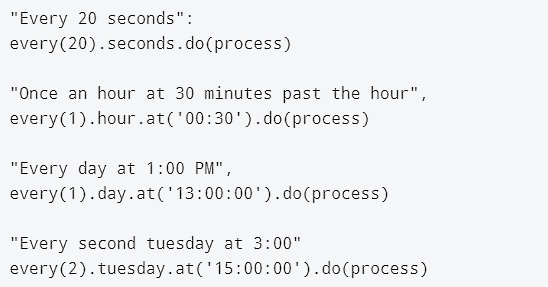](https://github.com/cognitivegears/CircuitPython_Schedule/)

CircuitPython_Schedule is a reduced version of the Python schedule library, which allows running jobs at custom time intervals - [GitHub](https://github.com/cognitivegears/CircuitPython_Schedule/) and [Reddit](https://www.reddit.com/r/circuitpython/comments/mrqvo5/new_library_to_simplify_scheduling_on/).

[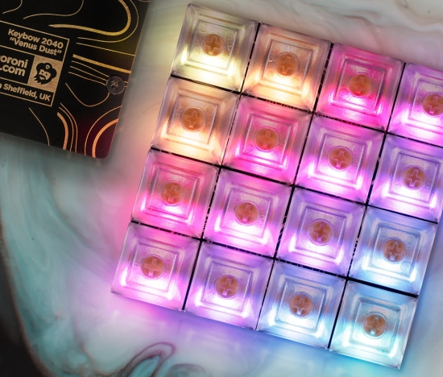](https://shop.pimoroni.com/products/keybow-2040?variant=32399559589971)

Keybow 2040 is a dreamy 4x4 mechanical mini-keyboard, powered by a Raspberry Pi RP2040. It comes with CircuitPython pre-installed and works with the Keybow 2040 CircuitPython library - [Pimoroni](https://shop.pimoroni.com/products/keybow-2040?variant=32399559589971) and [Twitter](https://twitter.com/pimoroni/status/1387394392483303425).

Capacitive Touch and Low Force buttons interfaced with a Adafruit QT Py or SeeedStudio Xiao for assistive technology - [Twitter](https://twitter.com/milador/status/1388204828053053447).

[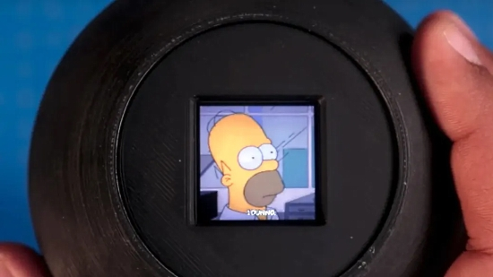](https://www.hackster.io/news/magic-gif-ball-a2f03dfcbd15)

Magic GIF Ball: random advice with GIFs instead of text - [hackster.io](https://www.hackster.io/news/magic-gif-ball-a2f03dfcbd15), [Element14 Community](https://www.element14.com/community/docs/DOC-96534/l/episode-495-magic-gif-ball-powered-by-raspberry-pi) and [YouTube](https://youtu.be/wDhnG030C2Q).

Chocolad keyboard hacking to make it run CircuitPython - [hackaday.io](https://hackaday.io/project/179496-chocolad-keyboard-hacking) and [Twitter](https://twitter.com/MicrochipMakes/status/1389202611342094339).

[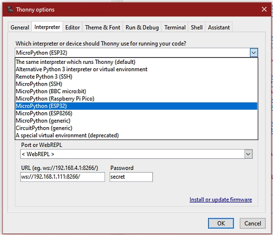](https://hackaday.com/2021/04/29/wireless-micropython-programming-with-thonny/)

Wireless MicroPython Programming With Thonny - [Hackaday](https://hackaday.com/2021/04/29/wireless-micropython-programming-with-thonny/) and [Twitter](https://twitter.com/PicopointToday/status/1388029362855874561).

[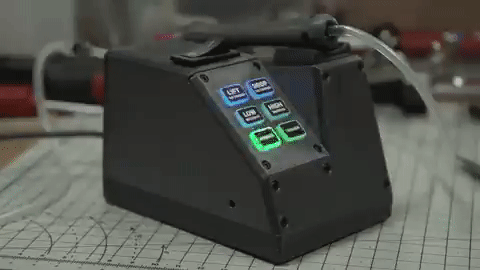](https://twitter.com/robin7331/status/1387544191526391808)

A vacuum pick & place pump, driven by a Raspberry Pi Pico. It's running the WS2812 Micropython demo using the PIO hardware of the RP2040 - [Twitter](https://twitter.com/robin7331/status/1387544191526391808).

An introduction to Raspberry Pi Pico and RP2040 with MicroPython, Part 3: PIO with Shawn Hymel - [YouTube](https://www.youtube.com/watch?v=PrMQpv9iCFw) and [Twitter](https://twitter.com/digikey/status/1387106097924694019).

[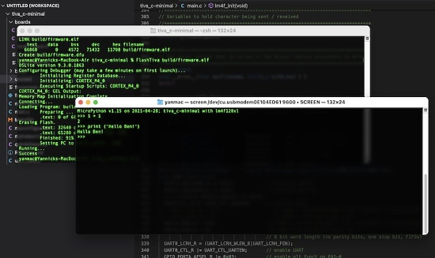](https://twitter.com/XV4Y/status/1387499233364746240)

Porting MicroPython to the Texas Instruments Tiva C architecture - [Twitter](https://twitter.com/XV4Y/status/1387499233364746240).

Web server on the ESP32 chip with MicroPython (Spanish) - [Programming With Ro](https://programandoconro.wordpress.com/servidor-web-en-el-esp32-chip-con-micropython/).

[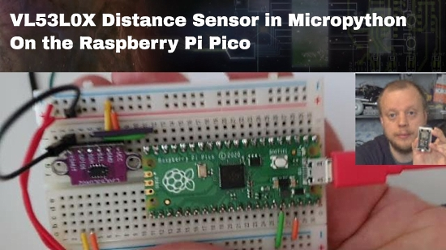](https://youtu.be/XQrxPcq2tZ8)

Using the Raspberry Pi Pico with two VL53L0x sensors in MicroPython - [YouTube](https://youtu.be/XQrxPcq2tZ8) and [Twitter](https://twitter.com/orionrobots/status/1386762345922367490).

[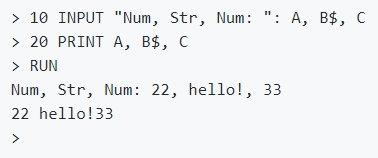](https://github.com/richpl/PyBasic)

PyBasic: a BASIC interpreter written in Python - [GitHub](https://github.com/richpl/PyBasic).

[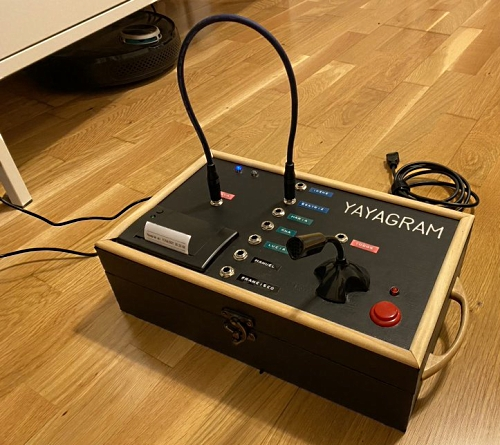](https://twitter.com/mrcatacroquer/status/1386318806411325440)

"Yayagram", a machine that helps our beloved elders to keep communicating with their grandchildren. A Raspberry Pi, Python, and includes an Adafruit thermal printer - [Twitter](https://twitter.com/mrcatacroquer/status/1386318806411325440).

Build a Platform Game in Python With Arcade - [Real Python](https://realpython.com/platformer-python-arcade/).

[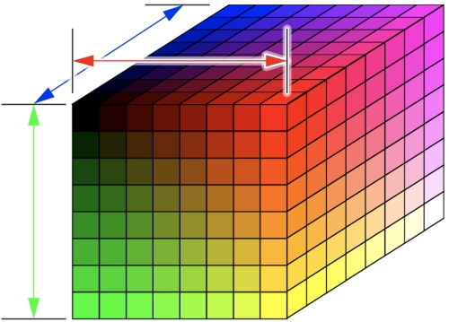](https://kevinmartinjose.com/2021/04/27/film-simulations-from-scratch-using-python/)

Film simulations from scratch using Python - [kevinmartinjose.com](https://kevinmartinjose.com/2021/04/27/film-simulations-from-scratch-using-python/).

[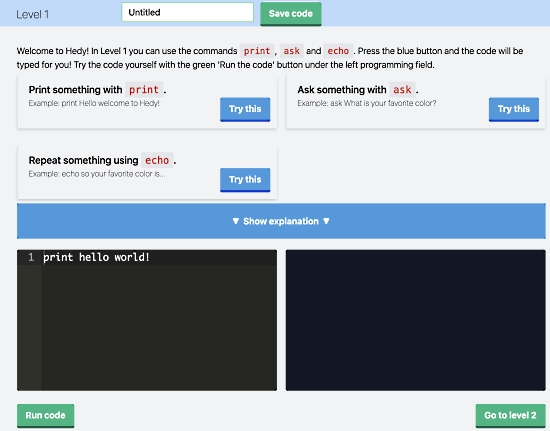](https://github.com/Felienne/hedy)

Hedy: A gradual programming language - [hedycode.com](https://github.com/Felienne/hedy) and [GitHub](https://github.com/Felienne/hedy).

Elk: a tiny JS engine for embedded systems - [GitHub](https://github.com/cesanta/elk).

Interfaces and Protocols - [Deciphering Glyph](https://glyph.twistedmatrix.com/2021/03/interfaces-and-protocols.html).

> "...when I actually finally put together this little circuit and put some data into memory that should show up as color and it showed up color, it was just one of those eureka moments and you're just shaking inside. It was just unbelievable. Here we had it in just a couple of chips. I had color, and then I had graphics, and then I had hi-res, and then I had paddles and sound to put games into the machine." - [Steve Wozniak](http://www.foundersatwork.com/steve-wozniak.html).

PyDev of the Week: Adam Johnson on [Mouse vs Python](https://www.blog.pythonlibrary.org/2021/05/03/pydev-of-the-week-adam-johnson/)

CircuitPython Weekly Meeting for May 3, 2021 ([notes](https://github.com/adafruit/adafruit-circuitpython-weekly-meeting/blob/master/2021/2021-05-03.md)) [on YouTube](https://youtu.be/yFDu1jn2dJM)

#ICYDNCI What was the most popular, most clicked link, in [last week's newsletter](https://www.adafruitdaily.com/2021/04/27/python-on-microcontrollers-newsletter-adafruit-sponsoring-pycon-2021-and-more-python-adafruit-circuitpython-micropython-thepsf/)? [PyCon 2021](https://us.pycon.org/2021/).

## Coming soon

[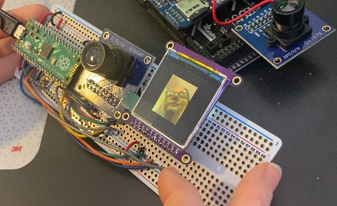](https://github.com/adafruit/Adafruit_CircuitPython_OV7670)

Did you know the RP2040 PIO periperals can be configured for reading in camera/video data? That's right, you can directly wire up OV7670/OV2640-like cameras to a RP2040/Pico and then read out image data into a RAM buffer (thankfully theres a ton of RAM on the RP2040). Adafruit has just placed support into CircuitPython as well, so one can read a buffer and then pipe it back out over SPI to a TFT LCD display. This could be great for image recognition, tinyML, DIY cameras, IoT monitoring, etc! - [GitHub](https://github.com/adafruit/Adafruit_CircuitPython_OV7670) and [YouTube](https://www.youtube.com/watch?v=gbSXNZSdJj0).

Jeff also gives an overview about these projects - [YouTube](https://youtu.be/0KhJE8t3UlQ).

Electronic Cats has posted a picture of a new RP2040 based LoRaWAN board in the Feather format called PicoWAN - [Instagram](https://www.instagram.com/p/COQ_TQGLM0h/).

## New Boards Supported by CircuitPython

The number of supported microcontrollers and Single Board Computers (SBC) grows every week. This section outlines which boards have been included in CircuitPython or added to [CircuitPython.org](https://circuitpython.org/).

This week there was one new board added:

- [Rock Pi 4C](https://circuitpython.org/blinka/rock_pi_4c/)

Looking to add a new board to CircuitPython? It's highly encouraged! Adafruit has four guides to help you do so:

- [How to Add a New Board to CircuitPython](https://learn.adafruit.com/how-to-add-a-new-board-to-circuitpython/overview)
- [How to add a New Board to the circuitpython.org website](https://learn.adafruit.com/how-to-add-a-new-board-to-the-circuitpython-org-website)
- [Adding a Single Board Computer to PlatformDetect for Blinka](https://learn.adafruit.com/adding-a-single-board-computer-to-platformdetect-for-blinka)
- [Adding a Single Board Computer to Blinka](https://learn.adafruit.com/adding-a-single-board-computer-to-blinka)

## New Learn Guides!

[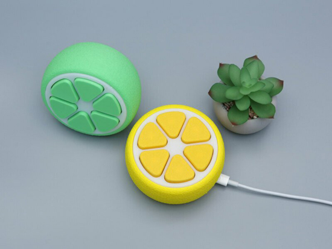](https://learn.adafruit.com/guides/latest)

[Lemon Mechanical Keypad](https://learn.adafruit.com/qtpy-lemon-mechanical-keypad-macropad) from [Noe and Pedro](https://learn.adafruit.com/users/pixil3d)

[Funhouse Door Alert with Email Notification](https://learn.adafruit.com/funhouse-door-alert-email-notification) from [John Park](https://learn.adafruit.com/users/johnpark)

[Using the Adafruit FunHouse with Home Assistant](https://learn.adafruit.com/using-the-adafruit-funhouse-with-home-assistant) from [Melissa LeBlanc-Williams](https://learn.adafruit.com/users/MakerMelissa)

[Creating FunHouse Projects with CircuitPython](https://learn.adafruit.com/creating-funhouse-projects-with-circuitpython) from [Melissa LeBlanc-Williams](https://learn.adafruit.com/users/MakerMelissa)

[Neo Trinkey Zoom Shortcuts](https://learn.adafruit.com/neo-trinkey-zoom-shortcuts) from [Liz Clark](https://learn.adafruit.com/users/BlitzCityDIY)

[Sound Reactive Sunflower Baby Crib Mobile with Bluetooth Control](https://learn.adafruit.com/sound-reactive-sunflower-baby-crib-mobile-with-bluetooth-control) from [Erin St. Blaine](https://learn.adafruit.com/users/firepixie)

[FunHouse Motion Detecting Lights with LIFX Bulbs](https://learn.adafruit.com/funhouse-motion-detecting-lighting-for-lifx-bulbs) from [John Park](https://learn.adafruit.com/users/johnpark)

## The New CircuitPython Project Bundle

When you get to the CircuitPython code section of an [Adafruit Learn Guide](https://learn.adafruit.com/), sometimes things can get a bit complicated. You not only have the code you need to upload to your device, but you likely also need to add some libraries that the code requires to run. This involved downloading all the libraries, digging through to find the ones you need, and copying them to your device. That was only the beginning on some projects, as those that include images and/or sound files required further downloading and copying of files. But, not anymore!

Now, with Project Bundles, you can download all the necessary code, libraries and, if needed, asset files with one click! We automatically check which libraries are required for the project and bundle them up for you. No more digging through a huge list of libraries to find the ones you need, or fiddling with looking for other files or dependencies. Download the Project Bundle, copy the contents to your device, and your code will simply work. We wanted to make this the easiest way to get a project working, regardless of whether you're a beginner or an expert. We'll also be adding this feature to popular IDEs as an add-on. Try it out with any CircuitPython guide on the Adafruit Learning System. Just look for the ‘Download Project Bundle’ button on the code page. 

**To download and use a Project Bundle:**

In the Learning System - above any embedded code in a guide in the Adafruit Learn System, you’ll find a Download Project Bundle button.

Click the button to download the Project Bundle zip.

Open the Project Bundle zip to find the example code, all necessary libraries, and, if available, any images, sounds, etc.

Simply copy all the files over to your CIRCUITPY drive, and you’re ready to go!

See the introductory video by Ladyada - [YouTube](https://www.youtube.com/watch?v=UgekT8epJjo).

If you run into any problems or bugs, or would like to submit feedback, please file an issue on the [Adafruit Learning System Guides GitHub repo](https://github.com/adafruit/Adafruit_Learning_System_Guides/issues).

## CircuitPython Libraries!

CircuitPython support for hardware continues to grow. We are adding support for new sensors and breakouts all the time, as well as improving on the drivers we already have. As we add more libraries and update current ones, you can keep up with all the changes right here!

For the latest libraries, download the [Adafruit CircuitPython Library Bundle](https://circuitpython.org/libraries). For the latest community contributed libraries, download the [CircuitPython Community Bundle](https://github.com/adafruit/CircuitPython_Community_Bundle/releases).

If you'd like to contribute, CircuitPython libraries are a great place to start. Have an idea for a new driver? File an issue on [CircuitPython](https://github.com/adafruit/circuitpython/issues)! Have you written a library you'd like to make available? Submit it to the [CircuitPython Community Bundle](https://github.com/adafruit/CircuitPython_Community_Bundle). Interested in helping with current libraries? Check out the [CircuitPython.org Contributing page](https://circuitpython.org/contributing). We've included open pull requests and issues from the libraries, and details about repo-level issues that need to be addressed. We have a guide on [contributing to CircuitPython with Git and Github](https://learn.adafruit.com/contribute-to-circuitpython-with-git-and-github) if you need help getting started. You can also find us in the #circuitpython channel on the [Adafruit Discord](https://adafru.it/discord).

You can check out this [list of all the Adafruit CircuitPython libraries and drivers available](https://github.com/adafruit/Adafruit_CircuitPython_Bundle/blob/master/circuitpython_library_list.md). 

The current number of CircuitPython libraries is **312**!

**New Libraries!**

Here's this week's new CircuitPython libraries:

 * [Adafruit_CircuitPython_OV7670](https://github.com/adafruit/Adafruit_CircuitPython_OV7670)

**Updated Libraries!**

This week, there are a huge amount of updated CircuitPython libraries:

 * [Adafruit_CircuitPython_HTU21D](https://github.com/adafruit/Adafruit_CircuitPython_HTU21D)
 * [Adafruit_CircuitPython_PM25](https://github.com/adafruit/Adafruit_CircuitPython_PM25)
 * [Adafruit_CircuitPython_SGP40](https://github.com/adafruit/Adafruit_CircuitPython_SGP40)
 * [Adafruit_CircuitPython_SGP30](https://github.com/adafruit/Adafruit_CircuitPython_SGP30)
 * [Adafruit_CircuitPython_SI7021](https://github.com/adafruit/Adafruit_CircuitPython_SI7021)
 * [Adafruit_CircuitPython_MCP9600](https://github.com/adafruit/Adafruit_CircuitPython_MCP9600)
 * [Adafruit_CircuitPython_MPR121](https://github.com/adafruit/Adafruit_CircuitPython_MPR121)
 * [Adafruit_CircuitPython_framebuf](https://github.com/adafruit/Adafruit_CircuitPython_framebuf)
 * [Adafruit_CircuitPython_LED_Animation](https://github.com/adafruit/Adafruit_CircuitPython_LED_Animation)
 * [Adafruit_CircuitPython_GFX](https://github.com/adafruit/Adafruit_CircuitPython_GFX)
 * [Adafruit_CircuitPython_hashlib](https://github.com/adafruit/Adafruit_CircuitPython_hashlib)
 * [Adafruit_CircuitPython_ServoKit](https://github.com/adafruit/Adafruit_CircuitPython_ServoKit)
 * [Adafruit_CircuitPython_MCP2515](https://github.com/adafruit/Adafruit_CircuitPython_MCP2515)
 * [Adafruit_CircuitPython_TLA202x](https://github.com/adafruit/Adafruit_CircuitPython_TLA202x)
 * [Adafruit_CircuitPython_TMP117](https://github.com/adafruit/Adafruit_CircuitPython_TMP117)
 * [Adafruit_CircuitPython_PyPortal](https://github.com/adafruit/Adafruit_CircuitPython_PyPortal)
 * [Adafruit_CircuitPython_MatrixPortal](https://github.com/adafruit/Adafruit_CircuitPython_MatrixPortal)
 * [Adafruit_CircuitPython_VEML7700](https://github.com/adafruit/Adafruit_CircuitPython_VEML7700)
 * [Adafruit_CircuitPython_AHTx0](https://github.com/adafruit/Adafruit_CircuitPython_AHTx0)
 * [Adafruit_CircuitPython_MS8607](https://github.com/adafruit/Adafruit_CircuitPython_MS8607)
 * [Adafruit_CircuitPython_ADT7410](https://github.com/adafruit/Adafruit_CircuitPython_ADT7410)
 * [Adafruit_CircuitPython_SHT31D](https://github.com/adafruit/Adafruit_CircuitPython_SHT31D)
 * [Adafruit_CircuitPython_TC74](https://github.com/adafruit/Adafruit_CircuitPython_TC74)
 * [Adafruit_CircuitPython_AM2320](https://github.com/adafruit/Adafruit_CircuitPython_AM2320)
 * [Adafruit_CircuitPython_LPS35HW](https://github.com/adafruit/Adafruit_CircuitPython_LPS35HW)
 * [Adafruit_CircuitPython_MCP9808](https://github.com/adafruit/Adafruit_CircuitPython_MCP9808)
 * [Adafruit_CircuitPython_BMP280](https://github.com/adafruit/Adafruit_CircuitPython_BMP280)
 * [Adafruit_CircuitPython_CCS811](https://github.com/adafruit/Adafruit_CircuitPython_CCS811)
 * [Adafruit_CircuitPython_HTS221](https://github.com/adafruit/Adafruit_CircuitPython_HTS221)
 * [Adafruit_CircuitPython_DPS310](https://github.com/adafruit/Adafruit_CircuitPython_DPS310)
 * [Adafruit_CircuitPython_BME680](https://github.com/adafruit/Adafruit_CircuitPython_BME680)
 * [Adafruit_CircuitPython_MCP4728](https://github.com/adafruit/Adafruit_CircuitPython_MCP4728)
 * [Adafruit_CircuitPython_BMP3XX](https://github.com/adafruit/Adafruit_CircuitPython_BMP3XX)
 * [Adafruit_CircuitPython_ProgressBar](https://github.com/adafruit/Adafruit_CircuitPython_ProgressBar)
 * [Adafruit_CircuitPython_MPL3115A2](https://github.com/adafruit/Adafruit_CircuitPython_MPL3115A2)
 * [Adafruit_CircuitPython_MLX90614](https://github.com/adafruit/Adafruit_CircuitPython_MLX90614)
 * [Adafruit_CircuitPython_MAX31865](https://github.com/adafruit/Adafruit_CircuitPython_MAX31865)
 * [Adafruit_CircuitPython_MAX31856](https://github.com/adafruit/Adafruit_CircuitPython_MAX31856)
 * [Adafruit_CircuitPython_MAX31855](https://github.com/adafruit/Adafruit_CircuitPython_MAX31855)
 * [Adafruit_CircuitPython_DS18X20](https://github.com/adafruit/Adafruit_CircuitPython_DS18X20)
 * [Adafruit_CircuitPython_LTR390](https://github.com/adafruit/Adafruit_CircuitPython_LTR390)
 * [Adafruit_CircuitPython_MPRLS](https://github.com/adafruit/Adafruit_CircuitPython_MPRLS)
 * [Adafruit_CircuitPython_BH1750](https://github.com/adafruit/Adafruit_CircuitPython_BH1750)
 * [Adafruit_CircuitPython_LPS2X](https://github.com/adafruit/Adafruit_CircuitPython_LPS2X)
 * [Adafruit_CircuitPython_PCF8523](https://github.com/adafruit/Adafruit_CircuitPython_PCF8523)
 * [Adafruit_CircuitPython_VEML6070](https://github.com/adafruit/Adafruit_CircuitPython_VEML6070)
 * [Adafruit_CircuitPython_DS1307](https://github.com/adafruit/Adafruit_CircuitPython_DS1307)
 * [Adafruit_CircuitPython_TSL2591](https://github.com/adafruit/Adafruit_CircuitPython_TSL2591)
 * [Adafruit_CircuitPython_AS7341](https://github.com/adafruit/Adafruit_CircuitPython_AS7341)
 * [Adafruit_CircuitPython_LSM6DS](https://github.com/adafruit/Adafruit_CircuitPython_LSM6DS)
 * [Adafruit_CircuitPython_SCD30](https://github.com/adafruit/Adafruit_CircuitPython_SCD30)
 * [Adafruit_CircuitPython_PortalBase](https://github.com/adafruit/Adafruit_CircuitPython_PortalBase)
 * [Adafruit_CircuitPython_MagTag](https://github.com/adafruit/Adafruit_CircuitPython_MagTag)
 * [Adafruit_CircuitPython_FunHouse](https://github.com/adafruit/Adafruit_CircuitPython_FunHouse)
 * [Adafruit_CircuitPython_DS3231](https://github.com/adafruit/Adafruit_CircuitPython_DS3231)
 * [Adafruit_Blinka](https://github.com/adafruit/Adafruit_Blinka)
 * [Adafruit_Python_PlatformDetect](https://github.com/adafruit/Adafruit_Python_PlatformDetect)
 * [CircuitPython_Community_Bundle](https://github.com/adafruit/CircuitPython_Community_Bundle)

## What’s the team up to this week?

What is the team up to this week? Let’s check in!

**Dan**

I'm finishing up implementing dynamic USB descriptors. I am already generating the dynamic descriptors, and have CIRCUITPY, the REPL, and HID devices working. There are some tricky issues related storage management: the dynamic descriptors must be carried over from boot.py, after its virtual machine has finished running and the heap has been discarded. Because the descriptors are dynamic, their size is not known, and ideally I only want to use as much RAM as is necessary. So I'm using a few tricks to minimize RAM use, such as saving a buffer on the stack temporarily between VM runs.

**Jeff**

I've been helping Scott out with the merge of MicroPython 1.12 into CircuitPython. MicroPython and CircuitPython share a great set of tests of all the core language functionality, which have caught problems accidentally introduced during the merge process.  I'll continue to help Scott as needed while there are more versions of MicroPython to merge and more tests to fix.

I also published my first CircuitPython library, adafruit_ov7670. Together with the imagecapture module in the development version of CircuitPython, this can be used to capture images from an OV7670 camera (on Grand Central M4 and RP2040-based boards) and display the data on a displayio LCD.

**Kattni**

This week I published my final newsletter: welcome back Anne edition! Thanks to everyone for sticking through it with me. Anne will be getting back to it now.

Otherwise, my week contained a lot of miscellaneous. I reviewed a significant number of PRs with documentation updates. Thanks to Jose David M. for all of the improvements! Continued work on templates, including adding some new ones and organising the templates better on the backend (thanks to Sheehan for manually doing that for me). I added a few pages to the FunHouse guide. And finally, I started the ItsyBitsy RP2040 guide, which will be out soon, so keep an eye out for that if you're interested. 

**Lucian**

This past week I've been wrapping up alarms and sleep on the RP2040, and working on merging in the NRF52, STM32, and ESP32-S2 updates to the alarm module. Mostly a lot of formatting and testing related busywork. My hope this week is to compare the power profiles of the Feathers for each of the 4 MCU types that support Alarm (ESP32-S2, nRF52840, STM32F405, and RP2040), so CircuitPython users have a reference for how much power they use during light and deep sleep across different ports.

**Melissa**

This past week, I wrote a new guide on creating FunHouse projects. Like some similar guides I've written in the past, this guide covered the FunHouse specifics to look out for as well as going over the code examples included in the library. You can check out the guide [here](https://learn.adafruit.com/creating-funhouse-projects-with-circuitpython).

I also had a guide on using the FunHouse with Home Assistant that I had written a couple weeks ago get published. There was a little delay in the guide because it was waiting for some content in another guide that I had published earlier. You can check out that guide [here](https://learn.adafruit.com/using-the-adafruit-funhouse-with-home-assistant).

**Scott**

This week I've been continuing the MicroPython merge. 1.11 is merged into main and 1.12 is nearly ready for review. I hope to get a good way through 1.13 by the end of this week. Hopefully, 1.14 and 1.15 will be easier too.

## Upcoming events!

PyCon US, the annual official annual Python gathering, has been announced to be held online May 12-15, 2021. Sprints will be held May 16-18, 2021. More information and signups are at [https://us.pycon.org/2021/](https://us.pycon.org/2021/)

EuroPython, the largest conference for the Python programming language in Europe, will be held online July 26 - August 1, 2021. More information at [https://ep2021.europython.eu/](https://ep2021.europython.eu/).

Call for proposals for PyOhio 2021 runs from March 15 - May 2, 2021 with the free event on July 31, 2021- [PyOhio.org](https://www.pyohio.org/2021/) via [Twitter](https://twitter.com/PyOhio/status/1370184124460367881).

**Send Your Events In**

As for other events, with the COVID pandemic, most in-person events are postponed or cancelled. If you know of virtual events or events that may occur in the future, please let us know on Discord or on Twitter with hashtag #CircuitPython or email CPnews(at)adafruit(dot)com.

## Latest releases

CircuitPython's stable release is [6.2.0](https://github.com/adafruit/circuitpython/releases/latest). New to CircuitPython? Start with our [Welcome to CircuitPython Guide](https://learn.adafruit.com/welcome-to-circuitpython).

[20210430](https://github.com/adafruit/Adafruit_CircuitPython_Bundle/releases/latest) is the latest CircuitPython library bundle.

[v1.15](https://micropython.org/download) is the latest MicroPython release. Documentation for it is [here](http://docs.micropython.org/en/latest/pyboard/).

[3.9.5](https://www.python.org/downloads/) is the latest Python release. The latest pre-release version is [3.10.0a7](https://www.python.org/download/pre-releases/).

[2,414 Stars](https://github.com/adafruit/circuitpython/stargazers) Like CircuitPython? [Star it on GitHub!](https://github.com/adafruit/circuitpython)

## Call for help -- Translating CircuitPython is now easier than ever!

One important feature of CircuitPython is translated control and error messages.

With the help of fellow open source project [Weblate](https://weblate.org/), we're making it even easier to add or improve translations.

Sign in with an existing account such as GitHub, Google or Facebook and start contributing through a simple web interface. No forks or pull requests needed!

As always, if you run into trouble join us on [Discord](https://adafru.it/discord), we're here to help.

## jobs.adafruit.com - Find a dream job, find great candidates!

[jobs.adafruit.com](https://jobs.adafruit.com/) has returned and folks are posting their skills (including CircuitPython) and companies are looking for talented makers to join their companies - from Digi-Key, to Hackaday, Micro Center, Raspberry Pi and more.

**Job of the Week**

Experience Design Specialist - Exploration Commons at 50 East, Carroll County Public Library - [Adafruit Jobs Board](https://jobs.adafruit.com/job/experience-design-specialist-2/).

## 28,887 thanks!

The Adafruit Discord community, where we do all our CircuitPython development in the open, reached over 28,887 humans, thank you!  Adafruit believes Discord offers a unique way for CircuitPython folks to connect. Join today at [https://adafru.it/discord](https://adafru.it/discord).

## ICYMI - In case you missed it

The wonderful world of Python on hardware! This is our Python video-newsletter-podcast! The news comes from the Python community, Discord, Adafruit communities and more and is reviewed on ASK an ENGINEER Wednesdays. The complete Python on Hardware weekly videocast [playlist is here](https://www.youtube.com/playlist?list=PLjF7R1fz_OOXRMjM7Sm0J2Xt6H81TdDev). 

This video podcast is on [iTunes](https://itunes.apple.com/us/podcast/python-on-hardware/id1451685192?mt=2), [YouTube](http://adafru.it/pohepisodes), [IGTV (Instagram TV](https://www.instagram.com/adafruit/channel/)), and [XML](https://itunes.apple.com/us/podcast/python-on-hardware/id1451685192?mt=2).

[Weekly community chat on Adafruit Discord server CircuitPython channel - Audio / Podcast edition](https://itunes.apple.com/us/podcast/circuitpython-weekly-meeting/id1451685016) - Audio from the Discord chat space for CircuitPython, meetings are usually Mondays at 2pm ET, this is the audio version on [iTunes](https://itunes.apple.com/us/podcast/circuitpython-weekly-meeting/id1451685016), Pocket Casts, [Spotify](https://adafru.it/spotify), and [XML feed](https://adafruit-podcasts.s3.amazonaws.com/circuitpython_weekly_meeting/audio-podcast.xml).

And lastly, we are working up a one-spot destination for all things podcast-able here - [podcasts.adafruit.com](https://podcasts.adafruit.com/)

## Codecademy "Learn Hardware Programming with CircuitPython"

Codecademy, an online interactive learning platform used by more than 45 million people, has teamed up with the leading manufacturer in STEAM electronics, Adafruit Industries, to create a coding course, "Learn Hardware Programming with CircuitPython". The course is now available in the [Codecademy catalog](https://www.codecademy.com/learn/learn-circuitpython?utm_source=adafruit&utm_medium=partners&utm_campaign=circuitplayground&utm_content=pythononhardwarenewsletter).

Python is a highly versatile, easy to learn programming language that a wide range of people, from visual effects artists in Hollywood to mission control at NASA, use to quickly solve problems. But you don’t need to be a rocket scientist to accomplish amazing things with it. This new course introduces programmers to Python by way of a microcontroller — CircuitPython — which is a Python-based programming language optimized for use on hardware.

CircuitPython’s hardware-ready design makes it easier than ever to program a variety of single-board computers, and this course gets you from no experience to working prototype faster than ever before. Codecademy’s interactive learning environment, combined with Adafruit's highly rated Circuit Playground Express, present aspiring hardware hackers with a never-before-seen opportunity to learn hardware programming seamlessly online.

Whether for those who are new to programming, or for those who want to expand their skill set to include physical computing, this course will have students getting familiar with Python and creating incredible projects along the way. By the end, students will have built their own bike lights, drum machine, and even a moisture detector that can tell when it's time to water a plant.

Visit Codecademy to access the [Learn Hardware Programming with CircuitPython](https://www.codecademy.com/learn/learn-circuitpython?utm_source=adafruit&utm_medium=partners&utm_campaign=circuitplayground&utm_content=pythononhardwarenewsletter) course and Adafruit to purchase a [Circuit Playground Express](https://www.adafruit.com/product/3333).

Codecademy has helped more than 45 million people around the world upgrade their careers with technology skills. The company’s online interactive learning platform is widely recognized for providing an accessible, flexible, and engaging experience for beginners and experienced programmers alike. Codecademy has raised a total of $43 million from investors including Union Square Ventures, Kleiner Perkins, Index Ventures, Thrive Capital, Naspers, Yuri Milner and Richard Branson, most recently raising its $30 million Series C in July 2016.

## Contribute!

The CircuitPython Weekly Newsletter is a CircuitPython community-run newsletter emailed every Tuesday. The complete [archives are here](https://www.adafruitdaily.com/category/circuitpython/). It highlights the latest CircuitPython related news from around the web including Python and MicroPython developments. To contribute, edit next week's draft [on GitHub](https://github.com/adafruit/circuitpython-weekly-newsletter/tree/gh-pages/_drafts) and [submit a pull request](https://help.github.com/articles/editing-files-in-your-repository/) with the changes. You may also tag your information on Twitter with #CircuitPython. 

Join our [Discord](https://adafru.it/discord) or [post to the forum](https://forums.adafruit.com/viewforum.php?f=60) for any further questions.
