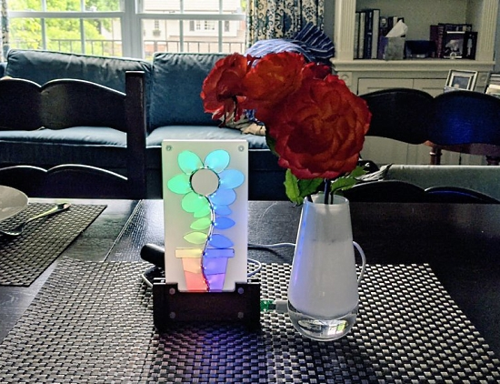
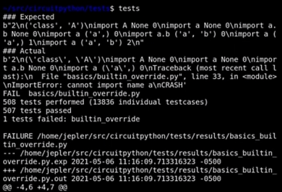
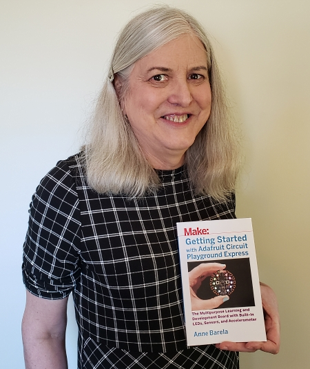
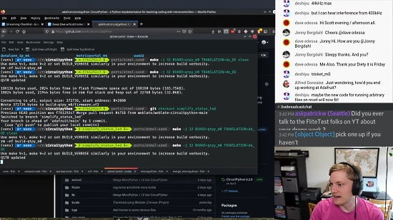
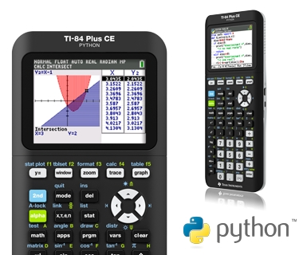
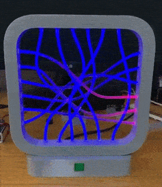
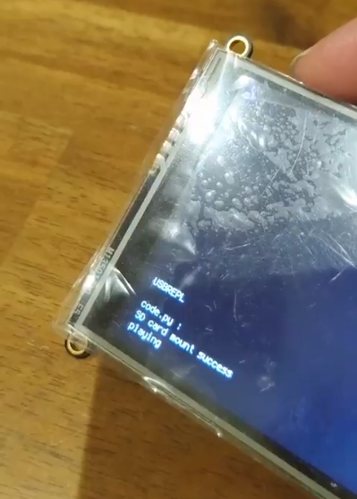
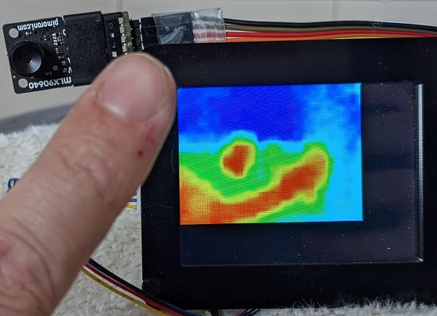
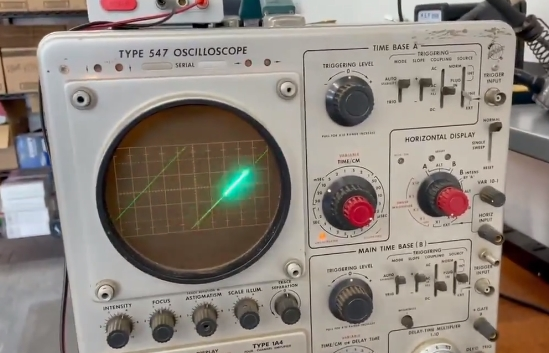

View this email in your browser.

Welcome to the latest Python on Microcontrollers newsletter, brought you by the community! We're on [Discord](https://discord.gg/HYqvREz), [Twitter](https://twitter.com/search?q=circuitpython&src=typed_query&f=live), and for past newsletters - [view them all here](https://www.adafruitdaily.com/category/circuitpython/). If you're reading this on the web, [subscribe here](https://www.adafruitdaily.com/). Let's get started!

## Celebrating Mother's Day by Making

An animated flower running an Adafruit CircuitPython led_animations example on a Raspberry Pi Pico - [Twitter](https://twitter.com/GeekMomProjects/status/1391223752608739328).

Melanie McDonough ([@melbamorph](https://twitter.com/melbamorph)) made a Mother's Day project using an Adafruit MagTag with quotes from Glennon Doyle's book Untamed - [Twitter](https://twitter.com/melbamorph/status/1391549589744914433).

## PyCon US is this Week

PyCon US, the annual official US-based Python gathering, is online this week May 12-15, 2021. Sprints will be held May 16-18, 2021. More information and signups at [https://us.pycon.org/2021/](https://us.pycon.org/2021/).

## KiCad 5.1.10 Release

KiCad project announced the latest series 5 stable release. The 5.1.10 stable version contains critical bug fixes and other minor improvements since the previous release - [kicad.org](https://www.kicad.org/blog/2021/05/KiCad-5.1.10-Release/)

## Running CircuitPython tests (& fixing resulting bugs)

In CircuitPython, there are thousands of tests that verify the correct behavior of the core interpreter code.  Here's a quick peek at how it looks to run the tests, and one bug we recently discovered and fixed thanks to the tests - [YouTube](https://youtu.be/Mre6RCj_Nwo)

## CircuitPythonista Anne Barela interviewed by embedded.fm

CircuitPython team member (*and newsletter editor*) Anne Barela was interviewed by Elecia and Christopher White at embedded.fm for issue 372: The Motivation of Creativity. In the podcast, Anne discusses her work with Adafruit to include tutorials, authoring [two books](https://www.amazon.com/Anne-Barela/e/B00OA5RJIW) on Adafruit products, and being retired from a 30 year career in engineering at the US Foreign Service - [embedded.fm](https://embedded.fm/episodes/372)

## CircuitPython Deep Dive Stream with Scott Shawcroft

[This week](https://youtu.be/cbLXRjjc-Yg), Scott streams his work on Merging and Blinking.

You can see the latest video and past videos on the Adafruit YouTube channel under the Deep Dive playlist - [YouTube](https://www.youtube.com/playlist?list=PLjF7R1fz_OOXBHlu9msoXq2jQN4JpCk8A).

## News from around the web!

4hackrr on Twitter built an automation system for their garage using ATMegaZero hardware programmed with CircuitPython. A robust Adafruit IO dashboard controls both garage doors and monitors the garage’s temperature and humidity - [Adafruit Blog](https://blog.adafruit.com/2021/05/07/iot-garage-automation-with-adafruitio-and-circuitpython/) and [Twitter](https://twitter.com/4hackrr/status/1390425456227360772).

The Python programming language repository migrates to main on GitHub - [Adafruit Blog](https://blog.adafruit.com/2021/05/04/python-cpython-the-python-programming-language-repository-migration-to-main-on-github/).

Python version 3.11 will have documententation which is theme responsive - [Twitter](https://twitter.com/bulat_olga/status/1391287580965081088).

> "This is one of the reasons I love open source: When I see a problem, instead of simply complaining, I can open an issue or create a Pull Request to solve it. I only wish more government and educational sites were open source. Fun fact: I started making the PR for responsive theme because after birth of my baby I couldn't read as much at my computer, and had to read the phone instead."

Plotting Carbon Dioxide Levels With the Pimoroni Enviro+ FeatherWing and Adafruit SCD-30 - [Instructables](https://www.instructables.com/Plotting-Carbon-Dioxide-Levels-With-the-Pimoroni-E/) and [Adafruit Blog](https://blog.adafruit.com/2021/05/07/plotting-co2-levels-with-the-pimoroni-enviro-featherwing-adafruit-scd-30-feather-circuitpython-instructables/).

A recent tweet from [@hamuhmau_Humi](https://twitter.com/hamuhmau_Humi): "there is a magical girl in Adafruit, CircuitPython can easily play WAV music data" - [Twitter](https://twitter.com/hamuhmau_Humi/status/1390294938085052417).

Texas Instruments announces the new TI-84 Plus CE Python graphing calculator - [TI](https://education.ti.com/en/products/calculators/graphing-calculators/ti-84-plus-ce-python).

> (An) MP3 file (4.9MB) written on the flash of Feather RP2040 is played back with high sound quality by I2S. Originally, RP2040 does not have I2S output pin, and it is implemented using PIO, but since PIO is already written inside the audiobusio library of CircuitPython, I2S output can be done just by calling the library, which is super convenient - [Twitter](https://twitter.com/AoyamaProd/status/1391729101988192258).

A Show and Tell FeatherWing badge, including an IMU, light sensor, and NeoPixels, running CircuitPython - [Twitter](https://twitter.com/MarkKomus/status/1389945630060068868).

Open source stories - Supporting MicroPython - an ASK AN ENGINEER clip - [YouTube](https://youtu.be/TO3xtJjFx1Y).

> Thanks to Pythonistas all over the world, the PSF has provided over 651 PyCon scholarships & travel grants to community members & $2,804,281 in grants to Python projects across 91 countries, over the past 20 years. Watch for details about our spring fundraiser, starting May 11 - [Twitter](https://twitter.com/ThePSF/status/1389940951821570052).

An LED fiber optic sculture using an Adafruit Trinket M0 and CircuitPython - [Twitter](https://twitter.com/mfinkle/status/1390875966327693314).

> I'm amazed at myself ... I was able to play ClariS with CircuitPython. Simply put, there is some processed music data in the SD card. I'm playing it - [Twitter](https://twitter.com/hamuhmau_Humi/status/1389942079971762181).

> Working on the next version of the Thermal Camera based on the 8x8 AMG8833 for PyPortal with CircuitPython. Bilinear interpolation enlarges the 8x8 array into a 15x15 image. Uses a traditional iron spectrum color palette. Touchscreen controls for shutter, focus, and histogram - [Twitter](https://twitter.com/CedarGroveMakr/status/1390035099337383937).

And more thermal camera work from David Glaude - [Twitter](https://twitter.com/DavidGlaude/status/1391752583912493060) and [GitHub](https://gist.github.com/dglaude/cdd4ede9e43fe620637a2199e05ba8cb).

> Thermal camera now works on PyPortal (with x4 bilinear x2 displayio). The trick is that the same code also work on the CLUE and the MatrixPortal. It also work with the FeatherWing keyboard using FeatherS2 or Feather RP2040.

Making a snake game with curved segments in MicroPython - [hackaday.io](https://hackaday.io/project/179669/gallery#1c98591fe49086d1c94bea5c30e15d5a).

Using Adafruit CircuitPython, young girls create rolling eye balls controlled by a servo motor and triggered by a distance sensor - [Twitter](https://twitter.com/yyhao/status/1391567684815532036).

A Feather Adalogger M0 using a few lines of CircuitPython generates a sawtooth wave for visualizing on an oscilloscope - [Twitter](https://twitter.com/josecastillo/status/1389710102022787075).

Glitch announces new updates allowing you to build even faster, with new starter apps, support for generated static sites, and a clean new look that makes the Glitch experience faster and fresher - [Glitch Blog](https://blog.glitch.com/post/remix-a-whole-new-glitch).

PyVim - a pure Python (3.4.0) Vim clone - [GitHub](https://github.com/prompt-toolkit/pyvim).

MOS Running Order Manager: an open source Python library for managing TV and radio running orders - [BBC News Labs](https://bbcnewslabs.co.uk/projects/mosromgr/).

Declarative Validation in Python - [drewolson.org](https://blog.drewolson.org/declarative-validation).

OpenIPC is a Linux operating system based on OpenWrt/Buildroot projects and targeting IP cameras with chipsets from different vendors - [OpenIPC](https://openipc.org/about/).

PyDev of the Week: Parker Allen on [Mouse vs Python](https://www.blog.pythonlibrary.org/2021/05/10/pydev-of-the-week-parker-allen/)

CircuitPython Weekly Meeting for May 10, 2021 ([notes](https://github.com/adafruit/adafruit-circuitpython-weekly-meeting/blob/master/2021/2021-05-10.md)) on [YouTube](https://youtu.be/FU2Yo3W83M0)

#ICYDNCI What was the most popular, most clicked link, in [last week's newsletter](https://www.adafruitdaily.com/2021/05/04/python-on-microcontrollers-newsletter-happy-8th-birthday-micropython-sponsorship-and-more-python-adafruit-circuitpython-micropython-thepsf/)? [Tom's Hardware Adafruit ItsyBitsy RP2040 Review](https://www.tomshardware.com/reviews/adafruit-itsybitsy-rp2040-review).

## Coming soon

Adafruit Kee Boar appears! It’s a shiny KB2040, an Arduino Pro Micro shaped board for keyboards with RP2040 - [Adafruit Blog](https://blog.adafruit.com/2021/05/09/a-wild-kee-boar-appears-its-a-shiny-kb2040-an-arduino-pro-micro-shaped-board-for-keebs-with-rp2040-keeb/).

Tom's Hardware writes about the KB2040 and Keeb Boar products coming from Adafruit - [Tom's Hardware](https://www.tomshardware.com/news/adafruit-rp2040-raspberry-pi-pico-keyboards).

The MorphESP 240 is billed as the ultimate ESP32-S2 development board - [Twitter](https://twitter.com/BeBoXoS/status/1391052291906670595) and [CrowdSupply](https://www.crowdsupply.com/morpheans/morphesp-240).

## New Boards Supported by CircuitPython

The number of supported microcontrollers and Single Board Computers (SBC) grows every week. This section outlines which boards have been included in CircuitPython or added to [CircuitPython.org](https://circuitpython.org/).

This week there were no new boards added, but several are in development.

Looking to add a new board to CircuitPython? It's highly encouraged! Adafruit has four guides to help you do so:

- [How to Add a New Board to CircuitPython](https://learn.adafruit.com/how-to-add-a-new-board-to-circuitpython/overview)
- [How to add a New Board to the circuitpython.org website](https://learn.adafruit.com/how-to-add-a-new-board-to-the-circuitpython-org-website)
- [Adding a Single Board Computer to PlatformDetect for Blinka](https://learn.adafruit.com/adding-a-single-board-computer-to-platformdetect-for-blinka)
- [Adding a Single Board Computer to Blinka](https://learn.adafruit.com/adding-a-single-board-computer-to-blinka)

## New Learn Guides!

[Motion Activated Outlet with the Adafruit FunHouse](https://learn.adafruit.com/motion-activated-outlet-with-the-adafruit-funhouse) from [Melissa LeBlanc-Williams](https://learn.adafruit.com/users/MakerMelissa)

[CircuitPython Libraries on any Computer with Raspberry Pi Pico](https://learn.adafruit.com/circuitpython-libraries-on-any-computer-with-raspberry-pi-pico) from [Carter Nelson](https://learn.adafruit.com/users/caternuson)

[Adafruit ItsyBitsy RP2040](https://learn.adafruit.com/adafruit-itsybitsy-rp2040) from [Kattni](https://learn.adafruit.com/users/kattni)

## CircuitPython Project Bundle

When you get to the CircuitPython code section of an [Adafruit Learn Guide](https://learn.adafruit.com/), sometimes things can get a bit complicated. You not only have the code you need to upload to your device, but you likely also need to add some libraries that the code requires to run. This involved downloading all the libraries, digging through to find the ones you need, and copying them to your device. That was only the beginning on some projects, as those that include images and/or sound files required further downloading and copying of files. But, not anymore!

Now, with Project Bundles, you can download all the necessary code, libraries and, if needed, asset files with one click! We automatically check which libraries are required for the project and bundle them up for you. No more digging through a huge list of libraries to find the ones you need, or fiddling with looking for other files or dependencies. Download the Project Bundle, copy the contents to your device, and your code will simply work. We wanted to make this the easiest way to get a project working, regardless of whether you're a beginner or an expert. We'll also be adding this feature to popular IDEs as an add-on. Try it out with any Circuit Python guide on the Adafruit Learning System. Just look for the ‘Download Project Bundle’ button on the code page. 

**To download and use a Project Bundle:**

In the Learning System - above any embedded code in a guide in the Adafruit Learn System, you’ll find a Download Project Bundle button.

Click the button to download the Project Bundle zip.

Open the Project Bundle zip to find the example code, all necessary libraries, and, if available, any images, sounds, etc.

Simply copy all the files over to your CIRCUITPY drive, and you’re ready to go!

If you run into any problems or bugs, or would like to submit feedback, please file an issue on the [Adafruit Learning System Guides GitHub repo](https://github.com/adafruit/Adafruit_Learning_System_Guides/issues).

## CircuitPython Libraries!

CircuitPython support for hardware continues to grow. We are adding support for new sensors and breakouts all the time, as well as improving on the drivers we already have. As we add more libraries and update current ones, you can keep up with all the changes right here!

For the latest libraries, download the [Adafruit CircuitPython Library Bundle](https://circuitpython.org/libraries). For the latest community contributed libraries, download the [CircuitPython Community Bundle](https://github.com/adafruit/CircuitPython_Community_Bundle/releases).

If you'd like to contribute, CircuitPython libraries are a great place to start. Have an idea for a new driver? File an issue on [CircuitPython](https://github.com/adafruit/circuitpython/issues)! Have you written a library you'd like to make available? Submit it to the [CircuitPython Community Bundle](https://github.com/adafruit/CircuitPython_Community_Bundle). Interested in helping with current libraries? Check out the [CircuitPython.org Contributing page](https://circuitpython.org/contributing). We've included open pull requests and issues from the libraries, and details about repo-level issues that need to be addressed. We have a guide on [contributing to CircuitPython with Git and Github](https://learn.adafruit.com/contribute-to-circuitpython-with-git-and-github) if you need help getting started. You can also find us in the #circuitpython channel on the [Adafruit Discord](https://adafru.it/discord).

You can check out this [list of all the Adafruit CircuitPython libraries and drivers available](https://github.com/adafruit/Adafruit_CircuitPython_Bundle/blob/master/circuitpython_library_list.md). 

The current number of CircuitPython libraries is **314**!

**Updated Libraries!**

Here's this week's updated CircuitPython libraries:

 * [Adafruit_CircuitPython_SHTC3](https://github.com/adafruit/Adafruit_CircuitPython_SHTC3)
 * [Adafruit_CircuitPython_SHT4x](https://github.com/adafruit/Adafruit_CircuitPython_SHT4x)
 * [Adafruit_CircuitPython_Thermistor](https://github.com/adafruit/Adafruit_CircuitPython_Thermistor)
 * [Adafruit_CircuitPython_AS7341](https://github.com/adafruit/Adafruit_CircuitPython_AS7341)
 * [Adafruit_CircuitPython_LSM6DS](https://github.com/adafruit/Adafruit_CircuitPython_LSM6DS)
 * [Adafruit_CircuitPython_TLV493D](https://github.com/adafruit/Adafruit_CircuitPython_TLV493D)
 * [Adafruit_CircuitPython_SCD30](https://github.com/adafruit/Adafruit_CircuitPython_SCD30)
 * [Adafruit_CircuitPython_DS3231](https://github.com/adafruit/Adafruit_CircuitPython_DS3231)
 * [Adafruit_CircuitPython_VEML7700](https://github.com/adafruit/Adafruit_CircuitPython_VEML7700)
 * [Adafruit_CircuitPython_TMP117](https://github.com/adafruit/Adafruit_CircuitPython_TMP117)
 * [Adafruit_CircuitPython_FXAS21002C](https://github.com/adafruit/Adafruit_CircuitPython_FXAS21002C)
 * [Adafruit_CircuitPython_FXOS8700](https://github.com/adafruit/Adafruit_CircuitPython_FXOS8700)
 * [Adafruit_CircuitPython_ProgressBar](https://github.com/adafruit/Adafruit_CircuitPython_ProgressBar)
 * [Adafruit_CircuitPython_Display_Text](https://github.com/adafruit/Adafruit_CircuitPython_Display_Text)
 * [Adafruit_CircuitPython_Touchscreen](https://github.com/adafruit/Adafruit_CircuitPython_Touchscreen)
 * [Adafruit_CircuitPython_BME280](https://github.com/adafruit/Adafruit_CircuitPython_BME280)
 * [Adafruit_CircuitPython_AHTx0](https://github.com/adafruit/Adafruit_CircuitPython_AHTx0)
 * [Adafruit_CircuitPython_PCT2075](https://github.com/adafruit/Adafruit_CircuitPython_PCT2075)
 * [Adafruit_CircuitPython_EMC2101](https://github.com/adafruit/Adafruit_CircuitPython_EMC2101)
 * [Adafruit_CircuitPython_SSD1306](https://github.com/adafruit/Adafruit_CircuitPython_SSD1306)
 * [Adafruit_CircuitPython_DHT](https://github.com/adafruit/Adafruit_CircuitPython_DHT)
 * [Adafruit_CircuitPython_HID](https://github.com/adafruit/Adafruit_CircuitPython_HID)
 * [Adafruit_CircuitPython_RPLIDAR](https://github.com/adafruit/Adafruit_CircuitPython_RPLIDAR)
 * [Adafruit_CircuitPython_AdafruitIO](https://github.com/adafruit/Adafruit_CircuitPython_AdafruitIO)
 * [Adafruit_CircuitPython_RGB_Display](https://github.com/adafruit/Adafruit_CircuitPython_RGB_Display)
 * [Adafruit_Blinka](https://github.com/adafruit/Adafruit_Blinka)
 * [Adafruit_Python_PlatformDetect](https://github.com/adafruit/Adafruit_Python_PlatformDetect)
 * [CircuitPython_Community_Bundle](https://github.com/adafruit/CircuitPython_Community_Bundle)

## What’s the team up to this week?

What is the team up to this week? Let’s check in!

**Dan**

Dynamic USB descriptors are almost done, and by the time you read this, will probably be showing up in the **main** build and in the 7.0.0 alpha release.

Because dynamic USB descriptors let you turn off both CIRCUITPY and the REPL, you can get into a state where your **boot.py** file locks you out of editing your code. So we're thinking that for each board, we will make a special CircuitPython build to recover. It will either erase **CIRCUITPY**, or simply go into safe mode without running **boot.py** or **code.py**, so that you can clean up your code or reformat the filesystem if it is damaged.

**Jeff**

I continued working with Scott to bring in improvements from MicroPython by fixing tests that were broken in the updates. It's fun (for me anyway) to work deep in the core code that MicroPython and CircuitPython share.

I also integrated some work from community member Foamyguy to create simulated screenshots of the CIRCUITPY drive for the Learn system. It will save authors' time when creating guides, and also will always be kept up to date with the list of library names.  This is a great companion to the BundleFly service that sends all-in-one zip files for projects.

**Kattni**

Over the last week, I've been in guide and template land. I published the ItsyBitsy RP2040 guide, and found some bugs in the CircuitPython board definition for it, which are now fixed. If you picked up an ItsyBitsy RP2040, make sure you're using the absolute newest version of CircuitPython for it to be able to utilise all the pins properly. Beyond that, I've been working on new template pages. All the Adafruit RP2040 board guides now have all of the existing templates in them, nested under a CircuitPython Essentials header. I have a long way to go to get all of the board guides updated, but it's a solid start.

**Lucian**

This past week we merged in the nRF52 alarms and deep sleep port, and I've wrapped up the internal work for the RP2040. I've most recently been investigating issues with the reported restart reasons issued by Circuitpython - they should now correctly distinguish between the initial startup, a REPL-based reload, autoreloads caused by saving to a file, and supervisor reloads triggered from code. I'm also wading into the infrastructure of calling a different file than `code.py` after a reload - this will be useful for projects like games and animation, but will require some finagling with the new sleep code.

**Melissa**

This past week I wrote up a fun project guide on using the PIR sensor on the FunHouse to control an electrical outlet so you can have devices likes fans and lights automatically turn on and off depending on whether you are moving around. You can check out the guide at https://learn.adafruit.com/motion-activated-outlet-with-the-adafruit-funhouse.

I also updated a guide that I had worked on last week for creating FunHouse projects with a temperature logger. The issue is that the temperature sensor is near the power circuitry and I go over some things you can do to mitigate the heating that can throw off the accuracy of the sensor. You can check out that new page at https://learn.adafruit.com/creating-funhouse-projects-with-circuitpython/temperature-logger-example.

**Scott**

I'm continuing the MicroPython merge. 1.12 is merged in and 1.13 is nearly there. Thanks to Jeff for helping fix the tough to debug test failures.

I've also been helping Trevor continue working on PyLeap, our first iOS app for working with BLE file transfer.

## Upcoming events!

PyCon US, the annual official US-based Python gathering, is online this week May 12-15, 2021. Sprints will be held May 16-18, 2021. More information and signups at [https://us.pycon.org/2021/](https://us.pycon.org/2021/)

EuroPython, the largest conference for the Python programming language in Europe, has been announced to be held online July 26 - August 1, 2021. More information at [https://ep2021.europython.eu/](https://ep2021.europython.eu/)

Call for proposals for PyOhio 2021 runs from March 15 - May 2, 2021 with the free event on July 31, 2021- [PyOhio.org](https://www.pyohio.org/2021/) via [Twitter](https://twitter.com/PyOhio/status/1370184124460367881).

**Send Your Events In**

As for other events, with the COVID pandemic, most in-person events are postponed or cancelled. If you know of virtual events or events that may occur in the future, please let us know on Discord or on Twitter with hashtag #CircuitPython.

## Latest releases

CircuitPython's stable release is [6.2.0](https://github.com/adafruit/circuitpython/releases/latest). New to CircuitPython? Start with our [Welcome to CircuitPython Guide](https://learn.adafruit.com/welcome-to-circuitpython).

[20210507](https://github.com/adafruit/Adafruit_CircuitPython_Bundle/releases/latest) is the latest CircuitPython library bundle.

[v1.15](https://micropython.org/download) is the latest MicroPython release. Documentation for it is [here](http://docs.micropython.org/en/latest/pyboard/).

[3.9.5](https://www.python.org/downloads/) is the latest Python release. The latest pre-release version is [3.10.0b1](https://www.python.org/download/pre-releases/).

[2,418 Stars](https://github.com/adafruit/circuitpython/stargazers) Like CircuitPython? [Star it on GitHub!](https://github.com/adafruit/circuitpython)

## Call for help -- Translating CircuitPython is now easier than ever!

One important feature of CircuitPython is translated control and error messages.

With the help of fellow open source project [Weblate](https://weblate.org/), we're making it even easier to add or improve translations.

Sign in with an existing account such as GitHub, Google or Facebook and start contributing through a simple web interface. No forks or pull requests needed!

As always, if you run into trouble join us on [Discord](https://adafru.it/discord), we're here to help.

## jobs.adafruit.com - Find a dream job, find great candidates!

[jobs.adafruit.com](https://jobs.adafruit.com/) has returned and folks are posting their skills (including CircuitPython) and companies are looking for talented makers to join their companies - from Digi-Key, to Hackaday, Micro Center, Raspberry Pi and more.

**Job of the Week**

Python Web Developer, Carril Solutions Pvt. Ltd. - [Adafruit Jobs Board](https://jobs.adafruit.com/job/python-web-developer/).

## 28,972 thanks!

The Adafruit Discord community, where we do all our CircuitPython development in the open, reached over 28,972 humans, thank you!  Adafruit believes Discord offers a unique way for CircuitPython folks to connect. Join today at [https://adafru.it/discord](https://adafru.it/discord).

## ICYMI - In case you missed it

The wonderful world of Python on hardware! This is our Python video-newsletter-podcast! The news comes from the Python community, Discord, Adafruit communities and more and is reviewed on ASK an ENGINEER Wednesdays. The complete Python on Hardware weekly videocast [playlist is here](https://www.youtube.com/playlist?list=PLjF7R1fz_OOXRMjM7Sm0J2Xt6H81TdDev). 

This video podcast is on [iTunes](https://itunes.apple.com/us/podcast/python-on-hardware/id1451685192?mt=2), [YouTube](http://adafru.it/pohepisodes), [IGTV (Instagram TV](https://www.instagram.com/adafruit/channel/)), and [XML](https://itunes.apple.com/us/podcast/python-on-hardware/id1451685192?mt=2).

[Weekly community chat on Adafruit Discord server CircuitPython channel - Audio / Podcast edition](https://itunes.apple.com/us/podcast/circuitpython-weekly-meeting/id1451685016) - Audio from the Discord chat space for CircuitPython, meetings are usually Mondays at 2pm ET, this is the audio version on [iTunes](https://itunes.apple.com/us/podcast/circuitpython-weekly-meeting/id1451685016), Pocket Casts, [Spotify](https://adafru.it/spotify), and [XML feed](https://adafruit-podcasts.s3.amazonaws.com/circuitpython_weekly_meeting/audio-podcast.xml).

And lastly, we are working up a one-spot destination for all things podcast-able here - [podcasts.adafruit.com](https://podcasts.adafruit.com/)

## Contribute!

The CircuitPython Weekly Newsletter is a CircuitPython community-run newsletter emailed every Tuesday. The complete [archives are here](https://www.adafruitdaily.com/category/circuitpython/). It highlights the latest CircuitPython related news from around the web including Python and MicroPython developments. To contribute, edit next week's draft [on GitHub](https://github.com/adafruit/circuitpython-weekly-newsletter/tree/gh-pages/_drafts) and [submit a pull request](https://help.github.com/articles/editing-files-in-your-repository/) with the changes. You may also tag your information on Twitter with #CircuitPython. 

Join our [Discord](https://adafru.it/discord) or [post to the forum](https://forums.adafruit.com/viewforum.php?f=60) for any further questions.
