View this email in your browser.

Welcome to the latest Python on Microcontrollers newsletter, brought you by the community! Catch us on [Discord](https://discord.gg/HYqvREz), [Twitter](https://twitter.com/search?q=circuitpython&src=typed_query&f=live), and for past newsletters - [view them all here](https://www.adafruitdaily.com/category/circuitpython/). If you're reading this on the web, [subscribe here](https://www.adafruitdaily.com/). Now for all the news:

## CircuitPython 7.0.0 Alpha 3 and 6.3.0 Stable Released!

**CircuitPython 6.3.0** is the latest minor revision of CircuitPython and is a new stable release. Notable changes since 6.2.0 include many new boards, many corrections to existing boards, the addition of a consistent board.LED to most boards - [Adafruit Blog](https://blog.adafruit.com/2021/06/01/circuitpython-6-3-0-released/) and [GitHub Release Notes](https://github.com/adafruit/circuitpython/releases/tag/6.3.0).

**CircuitPython 7.0.0-alpha.3** is an alpha release for CircuitPython 7.0.0. It is relatively stable, but contains a number of issues still to be addressed for 7.0.0. The Python API's it presents may change. Notable additions to 7.0.0 include run-time customization of USB devices, merging in of MicroPython fixes and enhancements as of MicroPython 1.15, simplifications to the RGB status LED codes, and a clocking fix for a few samples of RP2040 boards - [Adafruit Blog](https://blog.adafruit.com/2021/06/03/circuitpython-7-0-0-alpha-3-released/) and [GitHub Release Notes](https://github.com/adafruit/circuitpython/releases).

## Raspberry Pi update: RP2040 single chips going on sale now for $1

[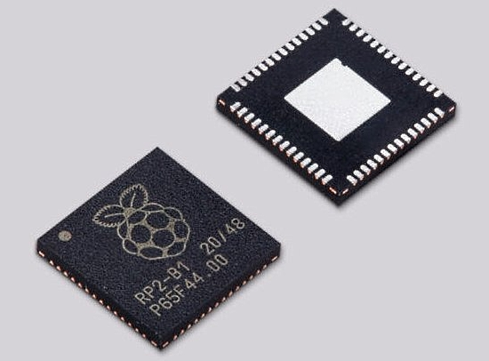](https://blog.adafruit.com/2021/06/01/raspberry-pi-update-rp2040-single-chips-on-sale-now-for-1-raspberrypi-raspberry_pi/)

On Tuesday June 1st, the Raspberry Pi Foundation announced that RP2040 microcontroller chips are available from their Approved Reseller partners in single-unit quantities, allowing people to build their own projects and products on Raspberry Silicon - [Raspberry Pi Blog](https://www.raspberrypi.org/blog/raspberry-pi-rp2040-on-sale/).

More:

* [Adafruit Blog](https://blog.adafruit.com/2021/06/01/raspberry-pi-update-rp2040-single-chips-on-sale-now-for-1-raspberrypi-raspberry_pi/).
* [EYE on NPI - RP2040](https://blog.adafruit.com/2021/06/03/eye-on-npi-raspberry-pi-rp2040-eyeonnpi-digikey-adafruit-raspberry_pi-digikey/).
* [hackster.io](https://www.hackster.io/videos/942) and [Tom's Hardware](https://www.tomshardware.com/news/one-dollar-pi-silicon).

## pyRTOS: a real-time operating system (RTOS) for CircuitPython

[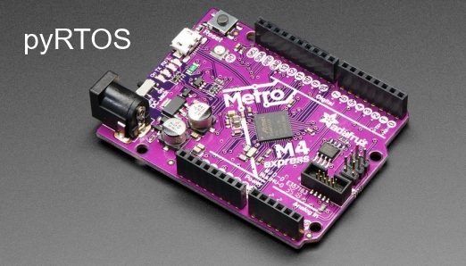](https://blog.adafruit.com/2021/06/04/pyrtos-a-real-time-operating-system-rtos-for-circuitpython-circuitpython/)

pyRTOS: a real-time operating system (RTOS) for CircuitPython - [Adafruit Blog](https://blog.adafruit.com/2021/06/04/pyrtos-a-real-time-operating-system-rtos-for-circuitpython-circuitpython/) and [GitHub](https://github.com/Rybec/pyRTOS/blob/main/README.md).

## Adafruit switching default branch of CircuitPython repositories from master to main

Over the course of the next few weeks, Adafruit is switching the CircuitPython repositories to use main as their default branch instead of master. This change is a continuation of past efforts to depart from language deeply rooted in centuries of racism and the subjugation of people based on the color of their skin towards language that is inclusive of everyone. These changes have sparked others in the electronic & maker communities (SparkFun, Make, and more) to think about the history of words, how they are used, and changes we can make together - [Adafruit Blog](https://blog.adafruit.com/2021/06/01/adafruit-switching-default-branch-of-circuitpython-repositories-from-master-to-main/).

## Q&A with Programming with Microcontrollers in CircuitPython author Armstrong Subero

Apress recently published the book Programming Microcontrollers in CircuitPython. Adafruit asked author Armstrong Subero some questions about both he and the book (and had [Armstrong on our SHOW AND TELL](https://youtu.be/EmZWdpf2_XY?t=276) too!) - [Adafruit Blog](https://blog.adafruit.com/2021/06/04/an-interview-with-armstrong-subero-author-of-programming-microcontrollers-in-circuitpython-circuitpython/).

## CircuitPython Deep Dive Stream with Scott Shawcroft

[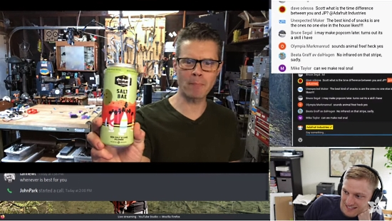](https://youtu.be/Wc5xCt9TjPI)

[This week](https://youtu.be/Wc5xCt9TjPI), Scott chats with John Park, answers questions and fixes the BLE workflow.

You can see the latest video and past videos on the Adafruit YouTube channel under the Deep Dive playlist - [YouTube](https://www.youtube.com/playlist?list=PLjF7R1fz_OOXBHlu9msoXq2jQN4JpCk8A).

## News from around the web!

The PyCon US 2021 recordings are available on their YouTube channel - [PyCon US Blog](https://pycon.blogspot.com/2021/06/pycon-us-2021-recordings-are-complete.html?m=1).

NeoKey 2 FeatherWing brings a pair of mechanical keyswitches with NeoPixel under-lighting to the bongo cat party on John Park's JP’s Product Pick of the Week show.
CircuitPython makes it simple to code USB HID and MIDI on the Feather RP2040 used here - [Twitter](https://twitter.com/adafruit/status/1399829436124438529).

A 3D printed MULTI PASS direct from the movie The Fifth Element, made with an Adafruit QT Py and programmed in CircuitPython - [Twitter](https://twitter.com/Gavin02639495/status/1399921426627432453).

Pico Keypad Minecraft Controller - [GitHub](https://github.com/pierreyvesbaloche/pico/tree/main/pimoroni_keypad_minecraft) and [Twitter](https://twitter.com/FunkyPiwy/status/1399070656059383811).

A small list of tips and tricks when working with CircuitPython - [GitHub](https://github.com/todbot/circuitpython-tricks).

MagTag Space weather display, a fairly simple Magtag app that grabs Space Weather from NOAA - [GitHub](https://github.com/mpechner/sunweather).

How to Build a Raspberry Pi Pico-Powered Camera Button - use a Pico and a button programmed in CircuitPython to fire a phone’s camera from a distance - [Tom's Hardware](https://www.tomshardware.com/how-to/raspberry-pi-pico-camera-button).

Programming languages: Why Python 4.0 might never arrive, according to its creator. Python programming language creator Guido van Rossum said it was "almost taboo to talk about a Python 4 in a serious sense" following the troubled migration from Python 2.0 to Python 3.0 - [TechRepublic](https://www.techrepublic.com/article/programming-languages-why-python-4-0-will-probably-never-arrive-according-to-its-creator/).

[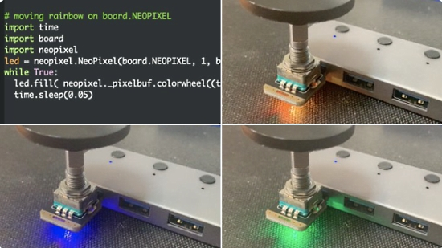](https://twitter.com/todbot/status/1399512917217669121)

A more compact and universal colorwheel (some CircuitPython boards have `_pypixelbuf`, some `adafruit_pypixelbuf`). But `neopixel` contains reference to an appropriate one!  Here is super simple rainbow code for boards with `board.NEOPIXEL`. Thanks to @kattni - [Twitter](https://twitter.com/todbot/status/1399512917217669121).

Defining segments within a strip of NeoPixels and treating them like a separate strips - [Twitter](https://twitter.com/hybotics/status/1400087014465146889) and [YouTube](https://www.youtube.com/watch?v=ua841hM821o&t=4s).

[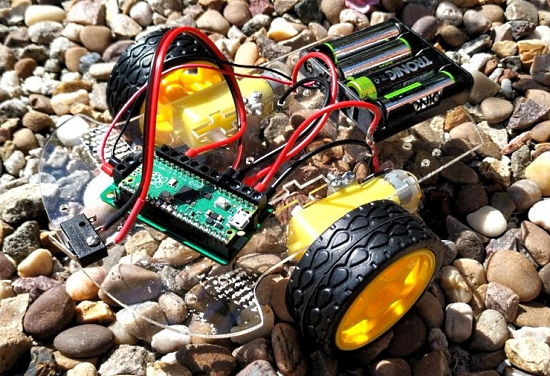](https://twitter.com/emwdx/status/1401021481392369667)

Building a simple Raspberry Pi Pico Robot with CircuitPython - [Twitter](https://twitter.com/emwdx/status/1401021481392369667) and [Tom's Hardware](https://www.tomshardware.com/how-to/raspberry-pi-pico-robot).

Standalone T9 Predictive Keyboard with CircuitPython- [hackaday.io](https://hackaday.io/project/179977-standalone-t9-predictive-keyboard), [Hackaday](https://hackaday.com/2021/06/03/miss-the-predictive-text-from-your-old-nokia-build-your-own-t9-keypad/) and [YouTube](https://youtu.be/6cbBSEbwLUI).

A Pimoroni Keybow gets a successful transplant from a Pi Zero to a Pi Pico using [Neil Lambeth's](https://twitter.com/NeilRedRobotics) Pico2Pi - [Twitter](https://twitter.com/FunkyPiwy/status/1401630330596085765).

Joey Castillo has developed a version of the Open Book using the Raspberry Pi Pico insted of a Feather, named the Open Book Abridged Edition - [Twitter](https://twitter.com/josecastillo/status/1401556815477985280).

[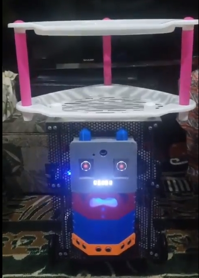](https://twitter.com/ArmstrongSubero/status/1401681854567174146)

A robot named Waiti - a CircuitPython version is in the works - [Twitter](https://twitter.com/ArmstrongSubero/status/1401681854567174146).

A new Robotics control board, based on RP2040 MCU, preloaded with CircuitPython, programmable with MicroPython and C/C++ as well - [Twitter](https://twitter.com/JeanRedelinghu1/status/1401406108091092992) and [Maker IoT 2000](https://www.makeriot2020.com/index.php/2021/06/06/introducing-maker-pi-rp2040/).

Using CircuitPython running on a Raspberry Pi to verify CircuitPython running on the RP2040 Stamp - [Twitter](https://twitter.com/arturo182/status/1401507537673928706).

[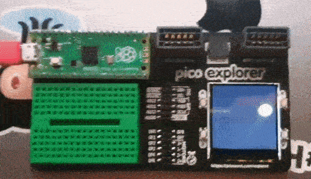](https://twitter.com/orionrobots/status/1399992084623466496)

> Last night I was playing with CircuitPython (having only used MicroPython so far) on the Pimoroni Pico Explorer. Having fun with the UI Lib, I got a bouncing ball with a button to add to the X. Not many steps to a tennis game... - [Twitter](https://twitter.com/orionrobots/status/1399992084623466496).

[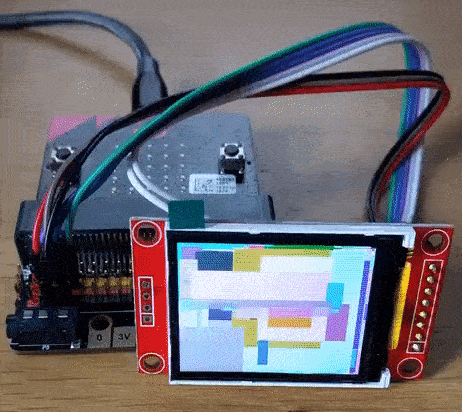](https://twitter.com/JammerGRG/status/1400793139070259205)

micro:bit using an LCD display with MicroPython and SPI - [Twitter](https://twitter.com/JammerGRG/status/1400793139070259205) and [Blog](https://grgsmiscellany.blogspot.com/2021/06/microbit-and-spi-display.html).

SITCore SC13048 chipset supports C#, DUE and today MicroPython - [Twitter](https://twitter.com/GHIElectronics/status/1398333380371128322) and [GHI Electronics](https://www.ghielectronics.com/2021/05/28/micropython-on-sitcore/).

[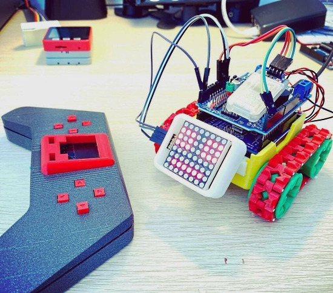](https://twitter.com/kevsmac/status/1401623001922162696)

SMARS Bluetooth Remote using the Raspberry Pi Pico and MicroPython - [Twitter](https://twitter.com/kevsmac/status/1401623001922162696) and [Instagram](https://www.instagram.com/p/CPyloVbrOFk/).

TinyTuya - a Python module to interface with Tuya WiFi smart devices - [GitHub](https://github.com/jasonacox/tinytuya).

[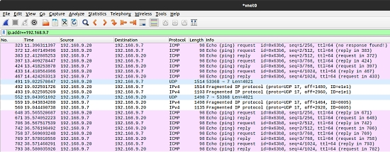](https://github.com/ccie18643/PyTCP)

PyTCP is an attempt to create fully functional TCP/IP stack in Python. It supports TCP stream based transport with reliable packet delivery based on sliding window mechanism and basic congestion control. It also supports IPv6/ICMPv6 protocols with SLAAC address configuration - [GitHub](https://github.com/ccie18643/PyTCP).

Remote Controlling a Nintendo Switch with Python - [Ari Codes](https://aricodes.net/posts/remote-controlling-a-nintendo-switch/).

[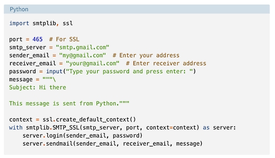](https://twitter.com/realpython/status/1400550376194072579)

Sending Emails With Python - [Twitter](https://twitter.com/realpython/status/1400550376194072579) and [Real Python](https://realpython.com/python-send-email/).

A diagram to ease the understanding of those steps for flashing smartwatches through BLE/OTA and daflasher. The WASP-OS based in MicroPython should be the next to be added - [Twitter](https://twitter.com/DanPeGon/status/1399690470771597314) and [Blog](http://bloglon.blogspot.com/2021/06/OTAFlashing4HackableSmartwatches.html).

Create and continuously update the code on your microcontrollers with Toit - [Adafruit Blog](https://blog.adafruit.com/2021/06/02/create-and-continuously-update-the-code-on-your-microcontrollers-with-toit-iot-internetofthings/) and the [Toit Blog](https://blog.toit.io/why-doesnt-v8-fit-on-my-microcontroller-71dc6e2d8f5c).

Bendy Boards From Geek Mom Projects Demonstrate a Functional Articulated PCB Chain including NeoPixels! - [hackster.io](https://www.hackster.io/news/bendy-boards-from-geek-mom-projects-demonstrate-a-functional-articulated-pcb-chain-e8eee977c6e4).

[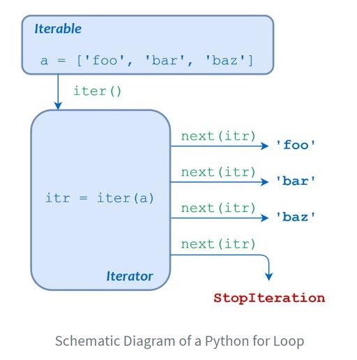](https://realpython.com/python-for-loop/)

Python "for" Loops (Definite Iteration) - [Real Python](https://realpython.com/python-for-loop/) and [Twitter](https://twitter.com/realpython/status/1400188064450887686).

Edublocks, a block based programming environment for electronics that includes Python, now has the ability to accept language translations - [Twitter](https://twitter.com/all_about_code/status/1399847070899576834).

[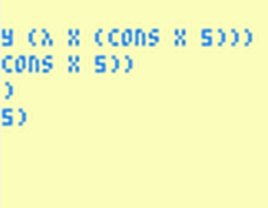](https://internet-janitor.itch.io/bulb)

Bulb is another teeny-tiny interpreted language that runs on SCHIP, taking up a good bit less than 4kb of RAM - [Internet Janitor](https://internet-janitor.itch.io/bulb).

PyDev of the Week: Fernando Masanori [from Mouse vs Python](https://www.blog.pythonlibrary.org/2021/06/07/pydev-of-the-week-fernando-masanori/)

CircuitPython Weekly for June 1st, 2021 [on YouTube](https://youtu.be/GjM3NP0LQLw) and [notes](https://github.com/adafruit/adafruit-circuitpython-weekly-meeting/blob/master/2021/2021-06-01.md)

CircuitPython Weekly for June 7th, 2021 [on YouTube](https://youtu.be/h0disj6f0f4) and [notes](https://github.com/adafruit/adafruit-circuitpython-weekly-meeting/blob/main/2021/2021-06-07.md)

#ICYDNCI What was the most popular, most clicked link, in [last week's newsletter](https://www.adafruitdaily.com/2021/06/01/python-on-microcontrollers-newsletter-python-on-hardware-becomes-mainstream-and-more-python-adafruit-circuitpython-micropython-thepsf/)? [Python on hardware in Gartner Embedded Software and Systems report](https://blog.adafruit.com/2021/05/27/python-on-hardware-in-gartner-embedded-software-and-systems-report-now-in-the-slope-of-enlightenment/).

## Coming soon

[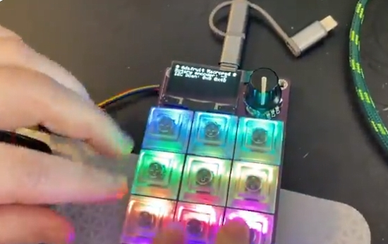](https://twitter.com/adafruit/status/1401626793317183494)

Adafruit Macropad RP2040 bring-up test - [Twitter](https://twitter.com/adafruit/status/1401626793317183494).

> We put together our hopefully-final prototypes for the Macropad we're working on at the office. Now we're home and it's time to bring up the design. We like to do our bring-ups in Arduino, so we're using the Philhower Arduino core to make a definition and verify all the hardware works. The new part here is the OLED, which uses a new chipset, but similar enough to other OLEDs we wrote a driver pretty fast. This test program lights up all the switch NeoPixels tracks the rotary encoder direction and pushbutton, and scans I2C connected to the Stemma QT port. So far so good!

Macropad RP2040 bring-up part deux - CircuitPython time - [Twitter](https://twitter.com/adafruit/status/1401703835727548419).

> Now that we have my hardware validated in Arduino, it's time to get it running in CircuitPython as well. We needed to write a little patch to the core to fix a row/col swap so that the SH1106 driver will work right, however, once we got that fixed, the display/buttons/encoder are working perfectly. Next up, maybe we can get the onboard audio working so that the final PCBs can be ordered.

Pimoroni to Release RP2040 Breakout for Maker Projects - [Tom's Hardware](https://www.tomshardware.com/news/pimoroni-pga-2040-rp2040-breakout-board) and [Twitter](https://twitter.com/ZodiusInfuser/status/1400481679593070592).

## New Boards Supported by CircuitPython

The number of supported microcontrollers and Single Board Computers (SBC) grows every week. This section outlines which boards have been included in CircuitPython or added to [CircuitPython.org](https://circuitpython.org/).

This week, there were four new boards added!

- [MacroPad RP2040](https://circuitpython.org/board/adafruit_macropad_rp2040/)
- [CP Sapling M0 Rev B](https://circuitpython.org/board/cp_sapling_m0_revb/)
- [Maker Pi RP2040](https://circuitpython.org/board/cytron_maker_pi_rp2040/)
- [MicroMod SAMD51 Processor](https://circuitpython.org/board/sparkfun_samd51_micromod/)

Looking to add a new board to CircuitPython? It's highly encouraged! Adafruit has four guides to help you do so:

- [How to Add a New Board to CircuitPython](https://learn.adafruit.com/how-to-add-a-new-board-to-circuitpython/overview)
- [How to add a New Board to the circuitpython.org website](https://learn.adafruit.com/how-to-add-a-new-board-to-the-circuitpython-org-website)
- [Adding a Single Board Computer to PlatformDetect for Blinka](https://learn.adafruit.com/adding-a-single-board-computer-to-platformdetect-for-blinka)
- [Adding a Single Board Computer to Blinka](https://learn.adafruit.com/adding-a-single-board-computer-to-blinka)

## New Learn Guides!

[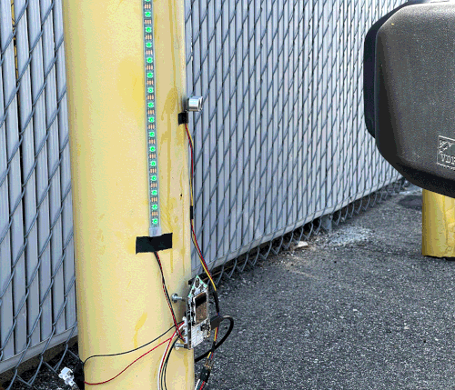](https://learn.adafruit.com/guides/latest)

[FunHouse Parking Assistant](https://learn.adafruit.com/funhouse-parking-assistant) from [John Park](https://learn.adafruit.com/users/johnpark)

[Adafruit NeoKey Trinkey](https://learn.adafruit.com/adafruit-neokey-trinkey) from [Kattni](https://learn.adafruit.com/users/kattni)

[Raspberry Pi E-Ink Event Calendar using Python](https://learn.adafruit.com/raspberry-pi-e-ink-desk-calendar-using-python) from [Melissa LeBlanc-Williams](https://learn.adafruit.com/users/MakerMelissa)

[Discord and Slack Connected Smart Plant with Adafruit IO Triggers](https://learn.adafruit.com/discord-and-slack-connected-smart-plant-with-adafruit-io-triggers) from [Dylan Herrada](https://learn.adafruit.com/users/dherrada)

[Adafruit Rotary Trinkey](https://learn.adafruit.com/adafruit-rotary-trinkey) from [Kattni](https://learn.adafruit.com/users/kattni)

## CircuitPython Project Bundle

When you get to the CircuitPython code section of an [Adafruit Learn Guide](https://learn.adafruit.com/), sometimes things can get a bit complicated. You not only have the code you need to upload to your device, but you likely also need to add some libraries that the code requires to run. This involved downloading all the libraries, digging through to find the ones you need, and copying them to your device. That was only the beginning on some projects, as those that include images and/or sound files required further downloading and copying of files. But, not anymore!

Now, with Project Bundles, you can download all the necessary code, libraries and, if needed, asset files with one click! We automatically check which libraries are required for the project and bundle them up for you. No more digging through a huge list of libraries to find the ones you need, or fiddling with looking for other files or dependencies. Download the Project Bundle, copy the contents to your device, and your code will simply work. We wanted to make this the easiest way to get a project working, regardless of whether you're a beginner or an expert. We'll also be adding this feature to popular IDEs as an add-on. Try it out with any Circuit Python guide on the Adafruit Learning System. Just look for the ‘Download Project Bundle’ button on the code page. 

**To download and use a Project Bundle:**

In the Learning System - above any embedded code in a guide in the Adafruit Learn System, you’ll find a Download Project Bundle button.

Click the button to download the Project Bundle zip.

Open the Project Bundle zip to find the example code, all necessary libraries, and, if available, any images, sounds, etc.

Simply copy all the files over to your CIRCUITPY drive, and you’re ready to go!

If you run into any problems or bugs, or would like to submit feedback, please file an issue on the [Adafruit Learning System Guides GitHub repo](https://github.com/adafruit/Adafruit_Learning_System_Guides/issues).

## CircuitPython Libraries!

CircuitPython support for hardware continues to grow. We are adding support for new sensors and breakouts all the time, as well as improving on the drivers we already have. As we add more libraries and update current ones, you can keep up with all the changes right here!

For the latest libraries, download the [Adafruit CircuitPython Library Bundle](https://circuitpython.org/libraries). For the latest community contributed libraries, download the [CircuitPython Community Bundle](https://github.com/adafruit/CircuitPython_Community_Bundle/releases).

If you'd like to contribute, CircuitPython libraries are a great place to start. Have an idea for a new driver? File an issue on [CircuitPython](https://github.com/adafruit/circuitpython/issues)! Have you written a library you'd like to make available? Submit it to the [CircuitPython Community Bundle](https://github.com/adafruit/CircuitPython_Community_Bundle). Interested in helping with current libraries? Check out the [CircuitPython.org Contributing page](https://circuitpython.org/contributing). We've included open pull requests and issues from the libraries, and details about repo-level issues that need to be addressed. We have a guide on [contributing to CircuitPython with Git and Github](https://learn.adafruit.com/contribute-to-circuitpython-with-git-and-github) if you need help getting started. You can also find us in the #circuitpython channel on the [Adafruit Discord](https://adafru.it/discord).

You can check out this [list of all the Adafruit CircuitPython libraries and drivers available](https://github.com/adafruit/Adafruit_CircuitPython_Bundle/blob/master/circuitpython_library_list.md). 

The current number of CircuitPython libraries is **318**!

**New Libraries!**

Here's this week's new CircuitPython libraries:

 * [Adafruit_CircuitPython_Simple_Text_Display](https://github.com/adafruit/Adafruit_CircuitPython_Simple_Text_Display)

**Updated Libraries!**

Here's this week's updated CircuitPython libraries:

 * [Adafruit_CircuitPython_Bitmap_Font](https://github.com/adafruit/Adafruit_CircuitPython_Bitmap_Font)
 * [Adafruit_CircuitPython_DisplayIO_Layout](https://github.com/adafruit/Adafruit_CircuitPython_DisplayIO_Layout)
 * [Adafruit_CircuitPython_DPS310](https://github.com/adafruit/Adafruit_CircuitPython_DPS310)
 * [Adafruit_CircuitPython_SI5351](https://github.com/adafruit/Adafruit_CircuitPython_SI5351)
 * [Adafruit_CircuitPython_PCA9685](https://github.com/adafruit/Adafruit_CircuitPython_PCA9685)
 * [Adafruit_CircuitPython_Gizmo](https://github.com/adafruit/Adafruit_CircuitPython_Gizmo)
 * [Adafruit_CircuitPython_ProgressBar](https://github.com/adafruit/Adafruit_CircuitPython_ProgressBar)
 * [Adafruit_CircuitPython_ESP32SPI](https://github.com/adafruit/Adafruit_CircuitPython_ESP32SPI)
 * [Adafruit_CircuitPython_FunHouse](https://github.com/adafruit/Adafruit_CircuitPython_FunHouse)
 * [Adafruit_CircuitPython_Dash_Display](https://github.com/adafruit/Adafruit_CircuitPython_Dash_Display)
 * [Adafruit_CircuitPython_HID](https://github.com/adafruit/Adafruit_CircuitPython_HID)
 * [Adafruit_CircuitPython_SI4713](https://github.com/adafruit/Adafruit_CircuitPython_SI4713)
 * [Adafruit_CircuitPython_TCA9548A](https://github.com/adafruit/Adafruit_CircuitPython_TCA9548A)
 * [Adafruit_CircuitPython_seesaw](https://github.com/adafruit/Adafruit_CircuitPython_seesaw)
 * [Adafruit_CircuitPython_Wiznet5k](https://github.com/adafruit/Adafruit_CircuitPython_Wiznet5k)
 * [Adafruit_CircuitPython_BNO08x](https://github.com/adafruit/Adafruit_CircuitPython_BNO08x)
 * [Adafruit_CircuitPython_SSD1306](https://github.com/adafruit/Adafruit_CircuitPython_SSD1306)
 * [circuitpython](https://github.com/adafruit/circuitpython)
 * [CircuitPython_Community_Bundle](https://github.com/adafruit/CircuitPython_Community_Bundle)

## What’s the team up to this week?

What is the team up to this week? Let’s check in!

**Dan**

I made the CircuitPython 6.3.0 final release this week, and am working on the first 7.0.0 alpha release that will be visible on circuitpython.org.

I'm continuing to work on a native module for keypad scanning in CircuitPython: We plan to support, one pin per key, matrix keypads, and shift-register-driven matrices.

I've fixed several bugs in the new customized HID device support. A user has found that there are complicated HID devices with multiple report ID's, and we've worked out a way to support those, so the API will change slightly.

**Jeff**

I've continued working on the camera code on ESP32-S2, but it doesn't work yet.  CircuitPython is able to capture data from the camera, but it's not the right data, as though the synchronization signals are being lost or ignored.

With the help of a community member, the `mpy-cross` program can now be built natively for M1 macs, and we provide a pre-built binary if for any reason you want to create mpy files on your M1 mac without building all of CircuitPython. (This applies to the development version of CircuitPython only.  For 6.x, you should still be able to use the x86_64 version on your M1 mac, it's just emulated by Rosetta 2)

I also added some scripts to our Github Actions that make sure that specific boards can be built on a Windows system with the MSYS2 build environment. We have relatively few developers & community members who are building on Windows (most use Mac or Linux, including using WSL within Windows), so it has been easy in the past to introduce problems with building CircuitPython that would not be noticed until an inconvenient moment.

**Kattni**

This week I published the Rotary Trinkey guide. It has everything you need to get started with your Rotary Trinkey including a number of CircuitPython and Arduino examples, such as: control a NeoPixel, create a volume knob, or advance through YouTube videos frame-by-frame. [Rotary Trinkey](https://www.adafruit.com/product/4964) is a great little board. If any of those things or more sound interesting to you, pick one up!

We've begun moving all of the CircuitPython library repositories on GitHub from `master` to `main` as the default branch. This is another step towards using more inclusive language in tech. We've written a [blog post[(https://blog.adafruit.com/2021/06/01/adafruit-switching-default-branch-of-circuitpython-repositories-from-master-to-main/) with some details.

This change will affect those folks who contribute to the Adafruit CircuitPython libraries. You will need to make sure that you’re working with the `main` branch instead of the `master` branch when you are working on library code or documentation. If you are planning on getting started contributing, we recommend starting fresh with a new clone of the repository to ensure that you have the latest updates. The Contribute to CircuitPython with Git and GitHub guide shows how to tell whether or not a library has been updated to `main`. Be aware that we are deleting the `master` branch in this process, so if you are trying to push to or sync with `master`, it will fail – this is deliberate as we do not want folks to be confused moving forward about which branch is the active one.

**Melissa**

This past week, I have been working on guide updates. One of the guides that gave me a little more trouble than the rest was the [Raspberry Pi E-Ink Event Calendar using Python guide](https://learn.adafruit.com/raspberry-pi-e-ink-desk-calendar-using-python) because Google had completely changed the setup process on their end. I went through and updated it with many screenshots to make sure it was easy to follow along.

**Scott**

This week I've continued working on BLE workflow. Bringing the protocol into the core has exposed some timing aspects that weren't apparent in the prototype implementation. So, I've had to make the test version more robust as well as fixing internal issues. All of this testing has also highlighted missing pieces of our internal bluetooth support around reconnecting to a device we already know about. This will be done when CircuitPython does a soft reload so it's important to get reliable. When done right, it should also mean that the CP device cannot be connected to by anyone unless you put it in a discoverable mode specifically. This is the piece we missed in our previous work on BLE and will make it possible to ship it in stable versions of CircuitPython. It's important work, just in the weeds a bit. Check out my Deep Dive streams for details around this work: https://www.youtube.com/playlist?list=PLjF7R1fz_OOXBHlu9msoXq2jQN4JpCk8A

## Upcoming events!

EuroPython, the largest conference for the Python programming language in Europe, will be held online July 26 - August 1, 2021. More information at [https://ep2021.europython.eu/](https://ep2021.europython.eu/)

PyOhio 2021 is a free event on July 31, 2021 - [PyOhio.org](https://www.pyohio.org/2021/) via [Twitter](https://twitter.com/PyOhio/status/1370184124460367881).

Call for proposals for PyConline AU 2021 runs until June 10th, 2021 with the event held 10-12 September, 2021 - [pyconlineau](https://2021.pycon.org.au/)

**Send Your Events In**

As for other events, with the COVID pandemic, most in-person events are postponed or cancelled. If you know of virtual events or events that may occur in the future, please let us know on Discord or on Twitter with hashtag #CircuitPython.

## Latest releases

CircuitPython's stable release is [6.3.0](https://github.com/adafruit/circuitpython/releases/latest) and its unstable release is [7.0.0-alpha.3](https://github.com/adafruit/circuitpython/releases). New to CircuitPython? Start with our [Welcome to CircuitPython Guide](https://learn.adafruit.com/welcome-to-circuitpython).

[20210606](https://github.com/adafruit/Adafruit_CircuitPython_Bundle/releases/latest) is the latest CircuitPython library bundle.

[v1.15](https://micropython.org/download) is the latest MicroPython release. Documentation for it is [here](http://docs.micropython.org/en/latest/pyboard/).

[3.9.5](https://www.python.org/downloads/) is the latest Python release. The latest pre-release version is [3.10.0b2](https://www.python.org/download/pre-releases/).

[2,462 Stars](https://github.com/adafruit/circuitpython/stargazers) Like CircuitPython? [Star it on GitHub!](https://github.com/adafruit/circuitpython)

## Call for help -- Translating CircuitPython is now easier than ever!

[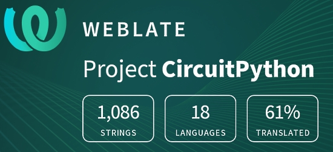](https://hosted.weblate.org/engage/circuitpython/)

One important feature of CircuitPython is translated control and error messages.

With the help of fellow open source project [Weblate](https://weblate.org/), we're making it even easier to add or improve translations.

Sign in with an existing account such as GitHub, Google or Facebook and start contributing through a simple web interface. No forks or pull requests needed!

As always, if you run into trouble join us on [Discord](https://adafru.it/discord), we're here to help.

## jobs.adafruit.com - Find a dream job, find great candidates!

[jobs.adafruit.com](https://jobs.adafruit.com/) has returned and folks are posting their skills (including CircuitPython) and companies are looking for talented makers to join their companies - from Digi-Key, to Hackaday, Micro Center, Raspberry Pi and more.

**Job of the Week**

Hardware Engineer - HeadSpin Inc. - [Adafruit Jobs Board](https://jobs.adafruit.com/job/hardware-engineer/).

## 29,463 thanks!

The Adafruit Discord community, where we do all our CircuitPython development in the open, reached over 29,463 humans, thank you!  Adafruit believes Discord offers a unique way for CircuitPython folks to connect. Join today at [https://adafru.it/discord](https://adafru.it/discord).

## ICYMI - In case you missed it

The wonderful world of Python on hardware! This is our Python video-newsletter-podcast! The news comes from the Python community, Discord, Adafruit communities and more and is reviewed on ASK an ENGINEER Wednesdays. The complete Python on Hardware weekly videocast [playlist is here](https://www.youtube.com/playlist?list=PLjF7R1fz_OOXRMjM7Sm0J2Xt6H81TdDev). 

This video podcast is on [iTunes](https://itunes.apple.com/us/podcast/python-on-hardware/id1451685192?mt=2), [YouTube](http://adafru.it/pohepisodes), [IGTV (Instagram TV](https://www.instagram.com/adafruit/channel/)), and [XML](https://itunes.apple.com/us/podcast/python-on-hardware/id1451685192?mt=2).

[Weekly community chat on Adafruit Discord server CircuitPython channel - Audio / Podcast edition](https://itunes.apple.com/us/podcast/circuitpython-weekly-meeting/id1451685016) - Audio from the Discord chat space for CircuitPython, meetings are usually Mondays at 2pm ET, this is the audio version on [iTunes](https://itunes.apple.com/us/podcast/circuitpython-weekly-meeting/id1451685016), Pocket Casts, [Spotify](https://adafru.it/spotify), and [XML feed](https://adafruit-podcasts.s3.amazonaws.com/circuitpython_weekly_meeting/audio-podcast.xml).

And lastly, we are working up a one-spot destination for all things podcast-able here - [podcasts.adafruit.com](https://podcasts.adafruit.com/)

## Contribute!

The CircuitPython Weekly Newsletter is a CircuitPython community-run newsletter emailed every Tuesday. The complete [archives are here](https://www.adafruitdaily.com/category/circuitpython/). It highlights the latest CircuitPython related news from around the web including Python and MicroPython developments. To contribute, edit next week's draft [on GitHub](https://github.com/adafruit/circuitpython-weekly-newsletter/tree/gh-pages/_drafts) and [submit a pull request](https://help.github.com/articles/editing-files-in-your-repository/) with the changes. You may also tag your information on Twitter with #CircuitPython. 

Join our [Discord](https://adafru.it/discord) or [post to the forum](https://forums.adafruit.com/viewforum.php?f=60) for any further questions.
