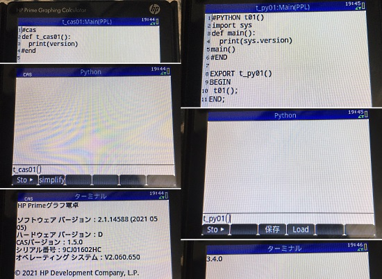
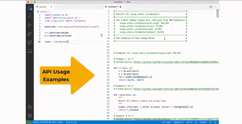
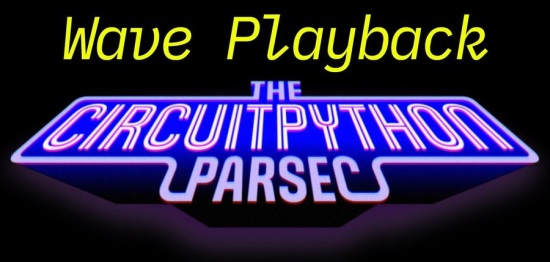
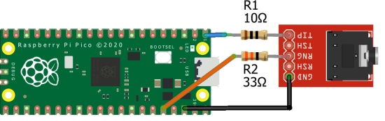
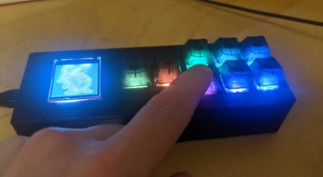
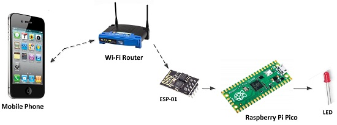
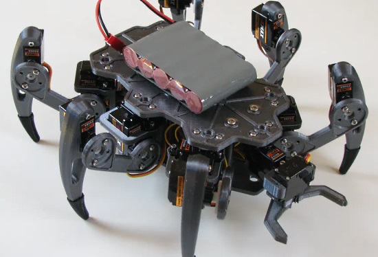
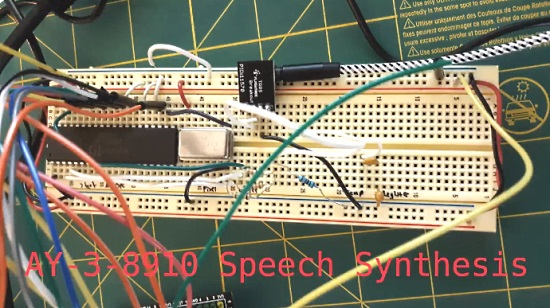

- [X] Kattni updates
- [ ] change date
- [ ] update title
- [ ] Feature story
- [ ] Update  for images
- [ ] Update ICYDNCI
- [ ] All images 550w max only
- [ ] Link "View this email in your browser."

View this email in your browser.

Welcome to the latest Python on Microcontrollers newsletter, brought you by the community! We're on [Discord](https://discord.gg/HYqvREz), [Twitter](https://twitter.com/search?q=circuitpython&src=typed_query&f=live), and for past newsletters - [view them all here](https://www.adafruitdaily.com/category/circuitpython/). If you're reading this on the web, [subscribe here](https://www.adafruitdaily.com/). Let's get started!

## Adafruit Learning System Reaches 2,500 Guides

The [Adafruit Learning System](https://learn.adafruit.com/) has exceeded the 2,500 guide mark! Thanks to the entire team at Adafruit who builds and makes [learn.adafruit.com](https://learn.adafruit.com/) one of the best resources online for learning. Thanks to all the authors and contributors for putting their smarts out there for so many to build their dreams with. Thanks to the teams and friends that take photos, shoot video, write code, and helped make something so special for so many.

Most of all, Adafruit thanks the folks who read, learn, and share learn.adafruit.com and use it to help others - [Adafruit Blog](https://blog.adafruit.com/2021/06/30/the-adafruit-learning-system-has-2500-guides-thank-you-adafruit-adafruit/).

## The Adafruit IoT Monthly Newsletter is out

The Adafruit IoT Monthly Newsletter is out, full of internet of things goodness - [Adafruit Blog](https://blog.adafruit.com/2021/07/01/icymi-adafruit-iot-monthly-smart-agriculture-an-e-ink-newspaper-and-more-iot-internetofthings-newsletter-adafruit/).

Subscribe, spam free, at [https://www.adafruitdaily.com/](https://www.adafruitdaily.com/)

## GitHub Copilot - an AI Coding Assistant Announced

GitHub Copilot - get suggestions for whole lines of code or entire functions right inside an editor. Trained on billions of lines of public code, Copilot "puts the knowledge you need at your fingertips, saving you time and helping you stay focused" - [GitHub](https://copilot.github.com/) and [Twitter](https://twitter.com/github/status/1409883156333879300).

## The HP Prime G2 Calculator Supports Two Types of Python

Twitter user [@hangyodon1123](https://twitter.com/hangyodon1123) notes on the HP Prime G2 calculator (apparently a Japanese version) supports two flavors of Python. The first is t_cas01 which features Python syntax with CAS (computer algebra system) - [Twitter](https://twitter.com/hangyodon1123/status/1410552863630131209).

Hardware specifications on the HP Prime G2 - [cemetech.net](https://www.cemetech.net/tools/prime).

From beta release notes, April 2021 - [hpcalc.org](https://www.hpcalc.org/prime/beta/betanotes.zip) (zip):

> Prime now includes a Python interpreter. This interprets Python scripts using the MicroPython interpreter. However, due to the way MicroPython manages memory, the Python interpreter is started with a fixed heap and stack of repectively 1MB and 40KB. Replacing the first parameter of the Python call to a list containing 2 or 3 items allows to change this.

Some additional documentation on Python for the Prime G2 is on a French site - [tiplanet.org](https://tiplanet.org/forum/viewtopic.php?f=55&t=24837&view=unread#HPPPY1).

## See Examples of Python API Usage in New VS Code Insider's Release

A new plug-in for Visual Studio Python editing: a single click Python API example usages - [Twitter](https://twitter.com/MarkPavWT/status/1411025019220549632) and [Visual Studio Marketplace](https://marketplace.visualstudio.com/items?itemName=VisualStudioExptTeam.vscodeintellicode-insiders).

## OSH Park Adds 6 Layer PCB Service

OSH Park, the US PCB board house, announced Friday they are now offering their "Perfect Purple PCBs" in 6 layers - [OSH Park](https://docs.oshpark.com/services/six-layer/) and [Twitter](https://twitter.com/oshpark/status/1411047681921675268).

## CircuitPython Deep Dive Stream with Scott Shawcroft

[This week](https://youtu.be/lS8eJsIYYno), Scott streams his work on WebBluetooth.

You can see the latest video and past videos on the Adafruit YouTube channel under the Deep Dive playlist - [YouTube](https://www.youtube.com/playlist?list=PLjF7R1fz_OOXBHlu9msoXq2jQN4JpCk8A).

## News from around the web!

John Park’s CircuitPython Parsec: Wave Playback - [Adafruit Blog](https://blog.adafruit.com/2021/06/29/john-parks-circuitpython-parsec-wave-playback-adafruit-johnedgarpark-adafruit-circuitpython/) and [Twitter](https://twitter.com/adafruit/status/1410031384199041025).

A Macropad RP2040 with multiple keymaps with CircuitPython - [GitHub](https://github.com/dgriswo/Macropad_RP2040).

Adding Serial MIDI to a toy keyboard with a Raspberry Pi Pico and CircuitPython - [DIY Electronics](https://diyelectromusic.wordpress.com/2021/06/28/toy-keyboard-usb-matrix-decode-with-the-pi-pico-part-2/).

The Keyboard FeatherWing is an open source QWERTY Keyboard + 2.6" LCD, accepting a microcontroller board in the Feather format. Revision 2 of the device changes the touch driver to the TSC2004 and adds an Ambient Light Sensor. Programmable in CircuitPython, Arduino, and Rust - [Tindie](https://www.tindie.com/products/arturo182/keyboard-featherwing-qwerty-keyboard-26-lcd/).

SideKick is a <$600 uL-precision liquid dispensing robot designed to democratize lab automation for undergraduate teaching & research, using Raspberry Pi Pico and MicroPython - [Twitter Thread](https://twitter.com/JoshuaSchrier/status/1410712304174444545) and [YouTube](https://www.youtube.com/watch?v=da3crqds75c).

A Language Creators' Conversation: Guido van Rossum, James Gosling, Anders Hejlsberg & Larry Wall, hosted by Carol Willing, organized by CS4ALL for their fundraiser in Seattle, WA. April 2, 2019 - [YouTube](https://www.youtube.com/watch?v=sBVYn0cIlWM).

The Python Software Foundation membership frequently asked questions (FAQ) - [PSF](https://www.python.org/psf/membership/) and [Twitter](https://twitter.com/ThePSF/status/1409621395231870976).

Pico AirLift NeoKeyboard - [Adafruit Blog](https://blog.adafruit.com/2021/07/02/pico-airlift-neokeyboard-piday-raspberrypi-raspberry_pi/) and [GitHub](https://github.com/bdsvac/Adafruit_Pico_Airlift_NeoKeyboard).

Adding Digital I/O To Your CircuitPython Compatible Board: The 74HC165 - [Woolsey Workshop](https://www.woolseyworkshop.com/2021/07/02/adding-digital-io-to-your-circuitpython-compatible-board-part-2-the-74hc165/).

> Figuring out CircuitPython on the Raspberry Pi Pico. Still learning how the PIO stuff works but I've got it displaying images on a screen and pretending to be a USB gamepad. - [Twitter](https://twitter.com/Pimentoad/status/1410400858651697153).

Mouse functionality added to a Pico HID keyboard using CircuitPython - [Twitter](https://twitter.com/Lathe20988365/status/1410580523064315912) (Japanese).

Python Best Practices for a New Project in 2021 - [Alex Mitelman](https://mitelman.engineering/blog/python-best-practice/automating-python-best-practices-for-a-new-project/).

Controlling an LED from a Smartphone Using Wi-Fi - [elector Magazine](https://www.elektormagazine.com/articles/raspberry-pi-pico-essentials-1).

Micropython: Expanding the GPIO Capability of the ESP8266 with the PCF8574 - [profetolocka.com.ar](https://www.profetolocka.com.ar/2021/03/09/micropython-ampliando-la-capacidad-de-gpio-del-esp8266-con-el-pcf8574/).

MicroPython ESP32 Synth Module: Receiving Gates - [Medium](https://medium.com/micropython-eurorack-modular-synth/micropython-esp32-synth-module-part-2-receiving-gates-f23220383a2b).

> @xorbit1 writes "Despite what it says on the download page, the new MicroPython 1.16 does support LAN! It also has support for the RTL8201 PHY on the new upcoming revision of the wESP32, see screenshot below. Not sure what the error is about, but as you can see it does work!" - [Twitter](https://twitter.com/xorbit1/status/1410989680661725185).

Driving an LED matrix display with a Raspberry Pi Pico and MicroPython - [Twitter](https://twitter.com/JennaSys/status/1410684088323764226).

Using The Things Network with ATOM Lite and LoRaWAN Unit, learn how to send messages to The Things Network with MicroPython - [hackster.io](https://www.hackster.io/andreas-motzek/using-the-things-network-with-atom-lite-and-lorawan-unit-21bd93).

Processing Raspberry Pi Pico switch input via interrupt in MicroPython - [note.com](https://note.com/uranus_xii_jp/n/ne6bdbe64ca1b) (Japanese).

ZeroBug is a 3D-Printed Micro Servo Hexapod powered by a Raspberry Pi (with Python) and STM32 - [hackster.io](https://www.hackster.io/news/zerobug-is-a-3d-printed-micro-servo-hexapod-powered-by-a-raspberry-pi-and-stm32-5d9df8a806d1).

ohd - Over Head Door Garage Door Monitor using Raspberry Pi and Python - [GitHub](https://github.com/casspop/ohd).

On a Raspberry Pi - "Wrote a prototype Python app that interacts with a button - press the button to mute or unmute my receiver in Zone 2 over the network in another room.  Now to program volume control" - [Twitter](https://twitter.com/prcutler/status/1410233328096120832).

AY-3-8910 Speech Synthesis - a Python library to control a General Instrument AY-3-8910 sound generator and make it speak - [hackster.io](https://www.hackster.io/nickbild/ay-3-8910-speech-synthesis-fe5f43).

Create, digitally sign, and broadcast a Bitcoin transaction in pure Python, from scratch, and with zero dependencies - [GitHub.io](https://karpathy.github.io/2021/06/21/blockchain/).

Automatically manage the \_\_all\_\_ variable in Python modules - [GitHub](https://github.com/jongracecox/auto-all).

Machine Learning Algorithms with Python - [The Clever Programmer](https://thecleverprogrammer.com/2020/11/27/machine-learning-algorithms-with-python/).

Python Inner Functions - [Real Python](https://realpython.com/courses/python-inner-functions/).

Protocol Types in Python 3.8: a quick introduction to the new Protocol class in Python 3.8 and how it enables structural typing - [auth0](https://auth0.com/blog/protocol-types-in-python/).

Commit Often, Perfect Later, Publish Once: Git Best Practices - [GitHub.io](https://sethrobertson.github.io/GitBestPractices/).

#ICYDNCI What was the most popular, most clicked link, in [last week's newsletter](https://www.adafruitdaily.com/2021/06/29/python-on-microcontrollers-newsletter-python-calculators-adabox-and-more-python-adafruit-circuitpython-micropython-thepsf/)? [Git Cheat Sheet](https://twitter.com/MIT_CSAIL/status/1408100103198367746).

## Coming soon

A new seesaw board from Adafruit using the modern ATtiny8x7 chip - [Twitter](https://twitter.com/adafruit/status/1410652798031740932).

## New Boards Supported by CircuitPython

The number of supported microcontrollers and Single Board Computers (SBC) grows every week. This section outlines which boards have been included in CircuitPython or added to [CircuitPython.org](https://circuitpython.org/).

This week, there were no new boards added, but several are in development.

Looking to add a new board to CircuitPython? It's highly encouraged! Adafruit has four guides to help you do so:

- [How to Add a New Board to CircuitPython](https://learn.adafruit.com/how-to-add-a-new-board-to-circuitpython/overview)
- [How to add a New Board to the circuitpython.org website](https://learn.adafruit.com/how-to-add-a-new-board-to-the-circuitpython-org-website)
- [Adding a Single Board Computer to PlatformDetect for Blinka](https://learn.adafruit.com/adding-a-single-board-computer-to-platformdetect-for-blinka)
- [Adding a Single Board Computer to Blinka](https://learn.adafruit.com/adding-a-single-board-computer-to-blinka)

## New Learn Guides!

[Kitty Toe Bean Keypad with Color TFT](https://learn.adafruit.com/kitty-toe-bean-paw-keypad-color-tct) from [Noe and Pedro](https://learn.adafruit.com/users/pixil3d)

[Adafruit NeoKey 1x4 QT I2C Breakout](https://learn.adafruit.com/neokey-1x4-qt-i2c) from [Kattni](https://learn.adafruit.com/users/kattni)

[Keypad and Matrix Scanning in CircuitPython](https://learn.adafruit.com/key-pad-matrix-scanning-in-circuitpython) from [Dan Halbert](https://learn.adafruit.com/users/danhalbert)

[Capturing Camera Images with CircuitPython](https://learn.adafruit.com/capturing-camera-images-with-circuitpython) from [Jeff Epler](https://learn.adafruit.com/users/jepler)

[CircuitPython Rotary Trinkey Brightness Crank](https://learn.adafruit.com/circuitpython-rotary-trinkey-brightness-crank) from [Tim C](https://learn.adafruit.com/users/Foamyguy)

[Adafruit MacroPad RP2040](https://learn.adafruit.com/adafruit-macropad-rp2040) from [Kattni](https://learn.adafruit.com/users/kattni)

## CircuitPython Project Bundle

When you get to the CircuitPython code section of an [Adafruit Learn Guide](https://learn.adafruit.com/), sometimes things can get a bit complicated. You not only have the code you need to upload to your device, but you likely also need to add some libraries that the code requires to run. This involved downloading all the libraries, digging through to find the ones you need, and copying them to your device. That was only the beginning on some projects, as those that include images and/or sound files required further downloading and copying of files. But, not anymore!

Now, with Project Bundles, you can download all the necessary code, libraries and, if needed, asset files with one click! We automatically check which libraries are required for the project and bundle them up for you. No more digging through a huge list of libraries to find the ones you need, or fiddling with looking for other files or dependencies. Download the Project Bundle, copy the contents to your device, and your code will simply work. We wanted to make this the easiest way to get a project working, regardless of whether you're a beginner or an expert. We'll also be adding this feature to popular IDEs as an add-on. Try it out with any Circuit Python guide on the Adafruit Learning System. Just look for the ‘Download Project Bundle’ button on the code page. 

**To download and use a Project Bundle:**

In the Learning System - above any embedded code in a guide in the Adafruit Learn System, you’ll find a Download Project Bundle button.

Click the button to download the Project Bundle zip.

Open the Project Bundle zip to find the example code, all necessary libraries, and, if available, any images, sounds, etc.

Simply copy all the files over to your CIRCUITPY drive, and you’re ready to go!

If you run into any problems or bugs, or would like to submit feedback, please file an issue on the [Adafruit Learning System Guides GitHub repo](https://github.com/adafruit/Adafruit_Learning_System_Guides/issues).

## CircuitPython Libraries!

CircuitPython support for hardware continues to grow. We are adding support for new sensors and breakouts all the time, as well as improving on the drivers we already have. As we add more libraries and update current ones, you can keep up with all the changes right here!

For the latest libraries, download the [Adafruit CircuitPython Library Bundle](https://circuitpython.org/libraries). For the latest community contributed libraries, download the [CircuitPython Community Bundle](https://github.com/adafruit/CircuitPython_Community_Bundle/releases).

If you'd like to contribute, CircuitPython libraries are a great place to start. Have an idea for a new driver? File an issue on [CircuitPython](https://github.com/adafruit/circuitpython/issues)! Have you written a library you'd like to make available? Submit it to the [CircuitPython Community Bundle](https://github.com/adafruit/CircuitPython_Community_Bundle). Interested in helping with current libraries? Check out the [CircuitPython.org Contributing page](https://circuitpython.org/contributing). We've included open pull requests and issues from the libraries, and details about repo-level issues that need to be addressed. We have a guide on [contributing to CircuitPython with Git and Github](https://learn.adafruit.com/contribute-to-circuitpython-with-git-and-github) if you need help getting started. You can also find us in the #circuitpython channel on the [Adafruit Discord](https://adafru.it/discord).

You can check out this [list of all the Adafruit CircuitPython libraries and drivers available](https://github.com/adafruit/Adafruit_CircuitPython_Bundle/blob/master/circuitpython_library_list.md). 

The current number of CircuitPython libraries is **323**!

**New Libraries!**

Here's this week's new CircuitPython libraries:

 * [Adafruit_CircuitPython_DisplayIO_SH1106](https://github.com/adafruit/Adafruit_CircuitPython_DisplayIO_SH1106)
 * [Adafruit_CircuitPython_NeoKey](https://github.com/adafruit/Adafruit_CircuitPython_NeoKey)

**Updated Libraries!**

Here's this week's updated CircuitPython libraries:

 * [Adafruit_CircuitPython_Display_Text](https://github.com/adafruit/Adafruit_CircuitPython_Display_Text)
 * [Adafruit_CircuitPython_EPD](https://github.com/adafruit/Adafruit_CircuitPython_EPD)
 * [Adafruit_CircuitPython_IS31FL3731](https://github.com/adafruit/Adafruit_CircuitPython_IS31FL3731)
 * [Adafruit_CircuitPython_LC709203F](https://github.com/adafruit/Adafruit_CircuitPython_LC709203F)
 * [Adafruit_CircuitPython_AdafruitIO](https://github.com/adafruit/Adafruit_CircuitPython_AdafruitIO)
 * [Adafruit_Blinka](https://github.com/adafruit/Adafruit_Blinka)
 * [Adafruit_Blinka_Displayio](https://github.com/adafruit/Adafruit_Blinka_Displayio)
 * [Adafruit_Python_PlatformDetect](https://github.com/adafruit/Adafruit_Python_PlatformDetect)
 * [CircuitPython_Community_Bundle](https://github.com/adafruit/CircuitPython_Community_Bundle)

## What’s the team up to this week?

What is the team up to this week? Let’s check in!

**Dan**

I wrote a [Learn Guide for the new `keypad` module](https://learn.adafruit.com/key-pad-matrix-scanning-in-circuitpython).

I'll be making the CircuitPython 7.0.0-alpha.4 release shortly. It should be out by the time you read this.

I'm back to looking at RP2040 audio problems, which are fairly mysterious at first glance. Both I2S and PWM audio are affected, in different ways.

**Jeff**

It's felt like a long path, but last week the guide for [Capturing Camera Images with CircuitPython](https://learn.adafruit.com/capturing-camera-images-with-circuitpython) went live on the Learn system. This follows several weeks of both implementing the ParallelImageCapture class in the CircuitPython core as well as libraries for configuring the OV7670 and OV2640 cameras. 

Like most of the fun stuff we've been talking about lately this is going to be available in CircuitPython 7! But you can grab the latest builds and try it out today.

**Kattni**

This week I published the MacroPad RP2040 guide. It has plenty to get you started with your new MacroPad including pPinouts, CircuitPython and Arduino examples, and downloads resources. If you managed to snag a MacroPad, and you're wondering where to begin, this guide is for you.

I also started work on a MacroPad CircuitPython library that will make using the MacroPad even simpler. Keep an eye out for that!

**Melissa**

This past week, I worked on an NVS Partition Generator that will allow us to take user supplied data and generate a partition for the ESP32 so that WipperSnapper will be able to work on the ESP32 chips, which don't have native USB.

Once I got that working, I realized there were some issues with the WebSerial ESPTool with the ESP32 and will be working on some stability improvements.

**Scott**

BLE file transfer code has been merged in. Now the challenge is to provide ways to use it. I've gotten sucked into using web bluetooth to communicate with a CP device from Chrome. I'm making pretty good progress and hope to provide a FileTransferClient Javascript library that folks can use. I also hope to use this in a web editor for CircuitPython that is somewhere on circuitpython.org.

I've also got pending BLE serial code that is nearly ready for pull request review. I'll polish it up soon and get it merged in.

Lots of good progress! Stay tuned via Show and Tell and my own Deep Dive streams.

## Upcoming events!

EuroPython, the largest conference for the Python programming language in Europe, will be held online July 26 - August 1, 2021. More information at [https://ep2021.europython.eu/](https://ep2021.europython.eu/)

PyOhio 2021 is a free event on July 31, 2021 - [PyOhio.org](https://www.pyohio.org/2021/) via [Twitter](https://twitter.com/PyOhio/status/1370184124460367881).

PyConline AU will be held 10-12 September, 2021 - [pyconlineau](https://2021.pycon.org.au/)

Kiwi PyCon XI, Ōtautahi Christchurch, 17th, 18th, & 19th of September 2021 and CFP ends July 16th - [python.nz](https://python.nz/kiwipycon).

**Send Your Events In**

As for other events, with the COVID pandemic, most in-person events are postponed or cancelled. If you know of virtual events or events that may occur in the future, please let us know on Discord or on Twitter with hashtag #CircuitPython.

## Latest releases

CircuitPython's stable release is [6.3.0](https://github.com/adafruit/circuitpython/releases/latest) and its unstable release is [7.0.0 Alpha 4](https://github.com/adafruit/circuitpython/releases). New to CircuitPython? Start with our [Welcome to CircuitPython Guide](https://learn.adafruit.com/welcome-to-circuitpython).

[20210705](https://github.com/adafruit/Adafruit_CircuitPython_Bundle/releases/latest) is the latest CircuitPython library bundle.

[1.16](https://micropython.org/download) is the latest MicroPython release. Documentation for it is [here](http://docs.micropython.org/en/latest/pyboard/).

[3.9.6](https://www.python.org/downloads/) is the latest Python release. The latest pre-release version is [3.10.0b3](https://www.python.org/download/pre-releases/).

[2,490 Stars](https://github.com/adafruit/circuitpython/stargazers) Like CircuitPython? [Star it on GitHub!](https://github.com/adafruit/circuitpython)

## Call for help -- Translating CircuitPython is now easier than ever!

One important feature of CircuitPython is translated control and error messages.

With the help of fellow open source project [Weblate](https://weblate.org/), we're making it even easier to add or improve translations.

Sign in with an existing account such as GitHub, Google or Facebook and start contributing through a simple web interface. No forks or pull requests needed!

As always, if you run into trouble join us on [Discord](https://adafru.it/discord), we're here to help.

## jobs.adafruit.com - Find a dream job, find great candidates!

[jobs.adafruit.com](https://jobs.adafruit.com/) has returned and folks are posting their skills (including CircuitPython) and companies are looking for talented makers to join their companies - from Digi-Key, to Hackaday, Micro Center, Raspberry Pi and more.

**Job of the Week**

Research Technician - Westat - [Adafruit Jobs Board](https://jobs.adafruit.com/job/research-technician/).

## 29,779 thanks!

The Adafruit Discord community, where we do all our CircuitPython development in the open, reached over 29,779 humans, thank you!  Adafruit believes Discord offers a unique way for CircuitPython folks to connect. Join today at [https://adafru.it/discord](https://adafru.it/discord).

## ICYMI - In case you missed it

The wonderful world of Python on hardware! This is our Python video-newsletter-podcast! The news comes from the Python community, Discord, Adafruit communities and more and is reviewed on ASK an ENGINEER Wednesdays. The complete Python on Hardware weekly videocast [playlist is here](https://www.youtube.com/playlist?list=PLjF7R1fz_OOXRMjM7Sm0J2Xt6H81TdDev). 

This video podcast is on [iTunes](https://itunes.apple.com/us/podcast/python-on-hardware/id1451685192?mt=2), [YouTube](http://adafru.it/pohepisodes), [IGTV (Instagram TV](https://www.instagram.com/adafruit/channel/)), and [XML](https://itunes.apple.com/us/podcast/python-on-hardware/id1451685192?mt=2).

[Weekly community chat on Adafruit Discord server CircuitPython channel - Audio / Podcast edition](https://itunes.apple.com/us/podcast/circuitpython-weekly-meeting/id1451685016) - Audio from the Discord chat space for CircuitPython, meetings are usually Mondays at 2pm ET, this is the audio version on [iTunes](https://itunes.apple.com/us/podcast/circuitpython-weekly-meeting/id1451685016), Pocket Casts, [Spotify](https://adafru.it/spotify), and [XML feed](https://adafruit-podcasts.s3.amazonaws.com/circuitpython_weekly_meeting/audio-podcast.xml).

And lastly, we are working up a one-spot destination for all things podcast-able here - [podcasts.adafruit.com](https://podcasts.adafruit.com/)

## Contribute!

The CircuitPython Weekly Newsletter is a CircuitPython community-run newsletter emailed every Tuesday. The complete [archives are here](https://www.adafruitdaily.com/category/circuitpython/). It highlights the latest CircuitPython related news from around the web including Python and MicroPython developments. To contribute, edit next week's draft [on GitHub](https://github.com/adafruit/circuitpython-weekly-newsletter/tree/gh-pages/_drafts) and [submit a pull request](https://help.github.com/articles/editing-files-in-your-repository/) with the changes. You may also tag your information on Twitter with #CircuitPython. 

Join our [Discord](https://adafru.it/discord) or [post to the forum](https://forums.adafruit.com/viewforum.php?f=60) for any further questions.
