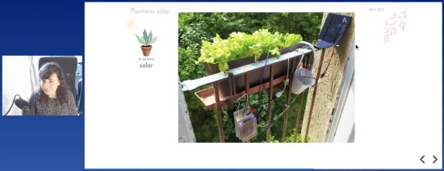

View this email in your browser.

Here's the latest Python on Microcontrollers newsletter, brought you by the community! We're on [Discord](https://discord.gg/HYqvREz), [Twitter](https://twitter.com/search?q=circuitpython&src=typed_query&f=live), and for past newsletters - [view them all here](https://www.adafruitdaily.com/category/circuitpython/). If you're reading this on the web, [subscribe here](https://www.adafruitdaily.com/). On to the news:

## CircuitPython Day 2021 is Friday!

**This is the week celebrating CircuitPython! CircuitPython will be featured by Adafruit all week.**

**Planned Events:**

- 11 am US Eastern Time (1500 UTC): Tim C (foamyguy) streams work on CircuitPython - [YouTube](https://www.youtube.com/watch?v=ED0luF_q3ec) and [Twitch](https://www.twitch.tv/foamyguy_twitch).
- 1 pm US Eastern Time (1700 UTC): Reddit Ask Me anything (AMA) with r/Python and the developers of CircuitPython - [Reddit](https://www.reddit.com/r/Python/).
- 1 pm US Eastern Time (1700 UTC): Jeff, Dan and Kattni Discuss CircuitPython
- 3 pm US Eastern Time (1900 UTC): A CircuitPython Board Tour with Ladyada - [YouTube Live](https://www.youtube.com/watch?v=UwGtmSZkm2c)
- 5 pm US Eastern Time (2100 UTC): Scott’s CircuitPython Day Deep Dive

For Adafruit streams without a link, monitor social media like Twitter for the links to join.

If you or your organization is celebrating CircuitPython Day, let Adafruit know with the hashtag #CircuitPythonDay2021 - [Adafruit Blog](https://blog.adafruit.com/2021/07/27/circuitpython-day-2021-is-on-august-6-2021-video-circuitpythonday2021-circuitpython-python/).

Rick Leander is offering 75% off his Kindle eBook, '[Ten Games for the Circuit Playground Express](https://www.amazon.com/gp/product/B08WF7VC8N/ref=dbs_a_def_rwt_hsch_vapi_tkin_p1_i0)'. Download the book for $0.99 all weekend August 6-8 - [Twitter](https://twitter.com/leander_rick/status/1420402392579788803).

## A Special Adafruit Show & Tell Wednesday

Wednesday, 7:30 PM US Eastern Time, a special live Show & Tell stream inviting everyone to demonstrate their CircuitPython projects as part of CircuitPython Day 2021 - [How to Join](https://learn.adafruit.com/show-and-tell).

## Reddit Ask Me Anything (AMA) with r/Python and the Developers of CircuitPython

Join in an AMA with the developers of CircuitPython on August 6th (CircuitPython Day) at about 17:00 UTC / 1pm US Eastern time.

Wednesday, Reddit is hosting an AMA with some of the developers for [CircuitPython](https://circuitpython.readthedocs.io) - a version of Python for microcontrollers - on August 6, [CircuitPython Day](https://blog.adafruit.com/2021/07/27/circuitpython-day-2021-is-on-august-6-2021-video-circuitpythonday2021-circuitpython-python/). CircuitPython is a beginner focused fork of [MicroPython](https://micropython.org/) which is a smaller Python implementation for microcontrollers..

Guests will be u/tannewt, u/kattni, u/ptorrone, and u/dhalbert. They'll be popping in to answer some questions as the day goes by.

Thursday Night there will be a sticky post in [r/Python](https://www.reddit.com/r/Python/) made for the AMA where you can begin asking your questions in the comment section.

[Reddit Information](https://www.reddit.com/r/Python/comments/ove20j/join_us_for_an_ama_with_the_developers_of_circuit/) and [Reddit r/python](https://www.reddit.com/r/Python/) (look for a pinned thread starting Thursday to enter your questions).

## EuroPython and PyOhio Conclude

Two of the largest yearly Python gatherings have just concluded: EuroPython 2021 and PyOhio 2021. Results and talks should be posted online in coming days. It is suggested that you follow the conference official Twitter feeds for material availability updates - [EuroPython](https://twitter.com/europython) and [PyOhio](https://twitter.com/PyOhio).

PyOhio Talk Playlist - [YouTube](https://www.youtube.com/playlist?list=PL2k6bbM_wgjtUqPImL1OChaD2TQw8ERuy).

A PyOhio talk of note: Basics of Hardware with a PyRuler by Kira Hartlage - [YouTube](https://www.youtube.com/watch?v=fZpZ1pc8Kpk), code on [GitHub](https://github.com/kirakirakira/python-hardware-pyruler).

And at EuroPython, [María José Molina-Contreras](https://twitter.com/MJ_BIO) presented her solar-powered plant watering system and cute cleaning robots made with a Circuit Playground Express and CircuitPython - [EuroPython](https://ep2021.europython.eu/talks/C5zGPwk-diy-home-automation-with-microcontrollers-and-circuitpython/).

## Now available: TI-84 Plus CE Python graphing calculator

The new TI-84 Plus CE Python Graphing Calculator by Texas Instruments is now available for purchase in the United States (it’s already on sale in Europe). The calculator runs a fork of CircuitPython on a dedicated Atmel processor inside - [Adafruit Blog](https://blog.adafruit.com/2021/07/29/the-ti-84-plus-ce-python-edition-now-on-sale-in-the-us-python-calculator-txinstruments/).

## CircuitPython Deep Dive Stream with Scott Shawcroft

[This week](https://youtu.be/CrqZKgXoxzY), join Scott as he answers questions and talks about 7.0.0 fixes.

You can see the latest video and past videos on the Adafruit YouTube channel under the Deep Dive playlist - [YouTube](https://www.youtube.com/playlist?list=PLjF7R1fz_OOXBHlu9msoXq2jQN4JpCk8A).

## News from around the web!

Rust ported to Espressif chips - [mabez.dev](https://mabez.dev/blog/posts/esp-rust-espressif/).

Microsoft CEO accidentally underplays GitHub's pervasiveness - [TechRepublic](https://www.techrepublic.com/article/microsoft-ceo-accidentally-underplays-githubs-pervasiveness/).

Testing code for turning an Adafruit Macropad into Kruise Control for KiCad. Rotary encoder under thumb for layer, trace width, or grid size - [Twitter](https://twitter.com/talldarknweirdo/status/1421593738002960386).

Become Obi Wan with an Arduino Nano RP2040 Connect. Easy to get CircuitPython running with sound and an Adafruit STEMMA QT gesture sensor - [Twitter](https://twitter.com/gallaugher/status/1421619249018179589).

Adding Digital I/O To Your CircuitPython Compatible Board: Part 3 – The MCP23017 - [Woolsey Workshop](https://www.woolseyworkshop.com/2021/07/28/adding-digital-io-to-your-circuitpython-compatible-board-part-3-the-mcp23017/).

> Button box I built recently using a QT Py RP2040, a bunch of arcade buttons, and programmed with CircuitPython. I've been using it to compile/run my code and other programming-related tasks. These chonky buttons are very satisfying to mash - [Twitter](https://twitter.com/aaron_pendley/status/1420036257506267136).

Display Covid-19 data using Maker Raspberry Pi Pico and CircuitPython - [Twitter](https://twitter.com/cytrontech/status/1420292945618644993).

A game on the Adafruit MacroPad using CircuitPython - [Twitter](https://twitter.com/coryflucas/status/1420208012422258691) and [GitHub](https://github.com/coryflucas/macro-whack).

Slurping Adafruit MacroPad key events into an array in CircuitPython to handle as data - [Twitter](https://twitter.com/lindes/status/1419743421078523904).

> I opened a Github where I put all my code for the Solderparty Keyboard FeatherWing (CircuitPython). I hope this will help you coding marvelous things with it. Some libs are customised - [Twitter](https://twitter.com/BeBoXoS/status/1419997238173044754) and [GitHub](https://twitter.com/BeBoXoS/status/1419997238173044754).

p5x.js macros laid out on an Adafruit MacroPad! Cut, copy, paste, comment, save, run, (), [], conditional, for loop, class construction, and color palette statement all at ones LED-lit fingertips when using the web editor - [Twitter](https://twitter.com/MrReuland/status/1421489290924675076).

MacroPact - a Raspberry Pi Pico KMK powered macropad with IPS screen - [GitHub](https://github.com/kbjunky/MacroPact).

Parallax offers a pre-engineering curriculum on using micro:bit with MicroPython - "What’s a Microcontroller? with micro:bit and Python Curriculum Ready for Fall 2021 Class Adoption!" - [Parallax](https://www.parallax.com/whats-a-microcontroller-with-microbit-and-python-curriculum-ready-for-fall-2021-class-adoption/).

Running MicroPython on a micro:bit to calculate distance via the accelerometer - [Our Thoughts on Science Blog](https://stormappsonline.co.uk/blog/2021/07/19/week-2-meet-the-accelerometers/) and [Twitter](https://twitter.com/stormeducation/status/1417197989685256201).

PicoPew running Imagilabs code on MicroPython at EuroPython - [Twitter](https://twitter.com/isziaui/status/1420754882395443209).

Making a simple programming language (simpler than Python, simpler even than BASIC or TinyBASIC) on a micro:bit with MicroPython - [Blog My Wiki](http://www.suppertime.co.uk/blogmywiki/2021/07/simple-text-language/).

> We live on the flight path for Glasgow airport, so I've hooked up an Raspberry Pi to an Adafruit display and used the Flightradar24 API to notify me with whatever I can hear overhead - [Twitter](https://twitter.com/CBotDev/status/1421075469282254849).

Tinkerstellar is an iPad app that helps one learn coding and data science with interactive tutorials (or labs), where one can edit and run code examples (like Python) straight away — no need to configure environments, download datasets or rely on networking connection to execute code - [Tinkerstellar](https://tinkerstellar.com/).

Dynamically Generate GitHub Stats as like Terminal Interface With Python - [Python Awesome](https://pythonawesome.com/dynamically-generate-github-stats-as-like-terminal-interface-with-python/) and [Twitter](https://twitter.com/Python_News/status/1420365054092906496).

Text2Code for Jupyter notebook - [GitHub](https://github.com/deepklarity/jupyter-text2code).

A free digital photograph metadata editing app build with Python - [Python Awesome](https://pythonawesome.com/a-free-digital-photograph-metadata-editing-app-build-with-python/) and [Twitter](https://twitter.com/Python_News/status/1419987407240314880).

Writing Clean Code in Python - [testdriven.io](https://testdriven.io/blog/clean-code-python/).

Join the Mouse vs. Python Slack for community - [Slack](https://mousevspython.slack.com/join/shared_invite/zt-tlkuvg5g-gctKUuvjcQdrvMevh48wJQ#/shared-invite/email).

PyDev of the Week: Patrick Loeber on [Mouse vs Python](https://www.blog.pythonlibrary.org/2021/08/02/pydev-of-the-week-patrick-loeber/)

CircuitPython Weekly Meeting for July 6th, 2020 ([notes](https://github.com/adafruit/adafruit-circuitpython-weekly-meeting/blob/main/2021/2021-08-02.md)) [on YouTube](https://youtu.be/kAgmokcT1gk)

#ICYDNCI What was the most popular, most clicked link, in [last week's newsletter](https://www.adafruitdaily.com/2021/07/27/python-on-microcontrollers-newsletter-europython-2021-circuitpython-7-0-0-alpha-5-and-more-python-adafruit-circuitpython-micropython-thepsf/)? [CircuitPython bandwidth shootout](https://tinyletter.com/jamesbowman/letters/circuitpython-bandwidth-shootout).

## Coming soon

Work in progress: writing a little gamelet for MacroPad, using it sideways. Catch dragon eggs, avoid fire - [Twitter](https://twitter.com/PaintYourDragon/status/1421549000684052480).

An Adafruit IS31FL3741 13x9 2mm RGB LED Matrix STEMMA QT Breakout is coming soon - [Twitter](https://twitter.com/adafruit/status/1422266539378716674).

## New Boards Supported by CircuitPython

The number of supported microcontrollers and Single Board Computers (SBC) grows every week. This section outlines which boards have been included in CircuitPython or added to [CircuitPython.org](https://circuitpython.org/).

This week, there were no new boards added.

Looking to add a new board to CircuitPython? It's highly encouraged! Adafruit has four guides to help you do so:

- [How to Add a New Board to CircuitPython](https://learn.adafruit.com/how-to-add-a-new-board-to-circuitpython/overview)
- [How to add a New Board to the circuitpython.org website](https://learn.adafruit.com/how-to-add-a-new-board-to-the-circuitpython-org-website)
- [Adding a Single Board Computer to PlatformDetect for Blinka](https://learn.adafruit.com/adding-a-single-board-computer-to-platformdetect-for-blinka)
- [Adding a Single Board Computer to Blinka](https://learn.adafruit.com/adding-a-single-board-computer-to-blinka)

## New Learn Guides!

[NeoKey Emoji Keyboard](https://learn.adafruit.com/neokey-emoji-keyboard) from [Liz Clark](https://learn.adafruit.com/users/BlitzCityDIY)

[MacroPad Summer Olympics Hotkeys](https://learn.adafruit.com/macropad-olympic-hotkeys) from [Isaac Wellish](https://learn.adafruit.com/users/isaacwellish)

[Adafruit NeoKey 5x6 Ortho Snap-Apart](https://learn.adafruit.com/adafruit-neokey-5x6-ortho-snap-apart) from [Kattni](https://learn.adafruit.com/users/kattni)

[AdaBox 019](https://learn.adafruit.com/adabox019) from [John Park](https://learn.adafruit.com/users/johnpark)

## CircuitPython Project Bundle

When you get to the CircuitPython code section of an [Adafruit Learn Guide](https://learn.adafruit.com/), sometimes things can get a bit complicated. You not only have the code you need to upload to your device, but you likely also need to add some libraries that the code requires to run. This involved downloading all the libraries, digging through to find the ones you need, and copying them to your device. That was only the beginning on some projects, as those that include images and/or sound files required further downloading and copying of files. But, not anymore!

Now, with Project Bundles, you can download all the necessary code, libraries and, if needed, asset files with one click! We automatically check which libraries are required for the project and bundle them up for you. No more digging through a huge list of libraries to find the ones you need, or fiddling with looking for other files or dependencies. Download the Project Bundle, copy the contents to your device, and your code will simply work. We wanted to make this the easiest way to get a project working, regardless of whether you're a beginner or an expert. We'll also be adding this feature to popular IDEs as an add-on. Try it out with any Circuit Python guide on the Adafruit Learning System. Just look for the ‘Download Project Bundle’ button on the code page. 

**To download and use a Project Bundle:**

In the Learning System - above any embedded code in a guide in the Adafruit Learn System, you’ll find a Download Project Bundle button.

Click the button to download the Project Bundle zip.

Open the Project Bundle zip to find the example code, all necessary libraries, and, if available, any images, sounds, etc.

Simply copy all the files over to your CIRCUITPY drive, and you’re ready to go!

If you run into any problems or bugs, or would like to submit feedback, please file an issue on the [Adafruit Learning System Guides GitHub repo](https://github.com/adafruit/Adafruit_Learning_System_Guides/issues).

## CircuitPython Libraries!

CircuitPython support for hardware continues to grow. We are adding support for new sensors and breakouts all the time, as well as improving on the drivers we already have. As we add more libraries and update current ones, you can keep up with all the changes right here!

For the latest libraries, download the [Adafruit CircuitPython Library Bundle](https://circuitpython.org/libraries). For the latest community contributed libraries, download the [CircuitPython Community Bundle](https://github.com/adafruit/CircuitPython_Community_Bundle/releases).

If you'd like to contribute, CircuitPython libraries are a great place to start. Have an idea for a new driver? File an issue on [CircuitPython](https://github.com/adafruit/circuitpython/issues)! Have you written a library you'd like to make available? Submit it to the [CircuitPython Community Bundle](https://github.com/adafruit/CircuitPython_Community_Bundle). Interested in helping with current libraries? Check out the [CircuitPython.org Contributing page](https://circuitpython.org/contributing). We've included open pull requests and issues from the libraries, and details about repo-level issues that need to be addressed. We have a guide on [contributing to CircuitPython with Git and Github](https://learn.adafruit.com/contribute-to-circuitpython-with-git-and-github) if you need help getting started. You can also find us in the #circuitpython channel on the [Adafruit Discord](https://adafru.it/discord).

You can check out this [list of all the Adafruit CircuitPython libraries and drivers available](https://github.com/adafruit/Adafruit_CircuitPython_Bundle/blob/master/circuitpython_library_list.md). 

The current number of CircuitPython libraries is **329**!

**New Libraries!**

Here's this week's new CircuitPython libraries:

* [Adafruit_CircuitPython_SCD4X](https://github.com/adafruit/Adafruit_CircuitPython_SCD4X)

**Updated Libraries!**

Here's this week's updated CircuitPython libraries:

 * [Adafruit_CircuitPython_DisplayIO_SH1106](https://github.com/adafruit/Adafruit_CircuitPython_DisplayIO_SH1106)
 * [Adafruit_CircuitPython_Display_Shapes](https://github.com/adafruit/Adafruit_CircuitPython_Display_Shapes)
 * [Adafruit_CircuitPython_PyBadger](https://github.com/adafruit/Adafruit_CircuitPython_PyBadger)
 * [Adafruit_CircuitPython_CursorControl](https://github.com/adafruit/Adafruit_CircuitPython_CursorControl)
 * [Adafruit_CircuitPython_MLX90640](https://github.com/adafruit/Adafruit_CircuitPython_MLX90640)
 * [Adafruit_CircuitPython_Wiznet5k](https://github.com/adafruit/Adafruit_CircuitPython_Wiznet5k)
 * [Adafruit_CircuitPython_Debug_I2C](https://github.com/adafruit/Adafruit_CircuitPython_Debug_I2C)
 * [Adafruit_CircuitPython_CircuitPlayground](https://github.com/adafruit/Adafruit_CircuitPython_CircuitPlayground)
 * [Adafruit_CircuitPython_DisplayIO_Layout](https://github.com/adafruit/Adafruit_CircuitPython_DisplayIO_Layout)
 * [Adafruit_CircuitPython_CLUE](https://github.com/adafruit/Adafruit_CircuitPython_CLUE)
 * [Adafruit_CircuitPython_ESP_ATcontrol](https://github.com/adafruit/Adafruit_CircuitPython_ESP_ATcontrol)
 * [Adafruit_CircuitPython_GFX](https://github.com/adafruit/Adafruit_CircuitPython_GFX)
 * [Adafruit_CircuitPython_HID](https://github.com/adafruit/Adafruit_CircuitPython_HID)
 * [Adafruit_CircuitPython_Simple_Text_Display](https://github.com/adafruit/Adafruit_CircuitPython_Simple_Text_Display)
 * [Adafruit_CircuitPython_MacroPad](https://github.com/adafruit/Adafruit_CircuitPython_MacroPad)
 * [Adafruit_Blinka](https://github.com/adafruit/Adafruit_Blinka)
 * [CircuitPython_Community_Bundle](https://github.com/adafruit/CircuitPython_Community_Bundle)

## What’s the team up to this week?

What is the team up to this week? Let’s check in!

**Dan**

CircuitPython 7 is dropping `gamepad` in favor of `keypad`. Kattni, FoamyGuy, and I worked on a transition strategy, because there is not room in the smallest builds to have both. We were able to drop some little-used functionality in a couple of libraries, and change others to work on both CircuitPython 6 and 7.

I have been working on and off on audio-playing problems on the RP2040, which also show up in different ways on some other ports. I believe I have finally started to make progress on this set of issues, after creating a systematic set of tests.

I am also working on some `usb_hid` API changes for CircuitPython 7. When these are done, the API changes we have planned for 7 will be done, and we can start doing beta releases.

**Jeff**

Another camera week!  I'm working on a demo to take upload the JPEG image from an OV2640 camera to Adafruit IO.

In the core, I added a section at the top of each built-in module listing the boards that include the module, instead of requiring a visit to a separate page to check.

**Kattni**

This week I published the [NeoKey Ortho Snap-Apart guide](https://learn.adafruit.com/adafruit-neokey-5x6-ortho-snap-apart). This guide has everything you need to get started working with your NeoKey Snap key matrix including overview, pinouts details and download resources. It also has examples for both Arduino and CircuitPython, including detailed wiring diagrams. 

I also updated the [MacroPad RP2040 guide](https://learn.adafruit.com/adafruit-macropad-rp2040/macropad-circuitpython-library) to have documentation about the Adafruit CircuitPython MacroPad library including basics, display text, display image, rotation, playing a tone, keyboard and mouse, and MIDI examples. The MacroPad library makes working with the MacroPad super simple, and the guide now has everything you need to know about using the library. Check it out!

**Melissa**

This past week, I wrapped up the WebSerial ESPTool improvements I made, but was unable to get the stub code for the ESP32 functioning at the faster speeds, which is what I originally wanted to do. After that I ported the keypad module from CircuitPython to Blinka and ended up doing a full implementation. It has been merged in and is ready for use. Usage information with the NeoKey Ortho and Snap Apart keys should be coming soon, but the [example code for CircuitPython](https://learn.adafruit.com/adafruit-neokey-5x6-ortho-snap-apart/circuitpython) just needs the pins changed to the appropriate Raspberry Pi pins and it should just work.

**Scott**

This week I've continued squashing bugs for 7.0.0. Here it is:
* Fix CTRL-C on ESP when fake deep sleeping.
* Fixed a crash on ESP32-S2 when true deep sleeping.
* Fix nRF time alarms after the first fake deep sleep.
* Switched all ports to the new PulseOut(pin, frequency, duty_cycle) API.
* Fixed pin in use tracking on STM32 for PulseOut.
* Fixed RP2040 PulseOut
* Fixed Arduino RP2040 flash size. (Back up your files and then erase it if you've already got it setup.)
* Added support for multiple status RGB LEDs. Playground boards will now blink all of the neopixels.
* Got rid of all OSError(0)'s on ESP32-S2 and removed the older network modules.

Next I'm going to take a crack at the nRF bug that hung me up a week ago or so. It'll bring me back into nRF land.

## Upcoming events!

PyConline AU will be held 10-12 September, 2021 - [pyconlineau](https://2021.pycon.org.au/)

Kiwi PyCon XI, Ōtautahi Christchurch, 17th, 18th, & 19th of September 2021 and CFP ends July 16th - [python.nz](https://python.nz/kiwipycon).

**Send Your Events In**

As for other events, with the COVID pandemic, most in-person events are postponed or cancelled. If you know of virtual events or events that may occur in the future, please let us know on Discord or on Twitter with hashtag #CircuitPython.

## Latest releases

CircuitPython's stable release is [6.3.0](https://github.com/adafruit/circuitpython/releases/latest) and its unstable release is [7.0.0-alpha.5](https://github.com/adafruit/circuitpython/releases). New to CircuitPython? Start with our [Welcome to CircuitPython Guide](https://learn.adafruit.com/welcome-to-circuitpython).

[20210731](https://github.com/adafruit/Adafruit_CircuitPython_Bundle/releases/latest) is the latest CircuitPython library bundle.

[v1.16](https://micropython.org/download) is the latest MicroPython release. Documentation for it is [here](http://docs.micropython.org/en/latest/pyboard/).

[3.9.6](https://www.python.org/downloads/) is the latest Python release. The latest pre-release version is [3.10.0b4](https://www.python.org/download/pre-releases/).

[2,525 Stars](https://github.com/adafruit/circuitpython/stargazers) Like CircuitPython? [Star it on GitHub!](https://github.com/adafruit/circuitpython)

## Call for help -- Translating CircuitPython is now easier than ever!

One important feature of CircuitPython is translated control and error messages.

With the help of fellow open source project [Weblate](https://weblate.org/), we're making it even easier to add or improve translations.

Sign in with an existing account such as GitHub, Google or Facebook and start contributing through a simple web interface. No forks or pull requests needed!

As always, if you run into trouble join us on [Discord](https://adafru.it/discord), we're here to help.

## jobs.adafruit.com - Find a dream job, find great candidates!

[jobs.adafruit.com](https://jobs.adafruit.com/) has returned and folks are posting their skills (including CircuitPython) and companies are looking for talented makers to join their companies - from Digi-Key, to Hackaday, Micro Center, Raspberry Pi and more.

**Job of the Week**

Software Developer - C, C++, Python, Arduino - Light Pong - [Adafruit Jobs Board](https://jobs.adafruit.com/job/software-developer-c-c-python-arduino/).

## 30,246 thanks!

The Adafruit Discord community, where we do all our CircuitPython development in the open, reached over 30,246 humans, thank you!  Adafruit believes Discord offers a unique way for CircuitPython folks to connect. Join today at [https://adafru.it/discord](https://adafru.it/discord).

## ICYMI - In case you missed it

The wonderful world of Python on hardware! This is our Python video-newsletter-podcast! The news comes from the Python community, Discord, Adafruit communities and more and is reviewed on ASK an ENGINEER Wednesdays. The complete Python on Hardware weekly videocast [playlist is here](https://www.youtube.com/playlist?list=PLjF7R1fz_OOXRMjM7Sm0J2Xt6H81TdDev). 

This video podcast is on [iTunes](https://itunes.apple.com/us/podcast/python-on-hardware/id1451685192?mt=2), [YouTube](http://adafru.it/pohepisodes), [IGTV (Instagram TV](https://www.instagram.com/adafruit/channel/)), and [XML](https://itunes.apple.com/us/podcast/python-on-hardware/id1451685192?mt=2).

[Weekly community chat on Adafruit Discord server CircuitPython channel - Audio / Podcast edition](https://itunes.apple.com/us/podcast/circuitpython-weekly-meeting/id1451685016) - Audio from the Discord chat space for CircuitPython, meetings are usually Mondays at 2pm ET, this is the audio version on [iTunes](https://itunes.apple.com/us/podcast/circuitpython-weekly-meeting/id1451685016), Pocket Casts, [Spotify](https://adafru.it/spotify), and [XML feed](https://adafruit-podcasts.s3.amazonaws.com/circuitpython_weekly_meeting/audio-podcast.xml).

And lastly, we are working up a one-spot destination for all things podcast-able here - [podcasts.adafruit.com](https://podcasts.adafruit.com/)

## Contribute!

The CircuitPython Weekly Newsletter is a CircuitPython community-run newsletter emailed every Tuesday. The complete [archives are here](https://www.adafruitdaily.com/category/circuitpython/). It highlights the latest CircuitPython related news from around the web including Python and MicroPython developments. To contribute, edit next week's draft [on GitHub](https://github.com/adafruit/circuitpython-weekly-newsletter/tree/gh-pages/_drafts) and [submit a pull request](https://help.github.com/articles/editing-files-in-your-repository/) with the changes. You may also tag your information on Twitter with #CircuitPython. 

Join our [Discord](https://adafru.it/discord) or [post to the forum](https://forums.adafruit.com/viewforum.php?f=60) for any further questions.
