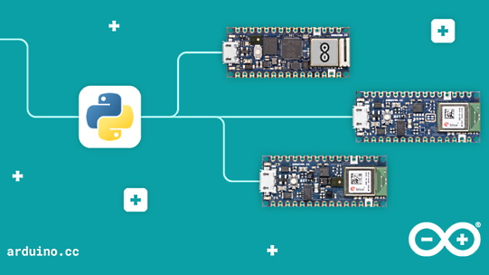
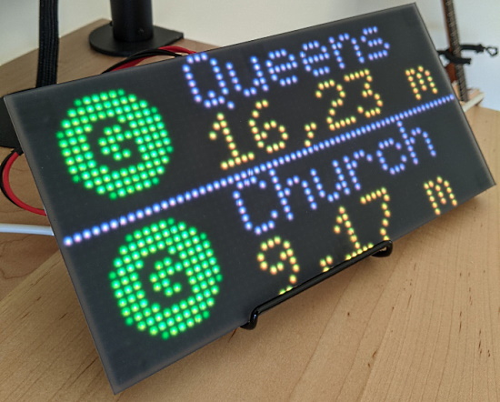
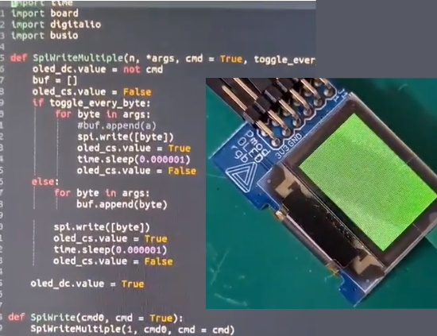
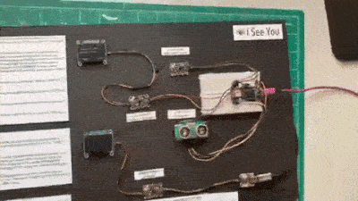
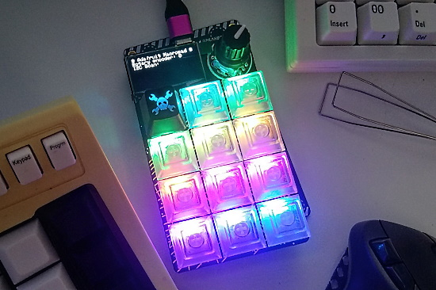
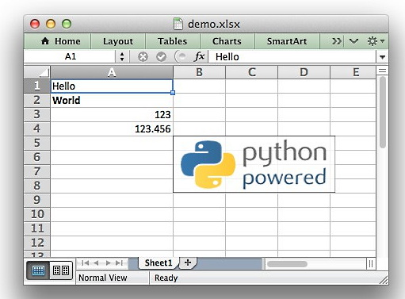
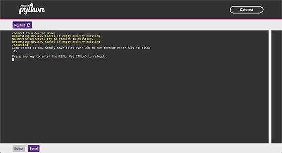

View this email in your browser.

As we head in the back to school season, we present this week's Python on Microcontrollers newsletter! We're on [Discord](https://discord.gg/HYqvREz), [Twitter](https://twitter.com/search?q=circuitpython&src=typed_query&f=live), and for past newsletters - [view them all here](https://www.adafruitdaily.com/category/circuitpython/). If you're reading this on the web, [subscribe here](https://www.adafruitdaily.com/). Here are this week's headlines:

## Building With CircuitPython Podcast

The Real Python Podcast presents *Building With CircuitPython & Constraints of Python for Microcontrollers with the lead developer of CircuitPython* with Scott Shawcroft at Adafruit - [Real Python Podcast](https://realpython.com/podcasts/rpp/75/).  

> Can you make a version of Python that fits within the memory constraints of a microcontroller and have it still feel like Python? That is the intention behind CircuitPython. This week on the show, we have Scott Shawcroft, who is the project lead for CircuitPython.    
We talk about all things CircuitPython. While working with the language on several projects I have developed many of my own questions to ask Scott. Scott answers my questions about boot loaders, packages, the bundle, and bluetooth low energy (BLE).    
He also talks about the struggle of fitting the language and board specific libraries within tiny memory constraints. We discuss projects and boards for beginners, and many resources to learn more.

## Linux Turns 30

On August 25th, Linux, the ubiquitous operating system, turned thirty years old, dated from a post graduate student Linus Torvalds posted on the comp.os.minix newsgroup.  - [Adafruit Blog](https://blog.adafruit.com/2021/08/25/linux-is-30-years-old-today-linux-opensource-linus__torvalds/).

Linux turns 30: Linus Torvalds on his "just a hobby" operating system, an interview with Linus Torvalds - [ZDNet](https://www.zdnet.com/article/linus-torvalds-on-linuxs-30th-birthday/).

## Arduino Embraces Python

Power of Python for Arduino Nano RP2040 Connect and Nano 33 BLE - [Arduino Blog](https://blog.arduino.cc/2021/08/24/power-of-python-for-arduino-nano-rp2040-connect-and-nano-33-ble/) and the [Adafruit Blog](https://blog.adafruit.com/2021/08/24/python-snakes-its-way-to-the-arduino-nano-rp2040-connect-and-nano-33-ble/).

> Python support for three of the hottest Arduino boards out there is now yours. Through our partnership with OpenMV, the Nano RP2040 Connect, Nano 33 BLE and Nano 33 BLE Sense can now be programmed with the popular MicroPython language.

## Halloween Hackfest

Join Hackaday, Digi-Key, and Adafruit for a Halloween-themed contest! They want to see your crazy, creepy, ghostly, spooky, and awesome projects. 

If costumes are your favorite part of Halloween, then why not dress up your outfit with some hacked upgrades? You could even design a ghoulish prop to add to your home’s Halloween decor or light up a Jack-o-lantern with LEDs. Whether it’s technical, artistic, or just plain terrifying, Hackaday wants to see your projects!

Check out the Halloween Show & Tell with Hackaday, Friday, October 29th at 1pm PT, to show off your awesome projects entered in the contest. Don't forget to also share your projects on social media and use the #HalloweenHackfest!

Hackaday and Digi-Key have partnered on this Halloween-themed contest to offer three winners an online shopping spree to the Digi-Key warehouse! - [Hackaday](https://hackaday.com/2021/08/10/new-contest-halloween-hackfest/) and [hackaday.io](https://hackaday.io/contest/180664-halloween-hackfest).

## Ten beginning CircuitPython education courses

Professor John Gallaugher has released 10 new CircuitPython School videos for his Fall course. They are tutorials for beginners. The first videos use the Adafruit Circuit Playground Bluefruit/Express. He states the videos are free to share with educators and newbies.

Check out the [first video](https://www.youtube.com/watch?v=eU1e6xPvZEU&list=PL9VJ9OpT-IPSsQUWqQcNrVJqy4LhBjPX2&index=1) which describes the series and see the [whole playlist](https://www.youtube.com/playlist?list=PL9VJ9OpT-IPSsQUWqQcNrVJqy4LhBjPX2).

## The Python on Microcontrollers Reaches 150 Issues

This is the 150th Python on Microcontrollers Newsletter! A huge thank you to the community and the approximately 9,000 subscriber base for all the support provided over nearly three years! - *Anne Barela, Editor*

## CircuitPython Deep Dive Stream with Scott Shawcroft

 

[This week](https://youtu.be/DQVXNNUGvbk), Scott streams his work on an Epic Memory Bug.

You can see the latest video and past videos on the Adafruit YouTube channel under the Deep Dive playlist - [YouTube](https://www.youtube.com/playlist?list=PLjF7R1fz_OOXBHlu9msoXq2jQN4JpCk8A).

## News from around the web!

Displaying phases of the moon on an Adafruit MagTag in CircuitPython - [Twitter](https://twitter.com/paarhaas/status/1428889954244038656).

The MTA Portal shows the train arrival times for your stations - [Adafruit Blog](https://blog.adafruit.com/2021/08/25/the-mta-portal-shows-the-train-arrival-times-for-your-stations-matrixportal-circuitpython-mta/) and [GitHub](https://github.com/alejandrorascovan/mta-portal/).

A glowy Tic-Tac-Toe game for the Adafruit MacroPad. It has nice RGB Cherry MX style keys and a RP2040 programmed in CircuitPython - [Twitter](https://twitter.com/LukeBerndt/status/1430876919185219590) and [GitHub](https://github.com/robotastic/macropad-tic-tac-toe).

> My Adafruit Pygamer has just been upgraded to CircuitPython 6.3 and Vacuum Invaders from Deshipu still works like a charm! Who said CircuitPython could not be used for video games? - [Twitter](https://twitter.com/titimoby/status/1431248013478010881).

Using Adafruit Blinka and CPython to prototype a driver for a display prior to implementing a native driver for an FPGA - [Twitter](https://twitter.com/splinedrive/status/1431299946096041987).

> Made two versions of thge Noe & Pedro 8x8 display so I could show students Black Acrylic diffusion (right) vs no acrylic (left). Coded in CircuitPython, of course.  From 
the [Adafruit guide](https://learn.adafruit.com/sqaure-neopixel-display-with-black-led-acrylic) - [Twitter](https://twitter.com/gallaugher/status/1430333023652917249).

Using the Solderparty Keyboard FeatherWing and a Feather S2 with CircuitPython. Control brightness of keyboard and screen - [Twitter](https://twitter.com/BeBoXoS/status/1430452374527791106).

Geek Mom Projects has built a linked bracelet in which tiny (10mm x 8mm) metal hinges provide both structural and electronic connections between segments. The controller is an SMT soldered Adafruit QT Py running CircuitPython - [Twitter Thread](https://twitter.com/GeekMomProjects/status/1432402835673546753).

Testing APA102, WS2812 RGB LEDs with Pimoroni Plasma 2040. This was *very* easy thanks to CircuitPython - [Twitter](https://twitter.com/biglesp/status/1430488504522444809).

> A distance and g esture sensor display for outside my office door. Classes start next week and I want the Physical Computing students to be able to compare parts for their projects. All coded in CircuitPython using an orchard of Adafruit devices - [Twitter](https://twitter.com/gallaugher/status/1431670839582334976).

Brandon Satrom will be presenting a talk entitled “Exploring the Wonderful World of Python on Devices” with demos featuring Adafruit CircuitPython, Raspberry Pi Pico with MicroPython and the Blues Wireless Notecard at the [arm DevSummit October 19-21, 2021](https://devsummit.arm.com/en/agenda/2021-10-19) - [Twitter](https://twitter.com/BrandonSatrom/status/1431033505304170501).

Hackaday's Keebin’ with Kristina: *The One with the Index Typewriters* - The New Hotness: Adafruit’s RP2040 MacroPad - [Adafruit Blog](https://blog.adafruit.com/2021/08/26/the-new-hotness-adafruits-rp2040-macropad-keyboards-kristinapanos-hackaday/) and [Hackaday](https://hackaday.com/2021/08/25/keebin-with-kristina-the-one-with-the-index-typewriters/).

PR to add the ability to run MicroPython while having the console over USB - [Twitter](https://twitter.com/xorbit1/status/1431030886443614209) and [GitHub](https://github.com/micropython/micropython/pull/7715).

GitHub CLI 2.0 is out! It includes support for extensions, allowing you to create and share custom commands like: 
💭 `gh user-status` 
🌳 `gh branch` 
🖥️ `gh screensaver`  
More - [GitHub Blog](https://github.blog/2021-08-24-github-cli-2-0-includes-extensions/) and [Twitter](https://twitter.com/github/status/1430204045801758725).

A Python Data Scientist’s Guide to the Apple Silicon Transition - [Anaconda](https://www.anaconda.com/blog/apple-silicon-transition).

A mini Raspberry Pi bartop game machine - [Twitter](https://twitter.com/RealJamHamster/status/1430559837172215812).

Magicbit is a wire-free, modular STEM education platform which runs MicroPython- [CNX Software](https://www.cnx-software.com/2021/08/30/magicbit-is-a-wire-free-modular-stem-education-platform-crowdfunding/) and [YouTube](https://youtu.be/eNzwxEV6CqM).

Automatic Indoor Garden watering with M5Stack and MicroPython - [hackaday.io](https://hackaday.io/project/181255-automatic-indoor-garden-waylay-io).

The Merlin Camera packs a Raspberry Pi to build a Python-powered custom handheld camera - [Twitter](https://twitter.com/Hacksterio/status/1431265875441635333) and [hackster.io](https://www.hackster.io/news/the-merlin-camera-packs-a-raspberry-pi-to-build-a-python-powered-custom-handheld-camera-68a634412443).

Automatically Light Up a Sign When Your Webcam is in Use with Python - [Fedora Magazine](https://fedoramagazine.org/automatically-light-up-a-sign-when-your-webcam-is-in-use/).

Pico8lisp is a small lisp interpreter built on PICO-8 virtual machine! - [lexaaloffle.com](https://www.lexaloffle.com/bbs/?tid=44438).

A Python module for creating Excel XLSX files - [Python Awesome](https://pythonawesome.com/a-python-module-for-creating-excel-xlsx-files/) and [Twitter](https://twitter.com/Python_News/status/1430270161060249601).

MPIRE for Python: MultiProcessing Is Really Easy - an introduction to MPIRE, the lightning-fast and most user-friendly multiprocessing library for Python - [Towards Data Science](https://towardsdatascience.com/mpire-for-python-multiprocessing-is-really-easy-d2ae7999a3e9).

PyDev of the Week: Joshua Ebner [from Mouse vs Python](https://www.blog.pythonlibrary.org/2021/08/30/pydev-of-the-week-joshua-ebner/)

CircuitPython Weekly Meeting for August 30th, 2021 [on YouTube](https://youtu.be/LPPoc_0_Haw) and [notes](https://github.com/adafruit/adafruit-circuitpython-weekly-meeting/blob/main/2021/2021-08-30.md)

**Programming Note for the Discord CircuitPython Weekly Meeting** - Monday September 6th is a US holiday. The meeting will be held Tuesday September 7th, same time, 1 pm Eastern US time.

#ICYDNCI What was the most popular, most clicked link, in [last week's newsletter](https://www.adafruitdaily.com/2021/08/24/python-on-microcontrollers-newsletter-circuitpython-7-0-0-beta-0-halloween-hackfest-and-more-python-adafruit-circuitpython-micropython-thepsf/)? [YouTube video: You need to learn Python RIGHT NOW!](https://www.youtube.com/watch?v=mRMmlo_Uqcs).

## Coming soon

> ESP-Box is our soon to be open sourced 3D printing project with ESP32-S3, dual core processor with AI instructions, 16 MB RAM, WiFi+BLE, LCD touch screen, dual mics for AI speech interface, speakers, 22.4° magic angle aligned docking station - [Twitter](https://twitter.com/EspressifSystem/status/1431970574817890304).

In the thread, Espressif is asked about ESP32-S3 availability and the answer is "Now, Please Write to us (Espressif)".

Unexpected Maker states "My new FeatherS2Neo is getting super close to being let out into the world!" - [Twitter](https://twitter.com/unexpectedmaker/status/1424941583049265155).

## New Boards Supported by CircuitPython

The number of supported microcontrollers and Single Board Computers (SBC) grows every week. This section outlines which boards have been included in CircuitPython or added to [CircuitPython.org](https://circuitpython.org/).

This week, there were six new boards added!

- [EncoderPad RP2040](https://github.com/jpconstantineau/EncoderPad_RP2040)
- [CrumpSpace CrumpS2](https://circuitpython.org/board/crumpspace_crumps2/)
- [PixelWing ESP32-S2 RGB Matrix](https://circuitpython.org/board/odt_pixelwing_esp32_s2/)
- [MorphESP 240](https://circuitpython.org/board/morpheans_morphesp-240/)
- [NodeMCU ESP-12K](https://circuitpython.org/board/ai_thinker_esp_12k_nodemcu/)
- [BeagleV Starlight Beta Prototype](https://circuitpython.org/blinka/beaglev_starlight/)

Looking to add a new board to CircuitPython? It's highly encouraged! Adafruit has four guides to help you do so:

- [How to Add a New Board to CircuitPython](https://learn.adafruit.com/how-to-add-a-new-board-to-circuitpython/overview)
- [How to add a New Board to the circuitpython.org website](https://learn.adafruit.com/how-to-add-a-new-board-to-the-circuitpython-org-website)
- [Adding a Single Board Computer to PlatformDetect for Blinka](https://learn.adafruit.com/adding-a-single-board-computer-to-platformdetect-for-blinka)
- [Adding a Single Board Computer to Blinka](https://learn.adafruit.com/adding-a-single-board-computer-to-blinka)

## New Learn Guides!

There were no new Learn guides this week. Keep an eye out here for more lovely guides next week!

## CircuitPython Project Bundle

When you get to the CircuitPython code section of an [Adafruit Learn Guide](https://learn.adafruit.com/), sometimes things can get a bit complicated. You not only have the code you need to upload to your device, but you likely also need to add some libraries that the code requires to run. This involved downloading all the libraries, digging through to find the ones you need, and copying them to your device. That was only the beginning on some projects, as those that include images and/or sound files required further downloading and copying of files. But, not anymore!

Now, with Project Bundles, you can download all the necessary code, libraries and, if needed, asset files with one click! We automatically check which libraries are required for the project and bundle them up for you. No more digging through a huge list of libraries to find the ones you need, or fiddling with looking for other files or dependencies. Download the Project Bundle, copy the contents to your device, and your code will simply work. We wanted to make this the easiest way to get a project working, regardless of whether you're a beginner or an expert. We'll also be adding this feature to popular IDEs as an add-on. Try it out with any Circuit Python guide on the Adafruit Learning System. Just look for the ‘Download Project Bundle’ button on the code page. 

**To download and use a Project Bundle:**

In the Learning System - above any embedded code in a guide in the Adafruit Learn System, you’ll find a Download Project Bundle button.

Click the button to download the Project Bundle zip.

Open the Project Bundle zip to find the example code, all necessary libraries, and, if available, any images, sounds, etc.

Simply copy all the files over to your CIRCUITPY drive, and you’re ready to go!

If you run into any problems or bugs, or would like to submit feedback, please file an issue on the [Adafruit Learning System Guides GitHub repo](https://github.com/adafruit/Adafruit_Learning_System_Guides/issues).

## CircuitPython Libraries!

CircuitPython support for hardware continues to grow. We are adding support for new sensors and breakouts all the time, as well as improving on the drivers we already have. As we add more libraries and update current ones, you can keep up with all the changes right here!

For the latest libraries, download the [Adafruit CircuitPython Library Bundle](https://circuitpython.org/libraries). For the latest community contributed libraries, download the [CircuitPython Community Bundle](https://github.com/adafruit/CircuitPython_Community_Bundle/releases).

If you'd like to contribute, CircuitPython libraries are a great place to start. Have an idea for a new driver? File an issue on [CircuitPython](https://github.com/adafruit/circuitpython/issues)! Have you written a library you'd like to make available? Submit it to the [CircuitPython Community Bundle](https://github.com/adafruit/CircuitPython_Community_Bundle). Interested in helping with current libraries? Check out the [CircuitPython.org Contributing page](https://circuitpython.org/contributing). We've included open pull requests and issues from the libraries, and details about repo-level issues that need to be addressed. We have a guide on [contributing to CircuitPython with Git and Github](https://learn.adafruit.com/contribute-to-circuitpython-with-git-and-github) if you need help getting started. You can also find us in the #circuitpython channel on the [Adafruit Discord](https://adafru.it/discord).

You can check out this [list of all the Adafruit CircuitPython libraries and drivers available](https://github.com/adafruit/Adafruit_CircuitPython_Bundle/blob/master/circuitpython_library_list.md). 

The current number of CircuitPython libraries is **332**!

**Updated Libraries!**

Here's this week's updated CircuitPython libraries:

 * [Adafruit_CircuitPython_MiniMQTT](https://github.com/adafruit/Adafruit_CircuitPython_MiniMQTT)
 * [Adafruit_CircuitPython_Gizmo](https://github.com/adafruit/Adafruit_CircuitPython_Gizmo)
 * [Adafruit_CircuitPython_IL91874](https://github.com/adafruit/Adafruit_CircuitPython_IL91874)
 * [Adafruit_CircuitPython_SSD1681](https://github.com/adafruit/Adafruit_CircuitPython_SSD1681)
 * [Adafruit_CircuitPython_SSD1608](https://github.com/adafruit/Adafruit_CircuitPython_SSD1608)
 * [Adafruit_CircuitPython_SSD1680](https://github.com/adafruit/Adafruit_CircuitPython_SSD1680)
 * [Adafruit_CircuitPython_Display_Text](https://github.com/adafruit/Adafruit_CircuitPython_Display_Text)
 * [Adafruit_CircuitPython_DisplayIO_Layout](https://github.com/adafruit/Adafruit_CircuitPython_DisplayIO_Layout)
 * [Adafruit_CircuitPython_SCD4X](https://github.com/adafruit/Adafruit_CircuitPython_SCD4X)
 * [Adafruit_CircuitPython_MacroPad](https://github.com/adafruit/Adafruit_CircuitPython_MacroPad)
 * [CircuitPython_Community_Bundle](https://github.com/adafruit/CircuitPython_Community_Bundle)

## What’s the team up to this week?

What is the team up to this week? Let’s check in!

**Dan**

Last week I improved audio playing on SAMD chips, adapting the changes I had made to improve RP2040 audio. The way DMA works on the two chips is quite different, but in the end I was able to figure out how to get the information I needed about which DMA transfer had just completed.

I released CircuitPython 7.0.0-beta.0 on Monday, August 23. Immediately someone found a usb_hid bug for me to fix, but it was quick to find the fix. We expect to be issuing another beta soon. We only have about ten issues to resolve for 7.0.0, down from about two dozen the previous week.

**Jeff**

It's been more bug squashing. In the past week, the bug I was happiest to squash was one which limited the usability of the `microcontroller.nvm` on esp32-s2 boards. Before, the module didn't quite behave the same as on other boards, could only store a few hundred bytes, and you could even get stuck without the ability to update the contents of nvm! now, you can store 8kB and should never get stuck without the ability to update.

The downside is that any nvm settings from 6.3 will be lost when you upgrad to 7.0, and 6.3 won't be able to read settings stored by 7.

**Kattni**

This week I've been working on two guides. One for the SCD-4x CO2 sensors, and one for MP3 playback on RP2040. Expect to see both of those completed very soon. 

Next up after that is updating the INA219 guide for the STEMMA QT revision of the board, and a guide for the PAM8302 amplifier, which won't be out until the MP3 guide is out because the example in that guide will be used in the PAM guide.

I also did a lot of testing with the CO2 sensors to verify they work properly on Raspberry Pi, CircuitPython and Arduino. The sensors work great. My air quality? Apparently not so great.

**Melissa**

This past week I focused on implementing a new interface for the CircuitPython Code Editor. Getting the initial look implemented was pretty straight forward, but learning the intricacies of the JavaScript based controls enough to style and manipulate them has been the bigger challenge. Also, working on a design that functions in both the desktop and mobile environments was a bit challenging as well. It should be in a state for people to play around with soon.

**Scott**

This week I did some testing of the BLE workflow. I made two tweaks to it as a result. First, I changed directory delete to be recursive. This makes it much quicker to delete a non-empty directory. Second, I changed the auto reload to wait after a write so that the BLE client has a chance to start a second command before the BLE connection is reset.

Besides that I've been bug hunting.
* I enabled unicode filename support in CP and tweaked string repr to print emojis instead of escaping them.
* I fixed USB on iMX RT which was broken due to sleeping while we needed to do something for USB.
* I fixed I2C allocation on RP2040 so that pins don't need to be next to one another.
* I added multiple status dotstar support (useful for Funhouse.)
* I fixed an ESP32-S2 crash when using an I2CDisplay.

This next week will be a similar mix of BLE work and bug hunting.

## Upcoming events!

PyConline AU will be held 10-12 September, 2021 - [pyconlineau](https://2021.pycon.org.au/)

Kiwi PyCon XI, Ōtautahi Christchurch, 17th, 18th, & 19th of September 2021 and CFP ends July 16th - [python.nz](https://python.nz/kiwipycon).

PyCon India is the largest gathering of Pythonistas in India for the Python programming language. The 13th edition of PyCon India will be taking place online from 17th September to 20th September 2021 - [PyCon India 2021](https://in.pycon.org/2021/).

PyGotham is a New York City based, eclectic, Py-centric conference covering many topics. [PyGotham TV 2021](https://2021.pygotham.tv/) is an online-only edition of PyGotham being held October 1-2, 2021. The call for proposals is [here](https://cfp.pygotham.tv/). Registration is [here](https://www.eventbrite.com/e/pygotham-tv-2021-tickets-157887556933).

**Send Your Events In**

As for other events, with the COVID pandemic, most in-person events are postponed or cancelled. If you know of virtual events or events that may occur in the future, please let us know on Discord or on Twitter with hashtag #CircuitPython.

## Latest releases

CircuitPython's stable release is [6.3.0](https://github.com/adafruit/circuitpython/releases/latest) and its unstable release is [7.0.0-beta.0](https://github.com/adafruit/circuitpython/releases). New to CircuitPython? Start with our [Welcome to CircuitPython Guide](https://learn.adafruit.com/welcome-to-circuitpython).

[20210827](https://github.com/adafruit/Adafruit_CircuitPython_Bundle/releases/latest) is the latest CircuitPython library bundle.

[v1.16](https://micropython.org/download) is the latest MicroPython release. Documentation for it is [here](http://docs.micropython.org/en/latest/pyboard/).

[3.9.6](https://www.python.org/downloads/) is the latest Python release. The latest pre-release version is [3.10.0rc1](https://www.python.org/download/pre-releases/).

[2,556 Stars](https://github.com/adafruit/circuitpython/stargazers) Like CircuitPython? [Star it on GitHub!](https://github.com/adafruit/circuitpython)

## Call for help -- Translating CircuitPython is now easier than ever!

One important feature of CircuitPython is translated control and error messages.

With the help of fellow open source project [Weblate](https://weblate.org/), we're making it even easier to add or improve translations.

Sign in with an existing account such as GitHub, Google or Facebook and start contributing through a simple web interface. No forks or pull requests needed!

As always, if you run into trouble join us on [Discord](https://adafru.it/discord), we're here to help.

## jobs.adafruit.com - Find a dream job, find great candidates!

[jobs.adafruit.com](https://jobs.adafruit.com/) has returned and folks are posting their skills (including CircuitPython) and companies are looking for talented makers to join their companies - from Digi-Key, to Hackaday, Micro Center, Raspberry Pi and more.

**Job of the Week**

Exhibit Maintenance Technician - [Adafruit Jobs Board](https://jobs.adafruit.com/job/exhibit-maintenance-technician/).

## 30,677 thanks!

The Adafruit Discord community, where we do all our CircuitPython development in the open, reached over 30,677 humans, thank you!  Adafruit believes Discord offers a unique way for CircuitPython folks to connect. Join today at [https://adafru.it/discord](https://adafru.it/discord).

## ICYMI - In case you missed it

The wonderful world of Python on hardware! This is our Python video-newsletter-podcast! The news comes from the Python community, Discord, Adafruit communities and more and is reviewed on ASK an ENGINEER Wednesdays. The complete Python on Hardware weekly videocast [playlist is here](https://www.youtube.com/playlist?list=PLjF7R1fz_OOXRMjM7Sm0J2Xt6H81TdDev). 

This video podcast is on [iTunes](https://itunes.apple.com/us/podcast/python-on-hardware/id1451685192?mt=2), [YouTube](http://adafru.it/pohepisodes), [IGTV (Instagram TV](https://www.instagram.com/adafruit/channel/)), and [XML](https://itunes.apple.com/us/podcast/python-on-hardware/id1451685192?mt=2).

[Weekly community chat on Adafruit Discord server CircuitPython channel - Audio / Podcast edition](https://itunes.apple.com/us/podcast/circuitpython-weekly-meeting/id1451685016) - Audio from the Discord chat space for CircuitPython, meetings are usually Mondays at 2pm ET, this is the audio version on [iTunes](https://itunes.apple.com/us/podcast/circuitpython-weekly-meeting/id1451685016), Pocket Casts, [Spotify](https://adafru.it/spotify), and [XML feed](https://adafruit-podcasts.s3.amazonaws.com/circuitpython_weekly_meeting/audio-podcast.xml).

And lastly, we are working up a one-spot destination for all things podcast-able here - [podcasts.adafruit.com](https://podcasts.adafruit.com/)

## Contribute!

The CircuitPython Weekly Newsletter is a CircuitPython community-run newsletter emailed every Tuesday. The complete [archives are here](https://www.adafruitdaily.com/category/circuitpython/). It highlights the latest CircuitPython related news from around the web including Python and MicroPython developments. To contribute, edit next week's draft [on GitHub](https://github.com/adafruit/circuitpython-weekly-newsletter/tree/gh-pages/_drafts) and [submit a pull request](https://help.github.com/articles/editing-files-in-your-repository/) with the changes. You may also tag your information on Twitter with #CircuitPython. 

Join our [Discord](https://adafru.it/discord) or [post to the forum](https://forums.adafruit.com/viewforum.php?f=60) for any further questions.
