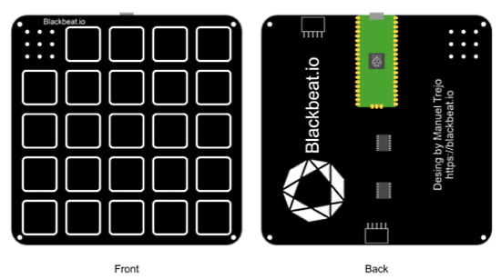
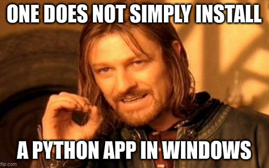
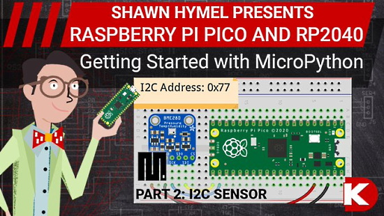
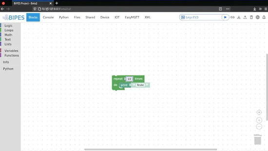
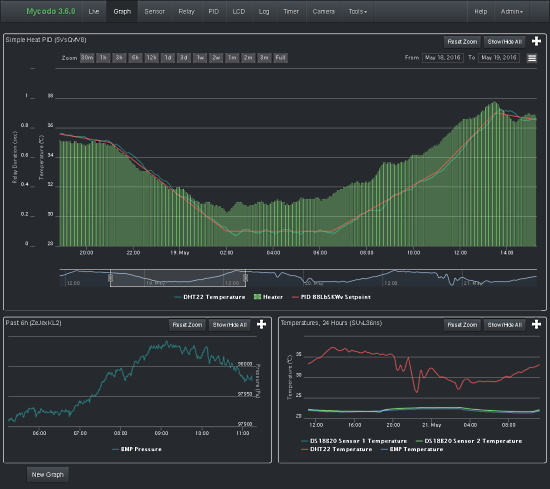
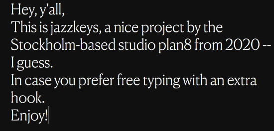
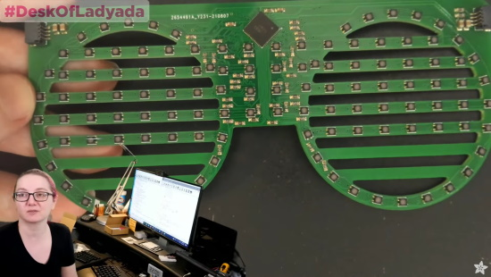
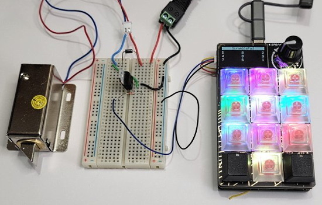

View this email in your browser.

Welcome to the latest Python on Microcontrollers newsletter, brought you by the community! We're on [Discord](https://discord.gg/HYqvREz), [Twitter](https://twitter.com/search?q=circuitpython&src=typed_query&f=live), and for past newsletters - [view them all here](https://www.adafruitdaily.com/category/circuitpython/). If you're reading this on the web, [subscribe here](https://www.adafruitdaily.com/). Let's get started!

## CircuitPython 7.0.0 Release Candidate 1

CircuitPython 7.0.0-rc1, is now available. Release candidate builds mark the final testing of CircuitPython 7 for stable release. It contains only a few issues still to be addressed for 7.0.0. The Python API’s it presents are not expected to change compatibility before the final 7.0.0 release, though they may be augmented.

Notable additions to 7.0.0 since 6.3.0 include:

* Support for the CircuitPython development workflow over BLE.
* Camera support on ESP32-S2.
* `qrio`: QR code decoding.
* The keypad key-scanning module.
* Run-time customization of USB devices.
* Merging in of MicroPython fixes and enhancements as of MicroPython 1.16.
* `_pixelbuf` is now `adafruit_pixelbuf`.
* `colorwheel()` routine moved to `rainbowio`.
* `supervisor.ticks_ms()` to allow easier time-keeping.
* Simplifications to the RGB status LED codes.
* A clocking fix for a few samples of RP2040 boards.
* Rework of `vectorio` and some of its API. `VectorShape` is no longer needed for user code.
* `atexit` module.
* `getpass` module.
* `traceback` module.
* `supervisor.get_previous_traceback()`.
* board.LED now consistently present on all boards that have such an LED.
* `PulseOut` no longer needs a `PWMOut`.
* Unicode filename support.
* Board ID is now in boot_out.txt and available as board.board_id.
* `aesio` on for full builds by default.

More - [GitHub](https://github.com/adafruit/circuitpython/releases).

## MicroPython 1.17 Released

The 1.17 release of MicroPython adds support for f-strings (PEP-498), with a few limitations compared to normal Python. F-strings are essentially syntactic sugar for "".format() and make formatting strings a lot more convenient. Other improvements to the core runtime include pretty printing OSError when it has two arguments (an errno code and a string), scheduling of KeyboardInterrupt on the main thread, and support for a single argument to the optimised form of StopIteration.

In the machine module a new I2S class has been added, with support for esp32 and stm32 ports. This provides a consistent API for transmit and receive of audio data in blocking, non-blocking and asyncio-based operation. Also, the json module has support for the "separators" argument in the dump and dumps functions, and framebuf now includes a way to blit between frame buffers of different formats using a palette. A new, portable machine.bitstream function is also added which can output a stream of bits with configurable timing, and is used as the basis for driving WS2812 LEDs in a common way across ports.

There has been some restructuring of the repository directory layout, with all third-party code now in the lib/ directory. And a new top-level directory shared/ has been added with first-party code that was previously in lib/ moved there.

The docs have seen further improvement with enhancements and additions to the rp2 parts, as well as a new quick reference for the zephyr port. The terms master/slave have been replaced with controller/peripheral, mainly relating to I2C and SPI usage. And u-module references have been replaced with just the module name without the u-prefix to help clear up the intended usage of modules in MicroPython. 

Read More - [GitHub](https://github.com/micropython/micropython/releases/tag/v1.17).

## Play MP3s on Raspberry Pi Pico with CircuitPython 7

Adafruit's Kattni Rembor shows how easy it is to play MP3s on a Raspberry Pi Pico via CircuitPython - [hackster.io](https://www.hackster.io/news/adafruit-s-kattni-rembor-shows-how-easy-it-is-to-play-mp3s-on-a-raspberry-pi-pico-via-circuitpython-f93e7b02956c) and [Adafruit Learning System](https://learn.adafruit.com/mp3-playback-rp2040).

## Halloween Hackfest

Join Hackaday, Digi-Key, and Adafruit for a Halloween-themed contest! They want to see your crazy, creepy, ghostly, spooky, and awesome projects. 

If costumes are your favorite part of Halloween, then why not dress up your outfit with some hacked upgrades? You could even design a ghoulish prop to add to your home’s Halloween decor or light up a Jack-o-lantern with LEDs. Whether it’s technical, artistic, or just plain terrifying, Hackaday wants to see your projects!

Check out the Halloween Show & Tell with Hackaday, Friday, October 29th at 1pm PT, to show off your awesome projects entered in the contest. Don't forget to also share your projects on social media and use the #HalloweenHackfest!

Hackaday and Digi-Key have partnered on this Halloween-themed contest to offer three winners an online shopping spree to the Digi-Key warehouse! - [Hackaday](https://hackaday.com/2021/08/10/new-contest-halloween-hackfest/) and [hackaday.io](https://hackaday.io/contest/180664-halloween-hackfest).

## Python Software Foundation News

Volunteer Opportunities for PyCon US - [Python Software Foundation](https://www.python.org/psf/volunteer/pycon/).

Python 3.9.7 and 3.8.12 are now available - [Python Insider](https://pythoninsider.blogspot.com/2021/08/python-397-and-3812-are-now-available.html).

Python 3.7.12 and 3.6.15 security updates now available - [Python Insider](https://pythoninsider.blogspot.com/2021/09/python-3712-and-3615-security-updates.html).

## CircuitPython Deep Dive Stream with Scott Shawcroft

[This week](link), Scott streams his work on .

You can see the latest video and past videos on the Adafruit YouTube channel under the Deep Dive playlist - [YouTube](https://www.youtube.com/playlist?list=PLjF7R1fz_OOXBHlu9msoXq2jQN4JpCk8A).

## CircuitPython Parsec

John Park’s CircuitPython Parsec: 

* The Color Helper Module - [Adafruit Blog](https://blog.adafruit.com/2021/08/31/john-parks-circuitpython-parsec-color-helper-module-adafruit-johnedgarpark-adafruit-circuitpython/) and [YouTube](https://youtu.be/oif__cjWhOQ).
* List Slices - [Adafruit Blog](https://blog.adafruit.com/2021/09/03/john-parks-circuitpython-parsec-list-slices-adafruit-johnedgarpark-adafruit-circuitpython/) and [YouTube](https://youtu.be/oTdB_06R5UY).

## News from around the web!

CircuitPython and Adafruit MACROPAD RP2040 DJ Controller - [Twitter](https://twitter.com/AoyamaProd/status/1433072647340838912).

Use Adafruit MacroPad for the SpaceX ISS Docking Simulator - [Adafruit Blog](https://blog.adafruit.com/2021/09/03/use-adafruit-macropad-for-the-spacex-iss-docking-simulator-macropad-circuitpython-spacex/), [Reddit](https://www.reddit.com/r/adafruit/comments/pg68cc/macropad_and_the_spacex_iss_docking_simulator/), and [GitHub](https://www.reddit.com/r/adafruit/comments/pg68cc/macropad_and_the_spacex_iss_docking_simulator/).

Video: Getting started with the ATMegaZero ESP32-S2 and CircuitPython - [YouTube](https://youtu.be/QD4pMub2IwI).

Blackboard is a board with 24 capacitive touch pads, 9 LEDs, customizable, using CircuitPython and Raspberry Pi Pico - [Tindie](https://www.tindie.com/products/blackbeat/blackboard/).

Devices Aid Speech for People with Disabilities: two devices that enable people with cerebral palsy to more easily access communication software to create speech. The units are based on the micro:bit and MicroPython - [Circuit Cellar](https://circuitcellar.com/cc-blog/devices-aid-speech-for-people-with-disabilities/).

The Python Superpowers Software Bundle:

> There’s no better time than now to master a new skill and make your computer even more useful! Pick up the awesome programming potential of Python, with software like Mastering PyCharm (2021 Edition), Object-Oriented Programming (OOP) in Python, and PyCharm Professional Edition - 6 months free. Plus, your purchase will support the Python Software Foundation and Women Who Code! - [Humble Bundle](https://www.humblebundle.com/software/python-2021-software).

Distributing Python apps for Windows (and dealing with the pain) - [Necromancer's Notes](https://ncrmnt.org/2021/08/14/distributing-python-apps-for-windows-and-dealing-with-the-pain/).

TI-84 CE Python Edition Review: Wait... when did calculators get sexy? (This calculator incorporates CircuitPython) - [Input Magazine](https://www.inputmag.com/reviews/ti-84-ce-with-python-review-when-did-graphing-calculators-get-sexy/amp).

Hackaday.io has dozens of Python on Microcontroller projects:

- [CircuitPython](https://hackaday.io/projects?tag=circuitpython).
- [MicroPython](https://hackaday.io/projects?tag=micropython).

Raspberry Pi Pico and RP2040 - MicroPython Part 2: I2C Sensor and Module - [maker.io](https://www.digikey.com/en/maker/projects/raspberry-pi-pico-and-rp2040-micropython-part-2-i2c-sensor-and-module/b43e7958153f41fc9e7403df4d626ba5).

A Raspberry Pi Pico Escape Room game in MicroPython - [GitHub](https://github.com/mytechnotalent/Pico-Escape-Room).

Visual MicroPython platform BIPES gets some major upgrades, including a dashboard and Web Bluetooth - [hackster.io](https://www.hackster.io/news/visual-micropython-platform-bipes-gets-some-major-upgrades-including-a-dashboard-and-web-bluetooth-e3393cabb57c) and [Twitter](https://twitter.com/Hacksterio/status/1432832437969735680).

How to use the 74hc595 chip with a Raspberry Pi Pico and MicroPython  - [peppe80](https://peppe8o.com/how-to-use-74hc595-shift-register-with-raspberry-pi-pico-and-micropython/).

Connect and use a DHT11 sensor to Raspberry Pi Pico with MicroPython - [peppe80](https://peppe8o.com/dht11-humidity-and-temperature-sensor-with-raspberry-pi-pico-and-micropython/).

ESP32 and ST7735S 1.4" TFT display with MicroPython - [Twitter](https://twitter.com/Kongduino/status/1431298916423667714).

An Apollo entry guidance implementation in Python - [GitHub](https://github.com/thomasantony/msl-apollo-entry-guidance) and [Twitter](https://twitter.com/PythonWeekly/status/1432765228371021830).

Mycodo: an environmental monitoring and regulation system with Raspberry Pi and Python - [GitHub](https://github.com/kizniche/Mycodo) and [YouTube](https://www.youtube.com/watch?v=z41Wy5ZF4O8).

geoplot: a high-level geospatial data visualization library for Python - [Python Awesome](https://pythonawesome.com/high-level-geospatial-data-visualization-library-for-python/) and [GitHub](https://github.com/ResidentMario/geoplot).

Apple exploring RISC-V, advertising for RISC-V 'High Performance' Programmers - [Tom's Hardware](https://www.tomshardware.com/news/apple-looking-for-risc-v-programmers) and [Adafruit Blog](https://blog.adafruit.com/2021/09/03/apple-exploring-risc-v-advertising-for-risc-v-high-performance-programmers-riscv-apple-tomshardware/).

Write an SQL query builder in 150 lines of Python - [death and gravity](https://death.andgravity.com/query-builder-how).

Snake In The JS Shadow: Run your Python script in nodejs - [dev.to](https://dev.to/addempsea/snake-in-the-js-shadow-run-your-python-script-in-nodejs-im8).

Jazzkeys – music while you are typing - [Adafruit Blog](https://blog.adafruit.com/2021/08/31/jazzkeys-music-while-you-are-free-typing-plan8_music/).

Python behind the scenes: how async/await works in Python - [Ten Thousand Meters](https://tenthousandmeters.com/blog/python-behind-the-scenes-12-how-asyncawait-works-in-python/).

A curated collection of Awesome Python Scripts that will make you go wow - [Python Awesome](https://pythonawesome.com/a-curated-collection-of-awesome-python-scripts-that-will-make-you-go-wow/).

The next Discord meeting will be Tuesday September 7th due to a US holiday. It'll be linked to the next newsletter.

PyDev of the Week: Déborah Mesquita - [Mouse vs. Python](https://www.blog.pythonlibrary.org/2021/09/06/pydev-of-the-week-deborah-mesquita/).

#ICYDNCI What was the most popular, most clicked link, in [last week's newsletter](https://www.adafruitdaily.com/2021/08/31/python-on-microcontrollers-newsletter-arduino-embraces-python-linux-turns-30-and-more-python-adafruit-circuitpython-micropython-thepsf/)? [Power of Python for Arduino Nano RP2040 Connect and Nano 33 BLE](https://blog.arduino.cc/2021/08/24/power-of-python-for-arduino-nano-rp2040-connect-and-nano-33-ble/).

## Coming soon

Desk of Ladyada: LED Glasses - [YouTube](https://www.youtube.com/watch?v=JmZ6pHKRdV8).

The LOLIN S2 Mini is a CircuitPython compatible board based on an ESP32-S2 - [CircuitPython.Org](https://circuitpython.org/board/lolin_s2_mini/).

## New Boards Supported by CircuitPython

The number of supported microcontrollers and Single Board Computers (SBC) grows every week. This section outlines which boards have been included in CircuitPython or added to [CircuitPython.org](https://circuitpython.org/).

This week, there were four new boards added!

- [LOLIN S2 Mini](https://circuitpython.org/board/lolin_s2_mini/)
- [ESP32-S2 Human Machine Interface Dev Kit](https://circuitpython.org/board/espressif_hmi_devkit_1/)
- [LED Glasses](https://circuitpython.org/board/adafruit_led_glasses_nrf52840/)
- [PicoSystem](https://circuitpython.org/board/pimoroni_picosystem/)

Looking to add a new board to CircuitPython? It's highly encouraged! Adafruit has four guides to help you do so:

- [How to Add a New Board to CircuitPython](https://learn.adafruit.com/how-to-add-a-new-board-to-circuitpython/overview)
- [How to add a New Board to the circuitpython.org website](https://learn.adafruit.com/how-to-add-a-new-board-to-the-circuitpython-org-website)
- [Adding a Single Board Computer to PlatformDetect for Blinka](https://learn.adafruit.com/adding-a-single-board-computer-to-platformdetect-for-blinka)
- [Adding a Single Board Computer to Blinka](https://learn.adafruit.com/adding-a-single-board-computer-to-blinka)

## New Learn Guides!

[Scrambled Number Security Keypad](https://learn.adafruit.com/scrambled-number-security-keypad) from [Anne Barela](https://learn.adafruit.com/users/AnneBarela)

[MP3 Playback on RP2040 with CircuitPython](https://learn.adafruit.com/mp3-playback-rp2040) from [Kattni](https://learn.adafruit.com/users/kattni)

[3D Print Ratcatcher 2 Controller Device](https://learn.adafruit.com/3d-print-ratcatcher-2-controller-device-wand) from [Noe and Pedro](https://learn.adafruit.com/users/pixil3d)

[Adafruit SCD-40 and SCD-41](https://learn.adafruit.com/adafruit-scd-40-and-scd-41) from [Kattni](https://learn.adafruit.com/users/kattni)

## CircuitPython Project Bundle

When you get to the CircuitPython code section of an [Adafruit Learn Guide](https://learn.adafruit.com/), sometimes things can get a bit complicated. You not only have the code you need to upload to your device, but you likely also need to add some libraries that the code requires to run. This involved downloading all the libraries, digging through to find the ones you need, and copying them to your device. That was only the beginning on some projects, as those that include images and/or sound files required further downloading and copying of files. But, not anymore!

Now, with Project Bundles, you can download all the necessary code, libraries and, if needed, asset files with one click! We automatically check which libraries are required for the project and bundle them up for you. No more digging through a huge list of libraries to find the ones you need, or fiddling with looking for other files or dependencies. Download the Project Bundle, copy the contents to your device, and your code will simply work. We wanted to make this the easiest way to get a project working, regardless of whether you're a beginner or an expert. We'll also be adding this feature to popular IDEs as an add-on. Try it out with any Circuit Python guide on the Adafruit Learning System. Just look for the ‘Download Project Bundle’ button on the code page. 

**To download and use a Project Bundle:**

In the Learning System - above any embedded code in a guide in the Adafruit Learn System, you’ll find a Download Project Bundle button.

Click the button to download the Project Bundle zip.

Open the Project Bundle zip to find the example code, all necessary libraries, and, if available, any images, sounds, etc.

Simply copy all the files over to your CIRCUITPY drive, and you’re ready to go!

If you run into any problems or bugs, or would like to submit feedback, please file an issue on the [Adafruit Learning System Guides GitHub repo](https://github.com/adafruit/Adafruit_Learning_System_Guides/issues).

## CircuitPython Libraries!

CircuitPython support for hardware continues to grow. We are adding support for new sensors and breakouts all the time, as well as improving on the drivers we already have. As we add more libraries and update current ones, you can keep up with all the changes right here!

For the latest libraries, download the [Adafruit CircuitPython Library Bundle](https://circuitpython.org/libraries). For the latest community contributed libraries, download the [CircuitPython Community Bundle](https://github.com/adafruit/CircuitPython_Community_Bundle/releases).

If you'd like to contribute, CircuitPython libraries are a great place to start. Have an idea for a new driver? File an issue on [CircuitPython](https://github.com/adafruit/circuitpython/issues)! Have you written a library you'd like to make available? Submit it to the [CircuitPython Community Bundle](https://github.com/adafruit/CircuitPython_Community_Bundle). Interested in helping with current libraries? Check out the [CircuitPython.org Contributing page](https://circuitpython.org/contributing). We've included open pull requests and issues from the libraries, and details about repo-level issues that need to be addressed. We have a guide on [contributing to CircuitPython with Git and Github](https://learn.adafruit.com/contribute-to-circuitpython-with-git-and-github) if you need help getting started. You can also find us in the #circuitpython channel on the [Adafruit Discord](https://adafru.it/discord).

You can check out this [list of all the Adafruit CircuitPython libraries and drivers available](https://github.com/adafruit/Adafruit_CircuitPython_Bundle/blob/master/circuitpython_library_list.md). 

The current number of CircuitPython libraries is **333**!

**New Libraries!**

Here's this week's new CircuitPython libraries:

 * [Adafruit_CircuitPython_ST7565](https://github.com/adafruit/Adafruit_CircuitPython_ST7565)

**Updated Libraries!**

Here's this week's updated CircuitPython libraries:

 * [Adafruit_CircuitPython_OV2640](https://github.com/adafruit/Adafruit_CircuitPython_OV2640)
 * [Adafruit_CircuitPython_DisplayIO_SSD1306](https://github.com/adafruit/Adafruit_CircuitPython_DisplayIO_SSD1306)
 * [Adafruit_CircuitPython_DisplayIO_SSD1305](https://github.com/adafruit/Adafruit_CircuitPython_DisplayIO_SSD1305)
 * [Adafruit_CircuitPython_SSD1322](https://github.com/adafruit/Adafruit_CircuitPython_SSD1322)
 * [Adafruit_CircuitPython_DisplayIO_SH1107](https://github.com/adafruit/Adafruit_CircuitPython_DisplayIO_SH1107)
 * [Adafruit_CircuitPython_SSD1325](https://github.com/adafruit/Adafruit_CircuitPython_SSD1325)
 * [Adafruit_CircuitPython_DisplayIO_SH1106](https://github.com/adafruit/Adafruit_CircuitPython_DisplayIO_SH1106)
 * [Adafruit_CircuitPython_BLE](https://github.com/adafruit/Adafruit_CircuitPython_BLE)
 * [Adafruit_CircuitPython_HID](https://github.com/adafruit/Adafruit_CircuitPython_HID)
 * [Adafruit_CircuitPython_SGP40](https://github.com/adafruit/Adafruit_CircuitPython_SGP40)
 * [Adafruit_CircuitPython_DisplayIO_Layout](https://github.com/adafruit/Adafruit_CircuitPython_DisplayIO_Layout)
 * [Adafruit_CircuitPython_MacroPad](https://github.com/adafruit/Adafruit_CircuitPython_MacroPad)
 * [Adafruit_Blinka_Displayio](https://github.com/adafruit/Adafruit_Blinka_Displayio)

## What’s the team up to this week?

What is the team up to this week? Let’s check in!

**Kattni**

This week I published the [SCD-4x guide](https://learn.adafruit.com/adafruit-scd-40-and-scd-41) and the [MP3 Playback on RP2040 using CircuitPython](https://learn.adafruit.com/mp3-playback-rp2040) guide. The first covers using the SCD-40 and SCD-41 CO2 sensors with CircuitPython, and the second one is pretty self-explanatory. I'm currently working on adding a third page to the MP3 guide - a new template for I2S audio. The example in the guide will use the Pico. I2S allows for use of a higher quality external DAC, which means the audio quality can be substantially better.

I also started the update of the INA219 guide for the STEMMA QT rev. The board revision has been out for a while, but the guide hasn't been updated, so I'm working on that as well.

**Melissa**

This past week I worked on the new CircuitPython code editor some more. This mostly was focused on diving into the JavaScript code. You can check out the updated editor at https://code.circuitpython.org.

**Scott**

This week has been more bug hunting and just starting to release the first CircuitPython 7.0.0 release candidate.
* Jeff and I debugged a very weird crash on ESP32-S2. I covered the issue on my [Deep Dive](https://www.youtube.com/watch?v=DQVXNNUGvbk).
* Fixed failing light sleep on nRF when USB serial had pending characters.
* Fixed two crashes when using the watchdog on nRF.
* Fixed a crash on nRF when using external interrupts internally.
* Fixed a race condition with USB startup on RP2040.
* Updated ESP-IDF to a newer version of 4.3.
* Shrunk build sizes by sorting objects when linking to reduce fill bytes.

For BLE workflow I also:
* Made deletes work recursively. Added a reload delay after BLE writes so writing multiple files can be done without needing to reconnect every file.
* Switched the BLE Serial UUIDs to ones custom for CircuitPython.

On top of that, I did many reviews and most of a release. We briefly had 0 open PRs. In the last week, we merged 40 PRs. Things are cruising. Thanks to everyone who contributes to CircuitPython.

## Upcoming events!

PyConline AU will be held 10-12 September, 2021 - [pyconlineau](https://2021.pycon.org.au/)

Kiwi PyCon XI, Ōtautahi Christchurch, 17th, 18th, & 19th of September 2021 and CFP ends July 16th - [python.nz](https://python.nz/kiwipycon).

PyCon India is the largest gathering of Pythonistas in India for the Python programming language. The 13th edition of PyCon India will be taking place online from 17th September to 20th September 2021 - [PyCon India 2021](https://in.pycon.org/2021/).

PyGotham is a New York City based, eclectic, Py-centric conference covering many topics. [PyGotham TV 2021](https://2021.pygotham.tv/) is an online-only edition of PyGotham being held October 1-2, 2021. The call for proposals is [here](https://cfp.pygotham.tv/). Registration is [here](https://www.eventbrite.com/e/pygotham-tv-2021-tickets-157887556933).

PyCon Sweden is back for the 2021 edition on 21-22 October! The conference is now welcoming proposals for talks, workshops, and lightning talks on anything Python-related! - [PyCon Sweden](https://pretalx.com/pycon-sweden-2021/).

**Send Your Events In**

As for other events, with the COVID pandemic, most in-person events are postponed or cancelled. If you know of virtual events or events that may occur in the future, please let us know on Discord or on Twitter with hashtag #CircuitPython.

## Latest releases

CircuitPython's stable release is [6.3.0](https://github.com/adafruit/circuitpython/releases/latest) and its unstable release is [7.0.0.rc.1](https://github.com/adafruit/circuitpython/releases). New to CircuitPython? Start with our [Welcome to CircuitPython Guide](https://learn.adafruit.com/welcome-to-circuitpython).

[20210903](https://github.com/adafruit/Adafruit_CircuitPython_Bundle/releases/latest) is the latest CircuitPython library bundle.

[v1.17](https://micropython.org/download) is the latest MicroPython release. Documentation for it is [here](http://docs.micropython.org/en/latest/pyboard/).

[3.9.7](https://www.python.org/downloads/) is the latest Python release. The latest pre-release version is [3.10.0rc1](https://www.python.org/download/pre-releases/).

[2,562 Stars](https://github.com/adafruit/circuitpython/stargazers) Like CircuitPython? [Star it on GitHub!](https://github.com/adafruit/circuitpython)

## Call for help -- Translating CircuitPython is now easier than ever!

One important feature of CircuitPython is translated control and error messages.

With the help of fellow open source project [Weblate](https://weblate.org/), we're making it even easier to add or improve translations.

Sign in with an existing account such as GitHub, Google or Facebook and start contributing through a simple web interface. No forks or pull requests needed!

As always, if you run into trouble join us on [Discord](https://adafru.it/discord), we're here to help.

## jobs.adafruit.com - Find a dream job, find great candidates!

[jobs.adafruit.com](https://jobs.adafruit.com/) has returned and folks are posting their skills (including CircuitPython) and companies are looking for talented makers to join their companies - from Digi-Key, to Hackaday, Micro Center, Raspberry Pi and more.

## 30,712 thanks!

The Adafruit Discord community, where we do all our CircuitPython development in the open, reached over 30,712 humans, thank you!  Adafruit believes Discord offers a unique way for CircuitPython folks to connect. Join today at [https://adafru.it/discord](https://adafru.it/discord).

## ICYMI - In case you missed it

The wonderful world of Python on hardware! This is our Python video-newsletter-podcast! The news comes from the Python community, Discord, Adafruit communities and more and is reviewed on ASK an ENGINEER Wednesdays. The complete Python on Hardware weekly videocast [playlist is here](https://www.youtube.com/playlist?list=PLjF7R1fz_OOXRMjM7Sm0J2Xt6H81TdDev). 

This video podcast is on [iTunes](https://itunes.apple.com/us/podcast/python-on-hardware/id1451685192?mt=2), [YouTube](http://adafru.it/pohepisodes), [IGTV (Instagram TV](https://www.instagram.com/adafruit/channel/)), and [XML](https://itunes.apple.com/us/podcast/python-on-hardware/id1451685192?mt=2).

[Weekly community chat on Adafruit Discord server CircuitPython channel - Audio / Podcast edition](https://itunes.apple.com/us/podcast/circuitpython-weekly-meeting/id1451685016) - Audio from the Discord chat space for CircuitPython, meetings are usually Mondays at 2pm ET, this is the audio version on [iTunes](https://itunes.apple.com/us/podcast/circuitpython-weekly-meeting/id1451685016), Pocket Casts, [Spotify](https://adafru.it/spotify), and [XML feed](https://adafruit-podcasts.s3.amazonaws.com/circuitpython_weekly_meeting/audio-podcast.xml).

And lastly, we are working up a one-spot destination for all things podcast-able here - [podcasts.adafruit.com](https://podcasts.adafruit.com/)

## Codecademy "Learn Hardware Programming with CircuitPython"

Codecademy, an online interactive learning platform used by more than 45 million people, has teamed up with the leading manufacturer in STEAM electronics, Adafruit Industries, to create a coding course, "Learn Hardware Programming with CircuitPython". The course is now available in the [Codecademy catalog](https://www.codecademy.com/learn/learn-circuitpython?utm_source=adafruit&utm_medium=partners&utm_campaign=circuitplayground&utm_content=pythononhardwarenewsletter).

Python is a highly versatile, easy to learn programming language that a wide range of people, from visual effects artists in Hollywood to mission control at NASA, use to quickly solve problems. But you don’t need to be a rocket scientist to accomplish amazing things with it. This new course introduces programmers to Python by way of a microcontroller — CircuitPython — which is a Python-based programming language optimized for use on hardware.

CircuitPython’s hardware-ready design makes it easier than ever to program a variety of single-board computers, and this course gets you from no experience to working prototype faster than ever before. Codecademy’s interactive learning environment, combined with Adafruit's highly rated Circuit Playground Express, present aspiring hardware hackers with a never-before-seen opportunity to learn hardware programming seamlessly online.

Whether for those who are new to programming, or for those who want to expand their skill set to include physical computing, this course will have students getting familiar with Python and creating incredible projects along the way. By the end, students will have built their own bike lights, drum machine, and even a moisture detector that can tell when it's time to water a plant.

Visit Codecademy to access the [Learn Hardware Programming with CircuitPython](https://www.codecademy.com/learn/learn-circuitpython?utm_source=adafruit&utm_medium=partners&utm_campaign=circuitplayground&utm_content=pythononhardwarenewsletter) course and Adafruit to purchase a [Circuit Playground Express](https://www.adafruit.com/product/3333).

Codecademy has helped more than 45 million people around the world upgrade their careers with technology skills. The company’s online interactive learning platform is widely recognized for providing an accessible, flexible, and engaging experience for beginners and experienced programmers alike. Codecademy has raised a total of $43 million from investors including Union Square Ventures, Kleiner Perkins, Index Ventures, Thrive Capital, Naspers, Yuri Milner and Richard Branson, most recently raising its $30 million Series C in July 2016.

## Contribute!

The CircuitPython Weekly Newsletter is a CircuitPython community-run newsletter emailed every Tuesday. The complete [archives are here](https://www.adafruitdaily.com/category/circuitpython/). It highlights the latest CircuitPython related news from around the web including Python and MicroPython developments. To contribute, edit next week's draft [on GitHub](https://github.com/adafruit/circuitpython-weekly-newsletter/tree/gh-pages/_drafts) and [submit a pull request](https://help.github.com/articles/editing-files-in-your-repository/) with the changes. You may also tag your information on Twitter with #CircuitPython. 

Join our [Discord](https://adafru.it/discord) or [post to the forum](https://forums.adafruit.com/viewforum.php?f=60) for any further questions.
