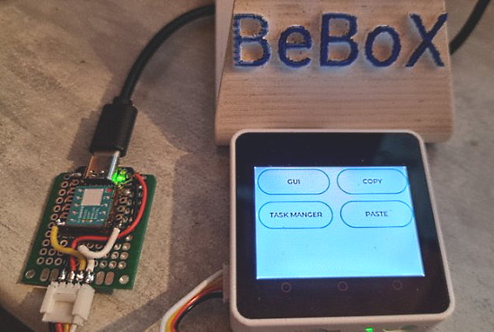
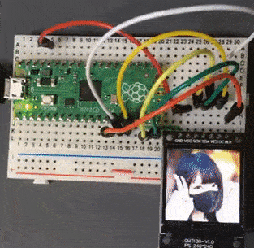
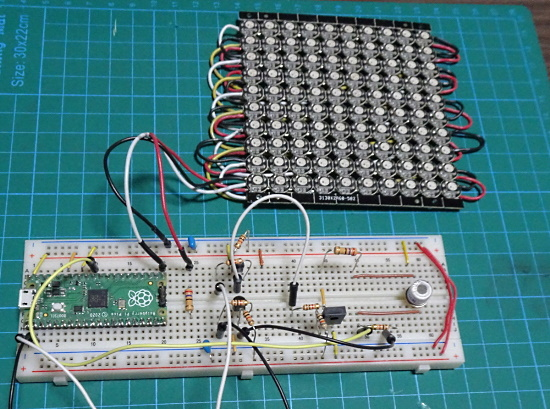
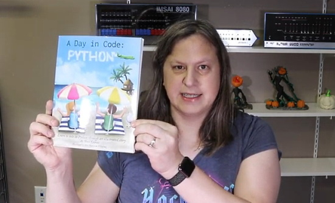
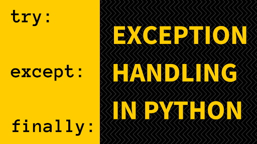
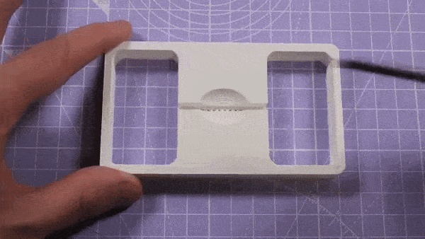
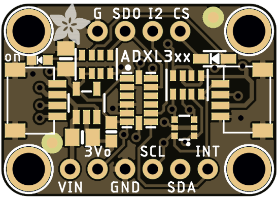
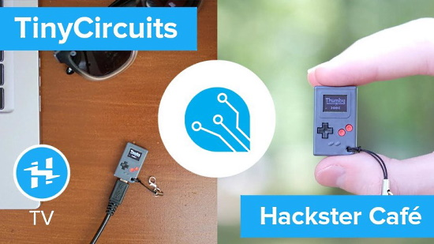
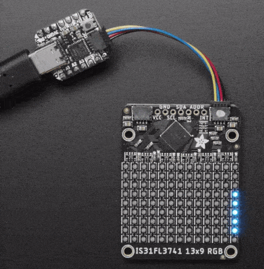
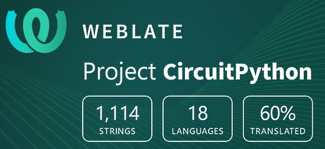

- [X] Kattni updates
- [ ] change date
- [ ] update title
- [ ] Feature story
- [ ] Update  for images
- [ ] Update ICYDNCI
- [ ] All images 550w max only
- [ ] Link "View this email in your browser."

View this email in your browser.

Welcome to the latest Python on Microcontrollers newsletter, brought you by the community! We're on [Discord](https://discord.gg/HYqvREz), [Twitter](https://twitter.com/search?q=circuitpython&src=typed_query&f=live), and for past newsletters - [view them all here](https://www.adafruitdaily.com/category/circuitpython/). If you're reading this on the web, [subscribe here](https://www.adafruitdaily.com/). Let's get started!

## 31,000+ thanks!

The Adafruit Discord community, where we do all our CircuitPython development in the open, reached over 31,000 humans, thank you!  Adafruit believes Discord offers a unique way for CircuitPython folks to connect. Join today at [https://adafru.it/discord](https://adafru.it/discord).

## Wippersnapper Official Beta Released

WipperSnapper is an interface for Adafruit IO, the incredibly easy-to-use IoT platform, designed to turn any WiFi-capable board into an IoT device without programming a single line of code. 

[A new guide](https://learn.adafruit.com/quickstart-adafruit-io-wippersnapper/) walks through the process of installing WipperSnapper on a development board, a brief overview of the WipperSnapper platform, and instructions for adding (and interacting with) physical components from the web - [Adafruit Blog](https://blog.adafruit.com/2021/09/27/new-guide-welcome-to-wippersnapper-adafruitlearningsystem-nocode-iot-adafruit/).

## Sound Reactive Glasses

A work in progress by That Dragon Guy on Twitter: sound-reactive blinky glasses. Werewolf for scale. Programmed in CircuitPython and ulab for Adafruit's [LED Glasses](https://www.adafruit.com/product/5210) - [Twitter](https://twitter.com/PaintYourDragon/status/1442001666132168712).

## Emulate a vintage ROM or EPROM with a Raspberry Pi Pico

The Apple IIe uses a custom microcontroller and ROM chip to put ASCII values from the keyboard into the computer’s memory. How can this function be emulated? The Bald Engineer tries an Arduino Mega 2560 and Teensy 4.0 before finding the inexpensive Raspberry Pi Pico up to the task. Programmed PIO handled the tight timing while CircuitPython controls the data flow and allows for quick programming and debug - [Element14](https://www.element14.com/community/docs/DOC-92059/l/episode-517-emulate-an-eprom-how-hard-could-it-be?CMP=SOM-TWITTER-PRG-E14PRESENTS-EP517), [YouTube](https://youtu.be/XyMrzPP4KBk) and [Adafruit Blog](https://blog.adafruit.com/2021/09/24/emulate-a-vintage-rom-or-eprom-with-a-raspberry-pi-pico-and-circuitpython-circuitpython-piday-raspberrypipico-e14community-baldengineer/).

## Halloween Hackfest

Join Hackaday, Digi-Key, and Adafruit for a Halloween-themed contest! They want to see your crazy, creepy, ghostly, spooky, and awesome projects. 

If costumes are your favorite part of Halloween, then why not dress up your outfit with some hacked upgrades? You could even design a ghoulish prop to add to your home’s Halloween decor or light up a Jack-o-lantern with LEDs. Whether it’s technical, artistic, or just plain terrifying, Hackaday wants to see your projects!

Check out the Halloween Show & Tell with Hackaday, Friday, October 29th at 1pm PT, to show off your awesome projects entered in the contest. Don't forget to also share your projects on social media and use the #HalloweenHackfest!

Hackaday and Digi-Key have partnered on this Halloween-themed contest to offer three winners an online shopping spree to the Digi-Key warehouse! - [Hackaday](https://hackaday.com/2021/08/10/new-contest-halloween-hackfest/) and [hackaday.io](https://hackaday.io/contest/180664-halloween-hackfest).

## Python 3.10.0rc2 is Available with Helpful Error Text

Python 3.10 is scheduled to be released October 4th - [Python Insider](https://pythoninsider.blogspot.com/2021/09/python-3100rc2-is-available.html).

[Luciano R on Twitter](https://twitter.com/ramalhoorg/status/1440399500804116488) summarizes a great new feature:

> I love Python's new user-friendly error messages!!! In Python 3.10rc2:    
`NameError: name 'results_count' is not defined. Did you mean: 'result_count'?` 
  Thank you so much [Pablo Galindo](https://twitter.com/pyblogsal) and everyone else who is contributing to make Python more and more friendly!

Apparently the user friendly messages were inspired by Rust which was inspired by Elm.

## Hacktoberfest Begins October 1st

Hosted by DigitalOcean for the 8th year in a row, Hacktoberfest encourages participation in giving back to the open source community by completing pull requests, participating in events, and donating to open source projects. 

Anyone around the globe who desires to help drive the growth of open source and make positive contributions to an ever-growing community. All backgrounds and skill levels are encouraged to participate. The first 55,000 participants can earn a T-shirt. Learn more - [DigitalOcean](https://hacktoberfest.digitalocean.com/).

For CircuitPython, issues will soon be tagged for Hacktoberfest. [Good First Issues](https://circuitpython.org/contributing/open-issues?label=good-first-issue) and [open issues](https://circuitpython.org/contributing/open-issues) will both be featured. It is anticipated that the number of CircuitPython issues to work on will be higher this year.

## Building battery-free electronic devices with CircuitPython

Computer engineers from Northwestern University and Delft University of Technology (TU Delft) introduces a new platform, BFree, that enables building battery-free electronic devices that run with intermittent, harvested energy.

BFree includes energy-harvesting hardware (the BFree Shield) and a power-failure-resistant version of CircuitPython, one of the most accessible and most used programming languages - [Adafruit Blog](https://blog.adafruit.com/2021/09/23/building-battery-free-electronic-devices-with-circuitpython-circuitpython-techxplore_com/), [GitHub](https://github.com/tudssl/bfree), and [article](https://techxplore.com/news/2021-09-battery-free-electronic-devices.html).

# October is also Open Hardware Month 

October is Open Hardware Month! The Open Source Hardware Association (OSHWA) is providing resources and asking the community to host small, local events in the name of open source hardware. See more - [OSHWA](https://ohm.oshwa.org/).

## EuroPython Talks - Edited Videos Coming Online

EuroPython has released the first batch of edited videos of EuroPython 2021, currently all videos of the first day, Wednesday, July 28. More videos will follow in the coming weeks - [EuroPython 2021](https://blog.europython.eu/europython-2021-edited-videos-of-the-first-day-available/) and [YouTube Playlist](https://www.youtube.com/playlist?list=PL8uoeex94UhFuRtXhkqOrROsdNI6ejuiq).

## CircuitPython Deep Dive Stream with Scott Shawcroft

[This week](https://youtu.be/Cv1HEFcL4Hw), Scott streams his work on ARMv8A MMU programming.

You can see the latest video and past videos on the Adafruit YouTube channel under the Deep Dive playlist - [YouTube](https://www.youtube.com/playlist?list=PLjF7R1fz_OOXBHlu9msoXq2jQN4JpCk8A).

## CircuitPython Parsec

John Park’s CircuitPython Parsec: 

* Servo Animation - [Adafruit Blog](https://blog.adafruit.com/2021/09/24/john-parks-circuitpython-parsec-servo-animation-list-adafruit-johnedgarpark-adafruit-circuitpython/) and [YouTube](https://youtu.be/E1AGcOltrXU)

Catch all the episodes in the [YouTube playlist](https://www.youtube.com/playlist?list=PLjF7R1fz_OOWFqZfqW9jlvQSIUmwn9lWr).

## News from around the web!

> Playing with the layout of components for the portable CO2+particulate air quality monitor. The phone-sized Pelican Go case is very spacious. Implemented with 
Adafruit CircuitPython v7.0.0. - [Twitter](https://twitter.com/CedarGroveMakr/status/1441472138230206469).

Stephane BeBoX has released the Boot Menu Application Laucher code highlighted in the last issue for creating menus on screen which launch CircuitPython programs - [GitHub](https://github.com/beboxos/circuitpython/tree/main/ATMegaZero%20S2/BootMenu) and [Twitter](https://twitter.com/BeBoXoS/status/1439211256783773700).

> I found my GC9A01 (round display) test board already wired up with a QTPy M0 Haxpress and I was able to quickly swap to a QTPy RP2040 and it works great! Also I updated my demos repo for it and CircuitPython 7 - [Twitter](https://twitter.com/todbot/status/1439294630546141186).

BlueMicro's PyKey60 Is a 60% Mechanical Keyboard Powered by an RP2040 and CircuitPython. Designed for beginners, this custom programmable keyboard includes per-key RGB LED lighting and hackable firmware - [hackster.io](https://www.hackster.io/news/bluemicro-s-pykey60-is-a-60-mechanical-keyboard-powered-by-an-rp2040-and-circuitpython-3d27434a6e92).

Build a Mobile Robot using Maker Pi RP2040 and CircuitPython by Idris Zainal Abidin at PyCon Malaysia 2021 - [Twitter](https://twitter.com/pyconmy/status/1439108009565700096).

Parallel LCD displays on ESP32-S2 with CircuitPython - [Adafruit Blog](https://blog.adafruit.com/2021/09/22/parallel-lcd-displays-on-esp32-s2-with-circuitpython-esp32-circuitpython-espressifsystem-adafruit/).

Roughly create a macro keyboard (not a board) with RP2040 and CircuitPython (Japanese) - [Akii Diary](https://akkiesoft.hatenablog.jp/entry/20210523/1621778666) and [YouTube](https://youtu.be/P5iPPrDTLQ8).

Example class and sample code in CircuitPython and MicroPython for Kitronik's Motor Driver/Robotics boards for Raspberry Pi Pico - [Kitronic](https://kitronik.co.uk/blogs/resources/circuitpython-for-kitronik-motor-driver-boards-for-raspberry-pi-pico) and [Twitter](https://twitter.com/Kitronik/status/1439212761905569795).

> CircuitPython exercises and solution demos for classess. Full solutions will be posted in slides next week. Keynote slides are in the Physical Computing Course Google drive linked at [gallaugher.com](https://gallaugher.com/) - [Twitter](https://twitter.com/gallaugher/status/1441209024842698755).

CircuitPython Seeed xiao UART to HID - [Twitter](https://twitter.com/BeBoXoS/status/1441141019391655938) and [GitHub](https://github.com/beboxos/circuitpython).

Elgato key light hack using a ATMegaZero ESP32-S2 & CircuitPython - [Adafruit Blog](https://blog.adafruit.com/2021/09/24/elgato-key-light-hack-using-a-atmegazero-esp32-s2-circuitpython-esp32-circuitpython-4hackrr/) and [YouTube](https://www.youtube.com/watch?v=39SaHweHzgA).

A Raspberry Pi Pico-based Macropad for quick-fire keymaps - [Adafruit Blog](https://blog.adafruit.com/2021/09/22/a-raspberry-pi-macropad-for-quick-fire-keymaps-circuitpython-raspberrypi-raspberrypipico/), [Tindie](https://www.tindie.com/products/jpconstantineau/raspberry-pi-pico-4x4-macropad/), and the [Tindie Blog](https://blog.tindie.com/2021/09/raspberry-pi-pico-macropad/).

> Working on Python code and labs that controls the multi-LED lights and fan in a [Grow Beyond Earth](https://twitter.com/GrowBeyondEarth) chamber. The device is based on a 
Raspberry Pi Pico micro running MicroPython. This will allow kids in the GBE program to hack the controls and add any accessories to the chambers - [Twitter](https://twitter.com/mariocruz/status/1442174679238594560).

Decoding 240x240 jpeg files on a ST7789 display with Raspberry Pi Pico and MicroPython - [Twitter](https://twitter.com/D_modal/status/1442048252338061318).

Display the output of the TGS2450 gas sensor using a NeoPixel LED array with MicroPython - [Tanuki Bayashin's Blog](https://tanuki-bayashin.hatenablog.com/entry/2021/09/24/193741) and [Twitter](https://twitter.com/Tanuki_Bayashin/status/1441354688570413056) (Japanese).

Maker Melissa reviews the book "A Day in Code: Python" aimed at beginners - [YouTube](https://www.youtube.com/watch?v=jOvphJwQAKc).

Python Try and Except Statements – How to Handle Exceptions in Python - [freeCodeCamp](https://www.freecodecamp.org/news/python-try-and-except-statements-how-to-handle-exceptions-in-python/) and [Twitter](https://twitter.com/Python_News/status/1441151162837778432).

Need to add some ASCII art flow diagrams to your README or code comments in GitHub and elsewhere? - [asciiflow.com](https://asciiflow.com/#/) and [Twitter](https://twitter.com/github/status/1441378096096051200).

> I work a lot in the Adafruit Feather ecosystem and because of that I always need 12- and 16- pin headers. I designed a snap fixture to make it easy to divide a 40-pin header into 12+16+12. Works great! - [Twitter](https://twitter.com/arturo182/status/1441494689652281344).

3 years ago at Maker Faire New York 2018: Folks gathered for a CircuitPython / Adafruit meet-up. Some fabulous Makers from the community - [Twitter](https://twitter.com/anne_engineer/status/1441083507837521923).

CircuitPython Weekly for September 27th, 2021 on [YouTube](https://youtu.be/cDFCIJ2NMDE) and [notes](https://github.com/adafruit/adafruit-circuitpython-weekly-meeting/blob/main/2021/2021-09-27.md)

PyDev of the Week: Tony Roberts - [Mouse vs. Python](https://www.blog.pythonlibrary.org/2021/09/27/pydev-of-the-week-tony-roberts/).

#ICYDNCI What was the most popular, most clicked link, in [last week's newsletter](https://www.adafruitdaily.com/2021/09/21/python-on-microcontrollers-newsletter-circuitpython-7-0-0-released-and-more-python-adafruit-circuitpython-micropython-thepsf/)? [Ultimate Python Cheat Sheet](https://dev.to/ericchapman/ultimate-python-cheat-sheet-2j88).

## Coming soon

Analog Devices has quite a few accelerometers in LGA format, so having a Stemma QT breakout for them will be handy, states Adafruit - [Twitter](https://twitter.com/adafruit/status/1441514220252762115).

TinyCircuits is releasing [Thumby](https://thumby.us/), a new keychain-sized game platform that you can program in MicroPython - [YouTube](https://www.youtube.com/watch?v=OGwWupO2gPg) and [Twitter](https://twitter.com/Hacksterio/status/1440278200064495621).

> If you like Adafruit's CircuitPython, Alex Lynd and Kody Kinzie are testing adding S2Mini boards based on the ESP32-S2 to the WifiNugget! Easy installation through a web interface, plus it mounts as a USB drive to easily drag & drop your code onto - [Twitter](https://twitter.com/KodyKinzie/status/1440944507457916932).

## New Boards Supported by CircuitPython

The number of supported microcontrollers and Single Board Computers (SBC) grows every week. This section outlines which boards have been included in CircuitPython or added to [CircuitPython.org](https://circuitpython.org/).

This week, there was one new board added:

- [Shake RP2040](https://circuitpython.org/board/melopero_shake_rp2040/)

Looking to add a new board to CircuitPython? It's highly encouraged! Adafruit has four guides to help you do so:

- [How to Add a New Board to CircuitPython](https://learn.adafruit.com/how-to-add-a-new-board-to-circuitpython/overview)
- [How to add a New Board to the circuitpython.org website](https://learn.adafruit.com/how-to-add-a-new-board-to-the-circuitpython-org-website)
- [Adding a Single Board Computer to PlatformDetect for Blinka](https://learn.adafruit.com/adding-a-single-board-computer-to-platformdetect-for-blinka)
- [Adding a Single Board Computer to Blinka](https://learn.adafruit.com/adding-a-single-board-computer-to-blinka)

## New Learn Guides!

[Adafruit IS31FL3741](https://learn.adafruit.com/adafruit-is31fl3741) from [Kattni](https://learn.adafruit.com/users/kattni)

[Adafruit 2.9" eInk Display Breakouts and FeatherWings](https://learn.adafruit.com/adafruit-2-9-eink-display-breakouts-and-featherwings) from [Melissa LeBlanc-Williams](https://learn.adafruit.com/users/MakerMelissa)

## CircuitPython Project Bundle

When you get to the CircuitPython code section of an [Adafruit Learn Guide](https://learn.adafruit.com/), sometimes things can get a bit complicated. You not only have the code you need to upload to your device, but you likely also need to add some libraries that the code requires to run. This involved downloading all the libraries, digging through to find the ones you need, and copying them to your device. That was only the beginning on some projects, as those that include images and/or sound files required further downloading and copying of files. But, not anymore!

Now, with Project Bundles, you can download all the necessary code, libraries and, if needed, asset files with one click! We automatically check which libraries are required for the project and bundle them up for you. No more digging through a huge list of libraries to find the ones you need, or fiddling with looking for other files or dependencies. Download the Project Bundle, copy the contents to your device, and your code will simply work. We wanted to make this the easiest way to get a project working, regardless of whether you're a beginner or an expert. We'll also be adding this feature to popular IDEs as an add-on. Try it out with any Circuit Python guide on the Adafruit Learning System. Just look for the ‘Download Project Bundle’ button on the code page. 

**To download and use a Project Bundle:**

In the Learning System - above any embedded code in a guide in the Adafruit Learn System, you’ll find a Download Project Bundle button.

Click the button to download the Project Bundle zip.

Open the Project Bundle zip to find the example code, all necessary libraries, and, if available, any images, sounds, etc.

Simply copy all the files over to your CIRCUITPY drive, and you’re ready to go!

If you run into any problems or bugs, or would like to submit feedback, please file an issue on the [Adafruit Learning System Guides GitHub repo](https://github.com/adafruit/Adafruit_Learning_System_Guides/issues).

## CircuitPython Libraries!

CircuitPython support for hardware continues to grow. We are adding support for new sensors and breakouts all the time, as well as improving on the drivers we already have. As we add more libraries and update current ones, you can keep up with all the changes right here!

For the latest libraries, download the [Adafruit CircuitPython Library Bundle](https://circuitpython.org/libraries). For the latest community contributed libraries, download the [CircuitPython Community Bundle](https://github.com/adafruit/CircuitPython_Community_Bundle/releases).

If you'd like to contribute, CircuitPython libraries are a great place to start. Have an idea for a new driver? File an issue on [CircuitPython](https://github.com/adafruit/circuitpython/issues)! Have you written a library you'd like to make available? Submit it to the [CircuitPython Community Bundle](https://github.com/adafruit/CircuitPython_Community_Bundle). Interested in helping with current libraries? Check out the [CircuitPython.org Contributing page](https://circuitpython.org/contributing). We've included open pull requests and issues from the libraries, and details about repo-level issues that need to be addressed. We have a guide on [contributing to CircuitPython with Git and Github](https://learn.adafruit.com/contribute-to-circuitpython-with-git-and-github) if you need help getting started. You can also find us in the #circuitpython channel on the [Adafruit Discord](https://adafru.it/discord).

You can check out this [list of all the Adafruit CircuitPython libraries and drivers available](https://github.com/adafruit/Adafruit_CircuitPython_Bundle/blob/master/circuitpython_library_list.md). 

The current number of CircuitPython libraries is **335**!

**New Libraries!**

Here's this week's new CircuitPython libraries:

 * [Adafruit_CircuitPython_UC8151D](https://github.com/adafruit/Adafruit_CircuitPython_UC8151D)

**Updated Libraries!**

Here's this week's updated CircuitPython libraries:

 * [Adafruit_CircuitPython_AS7341](https://github.com/adafruit/Adafruit_CircuitPython_AS7341)
 * [Adafruit_CircuitPython_ESP_ATcontrol](https://github.com/adafruit/Adafruit_CircuitPython_ESP_ATcontrol)
 * [Adafruit_CircuitPython_MIDI](https://github.com/adafruit/Adafruit_CircuitPython_MIDI)
 * [Adafruit_CircuitPython_TLC59711](https://github.com/adafruit/Adafruit_CircuitPython_TLC59711)
 * [Adafruit_CircuitPython_DisplayIO_SH1107](https://github.com/adafruit/Adafruit_CircuitPython_DisplayIO_SH1107)
 * [Adafruit_CircuitPython_EPD](https://github.com/adafruit/Adafruit_CircuitPython_EPD)
 * [Adafruit_CircuitPython_BLE](https://github.com/adafruit/Adafruit_CircuitPython_BLE)
 * [Adafruit_CircuitPython_PortalBase](https://github.com/adafruit/Adafruit_CircuitPython_PortalBase)
 * [Adafruit_CircuitPython_IS31FL3741](https://github.com/adafruit/Adafruit_CircuitPython_IS31FL3741)
 * [Adafruit_CircuitPython_TrellisM4](https://github.com/adafruit/Adafruit_CircuitPython_TrellisM4)
 * [Adafruit_CircuitPython_RGBLED](https://github.com/adafruit/Adafruit_CircuitPython_RGBLED)
 * [Adafruit_CircuitPython_BLE_Magic_Light](https://github.com/adafruit/Adafruit_CircuitPython_BLE_Magic_Light)
 * [Adafruit_CircuitPython_Pixie](https://github.com/adafruit/Adafruit_CircuitPython_Pixie)
 * [Adafruit_CircuitPython_CircuitPlayground](https://github.com/adafruit/Adafruit_CircuitPython_CircuitPlayground)
 * [Adafruit_CircuitPython_NeoKey](https://github.com/adafruit/Adafruit_CircuitPython_NeoKey)
 * [Adafruit_CircuitPython_LED_Animation](https://github.com/adafruit/Adafruit_CircuitPython_LED_Animation)
 * [circuitpython](https://github.com/adafruit/circuitpython)
 * [Adafruit_Blinka](https://github.com/adafruit/Adafruit_Blinka)
 * [CircuitPython_Community_Bundle](https://github.com/adafruit/CircuitPython_Community_Bundle)

## What’s the team up to this week?

What is the team up to this week? Let’s check in!

**Dan**

I released CircuitPython 7.0.0 final on Monday, September 20. Thanks to everyone who contributed to and tested the alpha, beta, and RC releases leading up to this final release.

I'm now working on a backlog of HID-related tasks for 7.1.0 or later. I hope to add boot-protocol keyboards. I'm also working on an example of an HID radial controller. The Microsoft Surface Dial is the most well-known such controller.

**Jeff**

I added a timestamping feature to key Event objects, so that CircuitPython code can tell when a keypress was registered, even if it's not reacted to immediately.

I also worked on improving parallel LCD support in the ESP32-S2. My original goal was to get the display of the Espressif HMI Devkit working, but I wasn't able to reach it. However, there's a coming enhancement for 8-bit displays that will make them faster than now using the I2S peripheral of the ESP32-S2.

**Kattni**

This week CircuitPython 7.0.0 stable was released, which means `rainbowio` is now available in a stable release! So, it meant it was time to go through all of the Learn examples and remove any references to `_pixelbuf` and `pypixelbuf`, as well as all instances of the `wheel()` function, and replace them with `colorwheel()` from `rainbowio`! There were 72 files modified in the Learn repo, and a further 5 libraries required example updates. It's exciting for me because `rainbowio` was my first core code contribution, so I'm really stoked to see it being used.

**Melissa**

This past week, I was out sick for a couple of days, so I didn't end up getting as much done as usual. I also ended up having to delay the 2.9" eInk guide for a bit that I had worked on because the newer eInk flexible display needed a new driver written for it in CircuitPython and Python. So I ended up writing that and updated the guide. The guide is now live [here](https://learn.adafruit.com/adafruit-2-9-eink-display-breakouts-and-featherwings).

**Scott**

This week I've been sucked into Cortex-A land on the Raspberry Pi. My goal is to bring TinyUSB and then CircuitPython to the Raspberry Pi 4s. I've got debugging over JTAG working and [designed a PCB](https://oshpark.com/shared_projects/fBq76nP9) to make it easy to connect to. I'll test it when I receive it. I've also figured out how to catch crashes and determine the reason. This is huge for debugging and fixing things. I used QEMU running the code too but found it doesn't mimic alignment checks like the real one does. So, my next step is getting the memory mapping unit (MMU) configured correctly so that strlen will work. At that point, I hope I'll have debug printing working. If you've done Cortex-A programming, then please ping me [on Discord](https://adafru.it/discord). I'd love some more eyes on the code.

## Upcoming events!

PyGotham is a New York City based, eclectic, Py-centric conference covering many topics. [PyGotham TV 2021](https://2021.pygotham.tv/) is an online-only edition of PyGotham being held October 1-2, 2021. The call for proposals is [here](https://cfp.pygotham.tv/). Registration is [here](https://www.eventbrite.com/e/pygotham-tv-2021-tickets-157887556933).

PyConZA is the annual gathering of the South African community using and developing the open-source Python programming language. PyConZA is organized by the Python community for the community. PyConZA 2021 will be happening on 7 & 8 October 2021, as an online event - [more](https://za.pycon.org/).

**Send Your Events In**

As for other events, with the COVID pandemic, most in-person events are postponed or cancelled. If you know of virtual events or events that may occur in the future, please let us know on Discord or on Twitter with hashtag #CircuitPython.

## Latest releases

CircuitPython's stable release is [7.0.0](https://github.com/adafruit/circuitpython/releases/latest). New to CircuitPython? Start with our [Welcome to CircuitPython Guide](https://learn.adafruit.com/welcome-to-circuitpython).

[20210925](https://github.com/adafruit/Adafruit_CircuitPython_Bundle/releases/latest) is the latest CircuitPython library bundle.

[v1.17](https://micropython.org/download) is the latest MicroPython release. Documentation for it is [here](http://docs.micropython.org/en/latest/pyboard/).

[3.9.7](https://www.python.org/downloads/) is the latest Python release. The latest pre-release version is [3.10.0rc2](https://www.python.org/download/pre-releases/).

[2,592 Stars](https://github.com/adafruit/circuitpython/stargazers) Like CircuitPython? [Star it on GitHub!](https://github.com/adafruit/circuitpython)

## Call for help -- Translating CircuitPython is now easier than ever!

One important feature of CircuitPython is translated control and error messages.

With the help of fellow open source project [Weblate](https://weblate.org/), we're making it even easier to add or improve translations.

Sign in with an existing account such as GitHub, Google or Facebook and start contributing through a simple web interface. No forks or pull requests needed!

As always, if you run into trouble join us on [Discord](https://adafru.it/discord), we're here to help.

## jobs.adafruit.com - Find a dream job, find great candidates!

[jobs.adafruit.com](https://jobs.adafruit.com/) has returned and folks are posting their skills (including CircuitPython) and companies are looking for talented makers to join their companies - from Digi-Key, to Hackaday, Micro Center, Raspberry Pi and more.

## ICYMI - In case you missed it

The wonderful world of Python on hardware! This is our Python video-newsletter-podcast! The news comes from the Python community, Discord, Adafruit communities and more and is reviewed on ASK an ENGINEER Wednesdays. The complete Python on Hardware weekly videocast [playlist is here](https://www.youtube.com/playlist?list=PLjF7R1fz_OOXRMjM7Sm0J2Xt6H81TdDev). 

This video podcast is on [iTunes](https://itunes.apple.com/us/podcast/python-on-hardware/id1451685192?mt=2), [YouTube](http://adafru.it/pohepisodes), [IGTV (Instagram TV](https://www.instagram.com/adafruit/channel/)), and [XML](https://itunes.apple.com/us/podcast/python-on-hardware/id1451685192?mt=2).

[Weekly community chat on Adafruit Discord server CircuitPython channel - Audio / Podcast edition](https://itunes.apple.com/us/podcast/circuitpython-weekly-meeting/id1451685016) - Audio from the Discord chat space for CircuitPython, meetings are usually Mondays at 2pm ET, this is the audio version on [iTunes](https://itunes.apple.com/us/podcast/circuitpython-weekly-meeting/id1451685016), Pocket Casts, [Spotify](https://adafru.it/spotify), and [XML feed](https://adafruit-podcasts.s3.amazonaws.com/circuitpython_weekly_meeting/audio-podcast.xml).

And lastly, we are working up a one-spot destination for all things podcast-able here - [podcasts.adafruit.com](https://podcasts.adafruit.com/)

## Contribute!

The CircuitPython Weekly Newsletter is a CircuitPython community-run newsletter emailed every Tuesday. The complete [archives are here](https://www.adafruitdaily.com/category/circuitpython/). It highlights the latest CircuitPython related news from around the web including Python and MicroPython developments. To contribute, edit next week's draft [on GitHub](https://github.com/adafruit/circuitpython-weekly-newsletter/tree/gh-pages/_drafts) and [submit a pull request](https://help.github.com/articles/editing-files-in-your-repository/) with the changes. You may also tag your information on Twitter with #CircuitPython. 

Join our [Discord](https://adafru.it/discord) or [post to the forum](https://forums.adafruit.com/viewforum.php?f=60) for any further questions.
