- [X] Kattni updates
- [ ] change date
- [ ] update title
- [ ] Feature story
- [ ] Update  for images
- [ ] Update ICYDNCI
- [ ] All images 550w max only
- [ ] Link "View this email in your browser."

View this email in your browser.

October brings the latest Python on Microcontrollers newsletter, packed with all sorts of goodies for all. Check out [Discord](https://discord.gg/HYqvREz), [Twitter](https://twitter.com/search?q=circuitpython&src=typed_query&f=live), and for past newsletters - [view them all here](https://www.adafruitdaily.com/category/circuitpython/). If you're reading this on the web, [subscribe here](https://www.adafruitdaily.com/). Grab your spooky friends and enjoy this issue.

## The Blues Wireless Swan - a Powerful CircuitPython Compatible Board in Feather Form Factor

[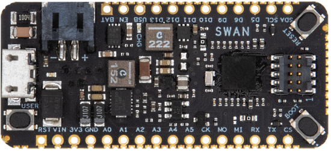](https://blues.io/products/swan/)

The Swan MCU has been introduced, making it perhaps the most extensible Feather-compatible MCU on the market.

* Feather-compatible dev board, powered by an STM32L4+ @ 120 MHz with 2MB of Flash and 640KB of RAM
* Expandable to 55 pins for access to additional I/O and buses
* Plenty of Flash and RAM for edge ML workloads or complex applications
* Support for C/C++, Arduino, and CircuitPython
* CORTEX Debug connector, enabling the use of Visual Studio Code, IAR, and STM32CubeIDE with optional SWD programmer

More - [Blues Wireless](https://blues.io/products/swan/).

## A New Raspberry Pi RP2040 Datasheet Released

A new RP2040 datasheet version was released September 30th. It covers information on the B2 release and it's errata and minor updates and corrections - [Raspberry Pi](https://datasheets.raspberrypi.org/rp2040/rp2040-datasheet.pdf).

## Ada Lovelace Day (ALD) is Tuesday 12 October 2021

Ada Lovelace Day (ALD) is an international celebration of the achievements of women in science, technology, engineering and maths (STEM). It aims to increase the profile of women in STEM and, in doing so, create new role models who will encourage more girls into STEM careers and support women already working in STEM. This year it is celebrated on Tuesday 12 October 2021 - [Finding Ada](https://findingada.com/).

## Made in New York City - Manufacturing in NYC with Adafruit!

National Manufacturing Day and Made in NYC week!

Held annually on the first Friday in October, National Manufacturing Day — MFG Day, helps show the reality of modern manufacturing. MFG Day empowers manufacturers to come together to address their collective challenges so they can help their communities and future generations thrive. See a virtual factory tour of Adafruit Industries, a manufacturer of advanced hardware products in lower Manhattan – [video](https://youtu.be/sDeiO-k6GME). More - [Adafruit Blog](https://blog.adafruit.com/2021/10/01/manufacturing-in-nyc-with-adafruit-madeinnyc-shopfloornam-mfgday21-madeinnycweek-madeinnyc-creatorswanted/).

## Python 3.10 Release Party

Python 3.10 is set to be released on 4 October 2021. View the Python 3.10 Release Stream with Pablo Galindo, CPython Core Developer and Python 3.10 Release Manager, and Leon Sandøy - [YouTube](https://www.youtube.com/watch?v=AHT2l3hcIJg), via [Twitter](https://twitter.com/pyblogsal/status/1442890650303664131).

## Halloween Hackfest

Join Hackaday, Digi-Key, and Adafruit for a Halloween-themed contest! They want to see your crazy, creepy, ghostly, spooky, and awesome projects. 

If costumes are your favorite part of Halloween, then why not dress up your outfit with some hacked upgrades? You could even design a ghoulish prop to add to your home’s Halloween decor or light up a Jack-o-lantern with LEDs. Whether it’s technical, artistic, or just plain terrifying, Hackaday wants to see your projects!

Check out the Halloween Show & Tell with Hackaday, Friday, October 29th at 1pm PT, to show off your awesome projects entered in the contest. Don't forget to also share your projects on social media and use the #HalloweenHackfest!

Hackaday and Digi-Key have partnered on this Halloween-themed contest to offer three winners an online shopping spree to the Digi-Key warehouse! - [Hackaday](https://hackaday.com/2021/08/10/new-contest-halloween-hackfest/) and [hackaday.io](https://hackaday.io/contest/180664-halloween-hackfest).

## Hacktoberfest Begins October 1st

Hosted by DigitalOcean for the 8th year in a row, Hacktoberfest encourages participation in giving back to the open source community by completing pull requests, participating in events, and donating to open source projects. 

Anyone around the globe who desires to help drive the growth of open source and make positive contributions to an ever-growing community. All backgrounds and skill levels are encouraged to participate. The first 55,000 participants can earn a T-shirt. Learn more - [DigitalOcean](https://hacktoberfest.digitalocean.com/) and via [Twitter](https://twitter.com/hacktoberfest).

For CircuitPython, issues will soon be tagged for Hacktoberfest. [Good First Issues](https://circuitpython.org/contributing/open-issues?label=good-first-issue) and [open issues](https://circuitpython.org/contributing/open-issues) will both be featured. It is anticipated that the number of CircuitPython issues to work on will be higher this year.

# October is also Open Hardware Month 

October is Open Hardware Month! The Open Source Hardware Association (OSHWA) is providing resources and asking the community to host small, local events in the name of open source hardware. Read more - [OSHWA](https://ohm.oshwa.org/).

New articles: 

* Best Practices for Sharing FPGA Designs - [OSHWA](https://www.oshwa.org/best-practices-for-sharing-fpga-designs/).
* Guidelines for Sharing FPGA Designs - [OSHWA](https://www.oshwa.org/2021/10/03/guidelines-for-sharing-fpga-designs-published/).

## Make Magazine: Getting Started With Python on Hardware

[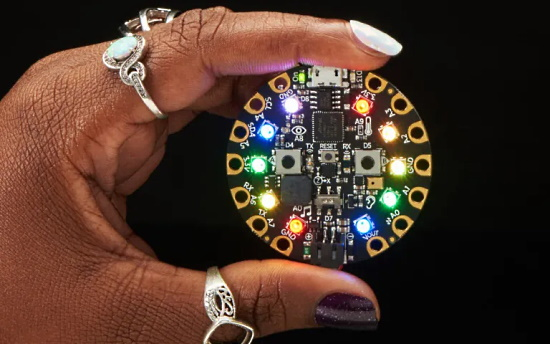](https://makezine.com/2021/09/21/getting-started-with-python-on-hardware/)

Make: features a new article *Getting Started With Python on Hardware*. Both MicroPython and CircuitPython are discussed with some example use steps in CircuitPython. Finally large projects using Python on hardware are featured. A great article to read over - [Make](https://makezine.com/2021/09/21/getting-started-with-python-on-hardware/).

## CircuitPython Deep Dive Stream with Scott Shawcroft

<!---  --->

This week, Scott is taking a well deserved day off and he'll resume next week.

You can see the latest video and past videos on the Adafruit YouTube channel under the Deep Dive playlist - [YouTube](https://www.youtube.com/playlist?list=PLjF7R1fz_OOXBHlu9msoXq2jQN4JpCk8A).

## CircuitPython Parsec

John Park’s CircuitPython Parsec: 

* Servo Easing - [Adafruit Blog](https://blog.adafruit.com/2021/10/01/john-parks-circuitpython-parsec-servo-easing-adafruit-johnedgarpark-adafruit-circuitpython/) and [YouTube](https://youtu.be/9lzWqi9lD8A).

Catch all the episodes in the [YouTube playlist](https://www.youtube.com/playlist?list=PLjF7R1fz_OOWFqZfqW9jlvQSIUmwn9lWr).

## CircuitPython Error Bingo

[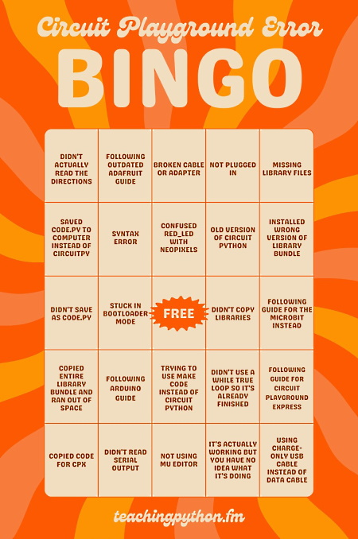](https://twitter.com/teachingpython/status/1445065816282701839)

The Teaching Python Podcast posts this on [Twitter](https://twitter.com/teachingpython/status/1445065816282701839):

> We made a game out of the error messages and problems students overcome when learning to use their Adafruit Circuit Playgrounds for the first time. It's important to normalize the process of solving problems and help students realize that they can figure it out!

## Five Free Python eBooks

LeanPub is offering five free Python eBooks this month as part of their The Indie Python Extravaganza:

* Python 101, 2nd edition by Mike Driscoll
* Practice Python Projects, Beginner to Intermediate level projects inspired by real world use cases by Sundeep Agarwal
* Pydon'ts, Write elegant Python code by Rodrigo Girão Serrão
* Python re(gex)? A magical tool for text processing by Sundeep Agarwal
* Clean Architectures in Python, A practical approach to better software design by Leonardo Giordani

You can tip the authors if you wish - [LeanPub](https://leanpub.com/b/theindiepythonextravaganza/c/pytober).

## News from around the web!

Light Pong: the 1-dimensional game console is now on Kickstarter. It features a number of games and is CircuitPython compatible - [Kickstarter](https://www.kickstarter.com/projects/aaqib/light-pong-game).

A PicoPad keyboard build with CircuitPython - [Twitter](https://twitter.com/CedarGroveMakr/status/1444022633113083905).

[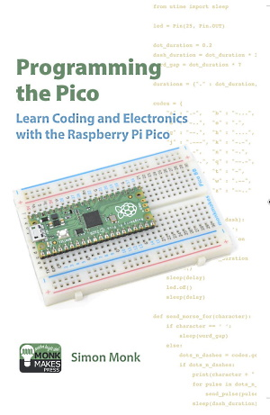](https://twitter.com/simonmonk2/status/1443685489190465539)

A new book out: Programming the Pico by Simon Monk. It discusses programming the Pico in MicroPython - [Twitter](https://twitter.com/simonmonk2/status/1443685489190465539).

[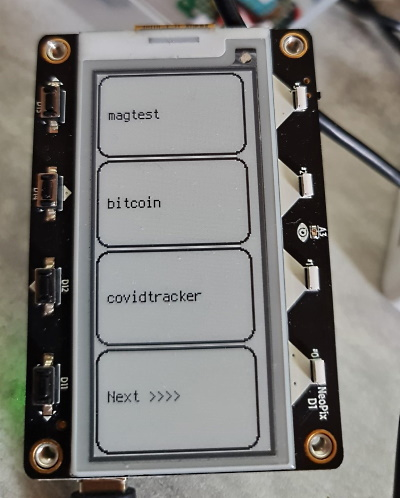](https://github.com/beboxos/circuitpython/tree/main/MagTag/BootAppSelector)

Making a CircuitPython boot launcher with an Adafruit MagTag eInk display - [GitHub](https://github.com/beboxos/circuitpython/tree/main/MagTag/BootAppSelector) and [Twitter](https://twitter.com/BeBoXoS/status/1443971536994635779).

PicoSystem is a pocket sized handheld games console, built around Raspberry Pi's RP2040 chip. It has C++/MicroPython libraries and CircuitPython for PicoSystem - [Pimoroni](https://shop.pimoroni.com/products/picosystem).

[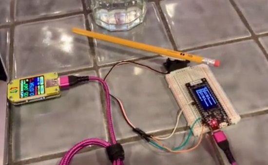](https://twitter.com/todbot/status/1443733338376716289)

Making a percussion instrument using CircuitPython and MQTT with the TTGO T8 ESP32-S2 board - [Twitter](https://twitter.com/todbot/status/1443733338376716289).

OctoMatrixPortal: An Octoprint monitor using the Adafruit Matrix Portal display programmed in CircuitPython - [GitHub](https://github.com/Wintaru/OctoMatrixPortal).

[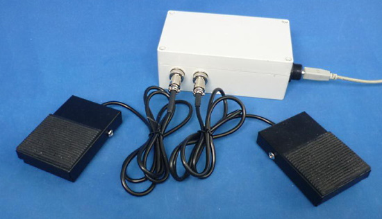](https://blog.adafruit.com/2021/09/30/a-usb-pedal-based-keypad-with-raspberry-pi-pico-and-circuitpython-raspberrypipico-circuitpython-keyboards-hackadayio/)

A USB pedal-based keypad with Raspberry Pi Pico and CircuitPython - [Adafruit Blog](https://blog.adafruit.com/2021/09/30/a-usb-pedal-based-keypad-with-raspberry-pi-pico-and-circuitpython-raspberrypipico-circuitpython-keyboards-hackadayio/) and [hackaday.io](https://hackaday.io/project/181821-usb-pedal-based-on-rpi-pico).

[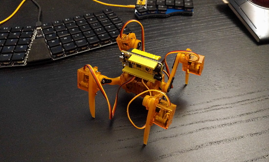](https://hackaday.io/project/180025-fluffbug)

Fluffbug is a four-legged walking robot that fits on your desk, can be programmed with CircuitPython and a USB cable without installing any special software on your computer, can be built on a budget of less than $30, and that can be easily expanded or modified to try out new ideas. - [hackaday.io](https://hackaday.io/project/180025-fluffbug) and [GitHub](https://github.com/deshipu/fluffbug).

[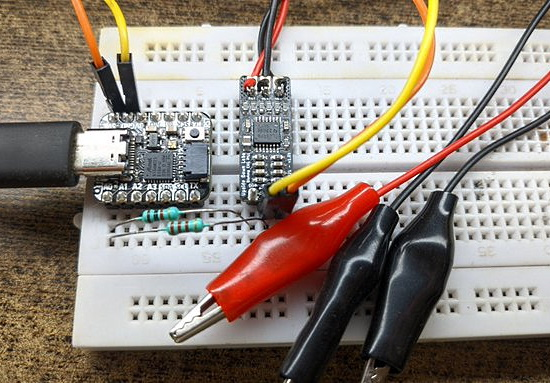](https://twitter.com/myupsidedownlab/status/1444032327273771009)

QtPy EXG Setup - a project update on how to record ECG, EMG, EOG and EEG using Adafruit QtPy with the BioAmp EXG Pill coming soon  - [Twitter](https://twitter.com/myupsidedownlab/status/1444032327273771009) and [CrowdSupply](https://www.crowdsupply.com/upside-down-labs/bioamp-exg-pill/updates/electrooculography-eog-walkthrough).

The Utility Pad - a design take on the Adafruit MacroPad - [back7.co](https://back7.co/home/the-utility-pad).

Socratica providea a series of YouTube videos on nearly 3 dozen Python topics - [Socratica](https://www.socratica.com/subject/python).

[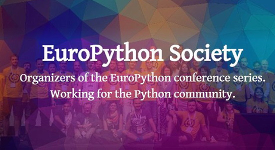](https://www.europython-society.org/launching-the-europython-society-fellow-grant/)

Launching the EuroPython Society Fellow Grant - [EuroPython Society](https://www.europython-society.org/launching-the-europython-society-fellow-grant/).

[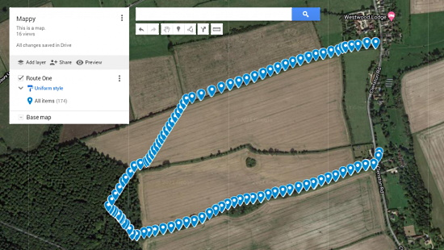](https://www.rs-online.com/designspark/building-a-gps-data-logger-for-an-electric-bike)

Building A GPS Data Logger For An Electric Bike with MicroPython - [DesignPark](https://www.rs-online.com/designspark/building-a-gps-data-logger-for-an-electric-bike) and [Twitter](https://twitter.com/DesignSparkRS/status/1444242255133478917).

Augmenting a Miffy Lamp from Japan with Micropython + MQTT + programmable spaces- [GitHub](https://github.com/anotherjesse/miffy) and [Twitter](https://twitter.com/anotherjesse/status/1444024919055024129).

A virtual pet (think Tamagotchi) using a Raspberry Pi Pico and an SSD1306 display, programmed in MicroPython - Pico-tamachibi - [Twitter](https://twitter.com/kevsmac/status/1442609302586499074) and [video](https://twitter.com/i/broadcasts/1RDGlgEPbboKL).

[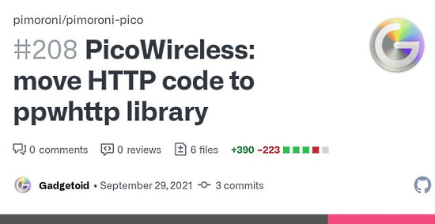](https://twitter.com/Gadgetoid/status/1443203165369913345)

Creates a new MicroPython ppwhttp library to hide the implementation detail of HTTP clients/servers - [Twitter](https://twitter.com/Gadgetoid/status/1443203165369913345) and [GitHub](https://github.com/pimoroni/pimoroni-pico/pull/208).

A Metro map Uses a Raspberry Pi, Python, and a lot of wires to show live train locations. Tying in to an API provided by the CTA - [hackster.io](https://www.hackster.io/news/vonmule-s-metro-map-uses-a-raspberry-pi-python-and-a-lot-of-wires-to-show-live-train-locations-9a742e5e077f).

EuroPython 2021: Edited videos of the second day available - [EuroPython Blog](https://blog.europython.eu/europython-2021-edited-videos-of-the-second-day-available/).

text - [site](url).

MagInkCal: E-Ink Magic Calendar that automatically syncs to Google Calendar and runs off a battery powered Raspberry Pi Zero - [GitHub](https://github.com/speedyg0nz/MagInkCal).

PYOBD is a remake of the program PYOBD. It works on Python3 and all new libraries. It was tested on Linux, Windows, and it should work on MAC too. You need an ELM327 USB or Bluetooth device and a PC (a laptop preferably) - [GitHub](https://github.com/barracuda-fsh/pyobd).

Python 101 - How to Work with a Database Using sqlite3 - [Mouse vs Python](https://www.blog.pythonlibrary.org/2021/09/30/sqlite/).

[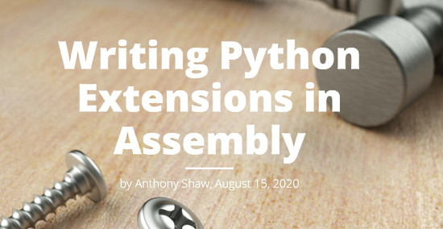](https://tonybaloney.github.io/posts/extending-python-with-assembly.html)

Writing Python Extensions in Assembly - [GitHub.io](https://tonybaloney.github.io/posts/extending-python-with-assembly.html).

PyDev of the Week: Martha Teye on [Mouse vs Python](https://www.blog.pythonlibrary.org/2021/10/04/pydev-of-the-week-martha-teye/)

CircuitPython Weekly Meeting for October 4, 2021 ([notes](https://github.com/adafruit/adafruit-circuitpython-weekly-meeting/blob/main/2021/2021-10-04.md)) [on YouTube](https://youtu.be/QRRn5QOD7Uc)

#ICYDNCI What was the most popular, most clicked link, in [last week's newsletter](https://www.adafruitdaily.com/2021/09/28/python-on-microcontrollers-newsletter-31k-discord-users-hacktoberfest-and-much-more-python-adafruit-circuitpython-micropython-thepsf/)? [Quickstart: Adafruit IO WipperSnapper](https://learn.adafruit.com/quickstart-adafruit-io-wippersnapper/).

## Coming soon

Sort of a spirit level googly eyes thing going on [Adafruit Glasses](https://www.adafruit.com/product/5210) - [Twitter](https://twitter.com/PaintYourDragon/status/1442691314080833542).

[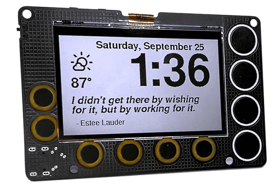](https://www.hackster.io/news/darian-johnson-s-newt-aims-to-be-your-go-to-device-for-low-power-all-in-one-iot-display-projects-7a4f8dcaedd1)

Newt aims to be your go-to device for low-power all-in-one IoT display projects. Designed for ultra-low-power operation, this always-on display includes Wi-Fi connectivity, capacitive touchpads, and is sunlight-readable. Programmable in the Arduino IDE, CircuitPython, or ESP-IDF, Newt is to launch on Crowd Supply in the near future - [hackster.io](https://www.hackster.io/news/darian-johnson-s-newt-aims-to-be-your-go-to-device-for-low-power-all-in-one-iot-display-projects-7a4f8dcaedd1).

## New Boards Supported by CircuitPython

The number of supported microcontrollers and Single Board Computers (SBC) grows every week. This section outlines which boards have been included in CircuitPython or added to [CircuitPython.org](https://circuitpython.org/).

This week, there were no new boards added but several are in sdevelopment.

Looking to add a new board to CircuitPython? It's highly encouraged! Adafruit has four guides to help you do so:

- [How to Add a New Board to CircuitPython](https://learn.adafruit.com/how-to-add-a-new-board-to-circuitpython/overview)
- [How to add a New Board to the circuitpython.org website](https://learn.adafruit.com/how-to-add-a-new-board-to-the-circuitpython-org-website)
- [Adding a Single Board Computer to PlatformDetect for Blinka](https://learn.adafruit.com/adding-a-single-board-computer-to-platformdetect-for-blinka)
- [Adding a Single Board Computer to Blinka](https://learn.adafruit.com/adding-a-single-board-computer-to-blinka)

## New Learn Guides!

[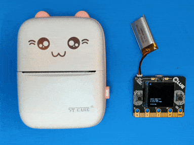](https://learn.adafruit.com/guides/latest)

[BLE Thermal "Cat" Printer with CircuitPython](https://learn.adafruit.com/ble-thermal-cat-printer-with-circuitpython) from [Jeff Epler](https://learn.adafruit.com/users/jepler)

[Raspberry Pi Rotary Encoder Animated Gif Player](https://learn.adafruit.com/python-rotary-animated-gif-player-two-different-ways) from [Melissa LeBlanc-Williams](https://learn.adafruit.com/users/MakerMelissa)

[Adafruit Proximity Trinkey](https://learn.adafruit.com/adafruit-proximity-trinkey) from [Kattni](https://learn.adafruit.com/users/kattni)

[Custom HID Devices in CircuitPython](https://learn.adafruit.com/custom-hid-devices-in-circuitpython) from [Dan Halbert](https://learn.adafruit.com/users/danhalbert)

## CircuitPython Project Bundle

When you get to the CircuitPython code section of an [Adafruit Learn Guide](https://learn.adafruit.com/), sometimes things can get a bit complicated. You not only have the code you need to upload to your device, but you likely also need to add some libraries that the code requires to run. This involved downloading all the libraries, digging through to find the ones you need, and copying them to your device. That was only the beginning on some projects, as those that include images and/or sound files required further downloading and copying of files. But, not anymore!

Now, with Project Bundles, you can download all the necessary code, libraries and, if needed, asset files with one click! We automatically check which libraries are required for the project and bundle them up for you. No more digging through a huge list of libraries to find the ones you need, or fiddling with looking for other files or dependencies. Download the Project Bundle, copy the contents to your device, and your code will simply work. We wanted to make this the easiest way to get a project working, regardless of whether you're a beginner or an expert. We'll also be adding this feature to popular IDEs as an add-on. Try it out with any Circuit Python guide on the Adafruit Learning System. Just look for the ‘Download Project Bundle’ button on the code page. 

**To download and use a Project Bundle:**

In the Learning System - above any embedded code in a guide in the Adafruit Learn System, you’ll find a Download Project Bundle button.

Click the button to download the Project Bundle zip.

Open the Project Bundle zip to find the example code, all necessary libraries, and, if available, any images, sounds, etc.

Simply copy all the files over to your CIRCUITPY drive, and you’re ready to go!

If you run into any problems or bugs, or would like to submit feedback, please file an issue on the [Adafruit Learning System Guides GitHub repo](https://github.com/adafruit/Adafruit_Learning_System_Guides/issues).

## CircuitPython Libraries!

CircuitPython support for hardware continues to grow. We are adding support for new sensors and breakouts all the time, as well as improving on the drivers we already have. As we add more libraries and update current ones, you can keep up with all the changes right here!

For the latest libraries, download the [Adafruit CircuitPython Library Bundle](https://circuitpython.org/libraries). For the latest community contributed libraries, download the [CircuitPython Community Bundle](https://github.com/adafruit/CircuitPython_Community_Bundle/releases).

If you'd like to contribute, CircuitPython libraries are a great place to start. Have an idea for a new driver? File an issue on [CircuitPython](https://github.com/adafruit/circuitpython/issues)! Have you written a library you'd like to make available? Submit it to the [CircuitPython Community Bundle](https://github.com/adafruit/CircuitPython_Community_Bundle). Interested in helping with current libraries? Check out the [CircuitPython.org Contributing page](https://circuitpython.org/contributing). We've included open pull requests and issues from the libraries, and details about repo-level issues that need to be addressed. We have a guide on [contributing to CircuitPython with Git and Github](https://learn.adafruit.com/contribute-to-circuitpython-with-git-and-github) if you need help getting started. You can also find us in the #circuitpython channel on the [Adafruit Discord](https://adafru.it/discord).

You can check out this [list of all the Adafruit CircuitPython libraries and drivers available](https://github.com/adafruit/Adafruit_CircuitPython_Bundle/blob/master/circuitpython_library_list.md). 

The current number of CircuitPython libraries is **336**!

**New Libraries!**

Here's this week's new CircuitPython libraries:

 * [Adafruit_CircuitPython_Radial_Controller](https://github.com/adafruit/Adafruit_CircuitPython_Radial_Controller)

**Updated Libraries!**

Here's this week's updated CircuitPython libraries:

 * [Adafruit_CircuitPython_BusDevice](https://github.com/adafruit/Adafruit_CircuitPython_BusDevice)
 * [Adafruit_CircuitPython_DS18X20](https://github.com/adafruit/Adafruit_CircuitPython_DS18X20)
 * [Adafruit_CircuitPython_IS31FL3741](https://github.com/adafruit/Adafruit_CircuitPython_IS31FL3741)
 * [Adafruit_CircuitPython_IterTools](https://github.com/adafruit/Adafruit_CircuitPython_IterTools)
 * [Adafruit_CircuitPython_BLE_Radio](https://github.com/adafruit/Adafruit_CircuitPython_BLE_Radio)
 * [CircuitPython_Community_Bundle](https://github.com/adafruit/CircuitPython_Community_Bundle)

## What’s the team up to this week?

What is the team up to this week? Let’s check in!

**Dan**

[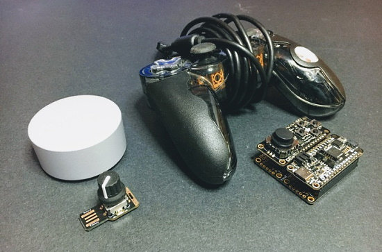](https://circuitpython.org/)

I finished a partial emulation of the radial controller of the Microsoft Surface Dial and am writing it up as part of a guide about custom HID devices that describes other devices as well. It took a lot of trial and error to determine the details of the HID report descriptor, and ranges of values that work best. I still some unanswered questions, but it's quite workable now.

**Jeff**

I finally dipped my toes into Bluetooth Low Energy (BLE) with CircuitPython. You can check out [my new guide](https://learn.adafruit.com/ble-thermal-cat-printer-with-circuitpython/overview), which shows how to print bitmap images to a "cute cat" thermal printer.

**Kattni**

This week I published the [Proximity Trinkey guide](https://learn.adafruit.com/adafruit-proximity-trinkey). It has everything you need to get started with your Proximity Trinkey, including an overview, pinouts, download resources, and examples in both CircuitPython and Arduino. After that, I began working on the [ANO rotary encoder](https://www.adafruit.com/product/5001) guide. If you picked up one of these fun encoders, or the [breakout](https://www.adafruit.com/product/5221), keep an eye out for this guide!

**Melissa**

This past week, I worked on creating a rotary encoder controlled Animated Gif Player. I actually created two different versions of the code. I started with the some Animated Gif Player code I had created to run in Python about a year and a half ago. I optimized the code a bit and updated it to work with the new I2C rotary encoder. The other version I did took it further and added support for PyGame so it could be played on the desktop of a raspberry pi. You can check out the Learn guide [here](https://learn.adafruit.com/python-rotary-animated-gif-player-two-different-ways).

**Scott**

Last week I was working on getting the Memory Management Unit (MMU) of the BCM2711 to cooperate with me. I succeeded on [my Deep Dive stream](https://www.youtube.com/watch?v=Cv1HEFcL4Hw) last week.

I've now got a decent grasp on the new to me architecture and want to take a bit of time to prep a baseline library for doing the basic low level stuff. It's the [broadcom-peripherals](https://github.com/adafruit/broadcom-peripherals) library and will be useful in TinyUSB, CircuitPython and other bare metal Raspberry Pi projects. It mimics the ARM CMSIS files available for Cortex-M microcontrollers that we've previously used.

## Upcoming events!

PyConZA is the annual gathering of the South African community using and developing the open-source Python programming language. PyConZA is organized by the Python community for the community. PyConZA 2021 will be happening on 7 & 8 October 2021, as an online event - [more](https://za.pycon.org/).

PyCon Sweden 2021 will be held on 21-22 October, online for free - [more](http://www.pycon.se/).

**Send Your Events In**

As for other events, with the COVID pandemic, most in-person events are postponed or cancelled. If you know of virtual events or events that may occur in the future, please let us know on Discord or on Twitter with hashtag #CircuitPython.

## Latest releases

CircuitPython's stable release is [7.0.0](https://github.com/adafruit/circuitpython/releases/latest). New to CircuitPython? Start with our [Welcome to CircuitPython Guide](https://learn.adafruit.com/welcome-to-circuitpython).

[20211003](https://github.com/adafruit/Adafruit_CircuitPython_Bundle/releases/latest) is the latest CircuitPython library bundle.

[v1.17](https://micropython.org/download) is the latest MicroPython release. Documentation for it is [here](http://docs.micropython.org/en/latest/pyboard/).

[3.9](https://www.python.org/downloads/) is the latest Python release. The latest pre-release version is [3.10.0.rc2](https://www.python.org/download/pre-releases/). By the time you read this, 3.10 may have been released!

[2,610 Stars](https://github.com/adafruit/circuitpython/stargazers) Like CircuitPython? [Star it on GitHub!](https://github.com/adafruit/circuitpython)

## Call for help -- Translating CircuitPython is now easier than ever!

One important feature of CircuitPython is translated control and error messages.

With the help of fellow open source project [Weblate](https://weblate.org/), we're making it even easier to add or improve translations.

Sign in with an existing account such as GitHub, Google or Facebook and start contributing through a simple web interface. No forks or pull requests needed!

As always, if you run into trouble join us on [Discord](https://adafru.it/discord), we're here to help.

## jobs.adafruit.com - Find a dream job, find great candidates!

[jobs.adafruit.com](https://jobs.adafruit.com/) has returned and folks are posting their skills (including CircuitPython) and companies are looking for talented makers to join their companies - from Digi-Key, to Hackaday, Micro Center, Raspberry Pi and more.

**Job of the Week**

Senior Cloud Infrastructure/DevOps Full-Time 100% Remote - Laudable - [Adafruit Jobs Board](https://jobs.adafruit.com/job/senior-cloud-infrastructure-devops-full-time-100-remote/).

## 31,188 thanks!

The Adafruit Discord community, where we do all our CircuitPython development in the open, reached over 31,188 humans, thank you!  Adafruit believes Discord offers a unique way for CircuitPython folks to connect. Join today at [https://adafru.it/discord](https://adafru.it/discord).

## ICYMI - In case you missed it

The wonderful world of Python on hardware! This is our Python video-newsletter-podcast! The news comes from the Python community, Discord, Adafruit communities and more and is reviewed on ASK an ENGINEER Wednesdays. The complete Python on Hardware weekly videocast [playlist is here](https://www.youtube.com/playlist?list=PLjF7R1fz_OOXRMjM7Sm0J2Xt6H81TdDev). 

This video podcast is on [iTunes](https://itunes.apple.com/us/podcast/python-on-hardware/id1451685192?mt=2), [YouTube](http://adafru.it/pohepisodes), [IGTV (Instagram TV](https://www.instagram.com/adafruit/channel/)), and [XML](https://itunes.apple.com/us/podcast/python-on-hardware/id1451685192?mt=2).

[Weekly community chat on Adafruit Discord server CircuitPython channel - Audio / Podcast edition](https://itunes.apple.com/us/podcast/circuitpython-weekly-meeting/id1451685016) - Audio from the Discord chat space for CircuitPython, meetings are usually Mondays at 2pm ET, this is the audio version on [iTunes](https://itunes.apple.com/us/podcast/circuitpython-weekly-meeting/id1451685016), Pocket Casts, [Spotify](https://adafru.it/spotify), and [XML feed](https://adafruit-podcasts.s3.amazonaws.com/circuitpython_weekly_meeting/audio-podcast.xml).

And lastly, we are working up a one-spot destination for all things podcast-able here - [podcasts.adafruit.com](https://podcasts.adafruit.com/)

## Codecademy "Learn Hardware Programming with CircuitPython"

Codecademy, an online interactive learning platform used by more than 45 million people, has teamed up with the leading manufacturer in STEAM electronics, Adafruit Industries, to create a coding course, "Learn Hardware Programming with CircuitPython". The course is now available in the [Codecademy catalog](https://www.codecademy.com/learn/learn-circuitpython?utm_source=adafruit&utm_medium=partners&utm_campaign=circuitplayground&utm_content=pythononhardwarenewsletter).

Python is a highly versatile, easy to learn programming language that a wide range of people, from visual effects artists in Hollywood to mission control at NASA, use to quickly solve problems. But you don’t need to be a rocket scientist to accomplish amazing things with it. This new course introduces programmers to Python by way of a microcontroller — CircuitPython — which is a Python-based programming language optimized for use on hardware.

CircuitPython’s hardware-ready design makes it easier than ever to program a variety of single-board computers, and this course gets you from no experience to working prototype faster than ever before. Codecademy’s interactive learning environment, combined with Adafruit's highly rated Circuit Playground Express, present aspiring hardware hackers with a never-before-seen opportunity to learn hardware programming seamlessly online.

Whether for those who are new to programming, or for those who want to expand their skill set to include physical computing, this course will have students getting familiar with Python and creating incredible projects along the way. By the end, students will have built their own bike lights, drum machine, and even a moisture detector that can tell when it's time to water a plant.

Visit Codecademy to access the [Learn Hardware Programming with CircuitPython](https://www.codecademy.com/learn/learn-circuitpython?utm_source=adafruit&utm_medium=partners&utm_campaign=circuitplayground&utm_content=pythononhardwarenewsletter) course and Adafruit to purchase a [Circuit Playground Express](https://www.adafruit.com/product/3333).

Codecademy has helped more than 45 million people around the world upgrade their careers with technology skills. The company’s online interactive learning platform is widely recognized for providing an accessible, flexible, and engaging experience for beginners and experienced programmers alike. Codecademy has raised a total of $43 million from investors including Union Square Ventures, Kleiner Perkins, Index Ventures, Thrive Capital, Naspers, Yuri Milner and Richard Branson, most recently raising its $30 million Series C in July 2016.

## Contribute!

The CircuitPython Weekly Newsletter is a CircuitPython community-run newsletter emailed every Tuesday. The complete [archives are here](https://www.adafruitdaily.com/category/circuitpython/). It highlights the latest CircuitPython related news from around the web including Python and MicroPython developments. To contribute, edit next week's draft [on GitHub](https://github.com/adafruit/circuitpython-weekly-newsletter/tree/gh-pages/_drafts) and [submit a pull request](https://help.github.com/articles/editing-files-in-your-repository/) with the changes. You may also tag your information on Twitter with #CircuitPython. 

Join our [Discord](https://adafru.it/discord) or [post to the forum](https://forums.adafruit.com/viewforum.php?f=60) for any further questions.
