View this email in your browser. **Warning: Flashing Imagery**

Welcome to the latest Python on Microcontrollers newsletter! The last week was very busy! CircuitPython 8.1.0beta0 dropped with the huge addition of native animated GIF playing support (up to 480x320) and more. Your editor and others were quick to kick the tires, find issues and optimizations. Raspberry Pi has new documentation for their RP2040 chip and boards out. There are some very novel projects out there as well as interesting hardware coming soon. I hope you enjoy this issue. And if you ever have news or projects to share, please post it on the 'net and send a link to cpnews(at)adafruit(dot)com for consideration - *Ed.*

We're on [Discord](https://discord.gg/HYqvREz), [Twitter](https://twitter.com/search?q=circuitpython&src=typed_query&f=live), and for past newsletters - [view them all here](https://www.adafruitdaily.com/category/circuitpython/). If you're reading this on the web, [subscribe here](https://www.adafruitdaily.com/). Here's the news this week:

## CircuitPython 8.1.0-beta.0 Released

CircuitPython 8.1.0-beta.0 is the new CircuitPython unstable release. - [Adafruit Blog](https://blog.adafruit.com/2023/02/28/circuitpython-8-1-0-beta-0-released/) and full [Release Notes](https://github.com/adafruit/circuitpython/releases/tag/8.1.0-beta.0).

**Notable changes to 8.1.0 since 8.0.0**

* Add animated GIF support: `gifio.OnDiskGif`.
* Add `safemode.py`, for programmatic handling of safe mode.
* Add 7-color e-ink display support.
* Allow setting pystack size in `settings.toml`.
* Add dither support to `Palette`.
* Support `array.extend(iterable)`.

## New Documentation for Raspberry Pi Pico, Pico W and RP2040

[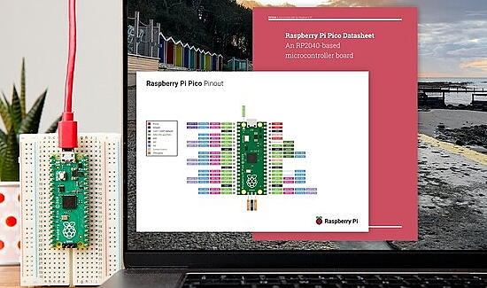](https://blog.adafruit.com/2023/03/03/raspberry-pi-releases-new-set-of-rp2040-pico-pico-w-documentation-piday-raspberry_pi/)

Raspberry Pi has released a new set of RP2040, Pico & Pico W documentation - [Documentation](https://www.raspberrypi.com/documentation/microcontrollers/), [Datasheets](https://datasheets.raspberrypi.com/) and [Adafruit Blog](https://blog.adafruit.com/2023/03/03/raspberry-pi-releases-new-set-of-rp2040-pico-pico-w-documentation-piday-raspberry_pi/).

[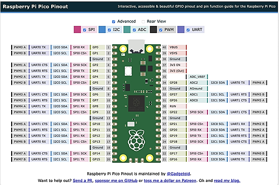](https://pico.pinout.xyz/)

An advanced pinout of the Raspberry Pi Pico compiled by Gadgetoid - [pico.pinout.xyz](https://pico.pinout.xyz/).

## A CircuitPython Battery Tester Which Works From Big Car Batteries Down to Teeny-Tiny Coin Cells

[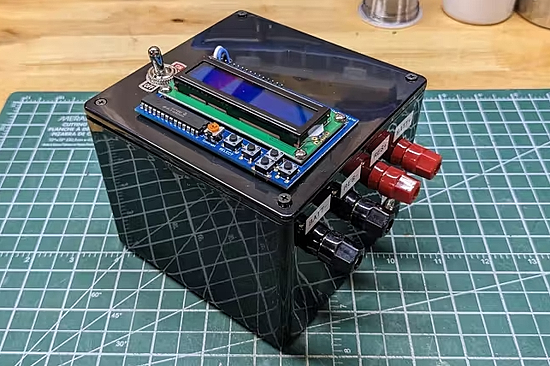](https://www.hackster.io/news/this-circuitpython-battery-tester-works-from-big-car-batteries-down-to-teeny-tiny-coin-cells-86932ee5aaf5)

Powered by a Raspberry Pi Pico, this battery tester uses a solid-state relay to shunt current through the user's choice of resistors - [hackster.io](https://www.hackster.io/news/this-circuitpython-battery-tester-works-from-big-car-batteries-down-to-teeny-tiny-coin-cells-86932ee5aaf5) and [YouTube](https://youtu.be/ewh2iR2EQAQ).

The device is powered by a Raspberry Pi Pico development board running CircuitPython on a RP2040 microcontroller, connected to an Adafruit 16×2 character-based LCD with buttons for user input and status reporting. There's a Texas Instruments INA260 battery monitor, connected via I2C, and a solid-state relay plus three different resistors to provide an adjustable current sink.

## Making Animated GIF Display on a Floppy

Your editor has been kicking the tires on the new animated GIF support in CircuitPython 8.1.0beta0. Taking the [Floppy with a Display](https://learn.adafruit.com/a-floppy-thumb-drive-with-a-color-file-icon-display/overview) hardware, I loaded the beta and a test GIF player. It worked out of the gate! First was a Max Headroom demo, initially posted to Twitter. About 10 different iterations were made with memes, computer and software startup screens and more. Likely when 8.1.0 is released, there will be an Adafruit guide on using animated GIFs as we are still working out subtle bugs and performance. A huge shout out to CircuitPython community member Mark Komus for adding this capability, it was my top #CircuitPython2023 request - [Twitter initial post](https://twitter.com/anne_engineer/status/1630375626682105858), [Adafruit Blog video medley](https://twitter.com/adafruit/status/1631151938921279491), and [Adafruit Show and Tell](https://www.youtube.com/live/ur-Gl-fj6HA?feature=share&t=309).

## NASA and Open Source Software

NASA and open-source software: sharing information has been in the DNA of the space agency from the beginning. As a result, NASA contributes to and releases open-source software and open data. In a keynote at FOSDEM 2023, Science Data Officer Steve Crawford talked about NASA and open-source software, including the challenges NASA has faced in using open source and the agency's recent initiatives to lower barriers - [lwn.net](https://lwn.net/Articles/923223/).

## This Week's Python Streams

Python on Hardware is all about building a cooperative ecosphere which allows contributions to be valued and to grow knowledge. Below are the streams within the last week focusing on the community.

### CircuitPython Deep Dive Stream

[This week](https://www.youtube.com/watch?v=DghAOR0-i7A), Tim streamed work on Framebuf testing and updating examples for the displayio API.

You can see the latest video and past videos on the Adafruit YouTube channel under the Deep Dive playlist - [YouTube](https://www.youtube.com/playlist?list=PLjF7R1fz_OOXBHlu9msoXq2jQN4JpCk8A).

### CircuitPython Parsec

John Park’s CircuitPython Parsec this week is on Rainbowio Colorwheel - [Adafruit Blog](https://blog.adafruit.com/2023/03/04/john-parks-circuitpython-parsec-rainbowio-colorwheel-adafruit-circuitpython/) and [YouTube](https://youtu.be/Lp7u72dt_hw).

Catch all the episodes in the [YouTube playlist](https://www.youtube.com/playlist?list=PLjF7R1fz_OOWFqZfqW9jlvQSIUmwn9lWr).

## Project of the Week: VT2040 - A MicroPython-based Portable Terminal

[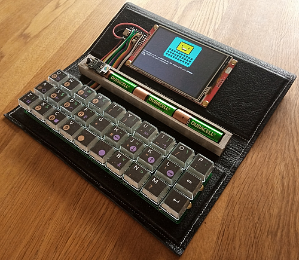](https://github.com/ncrawforth/VT2040)

[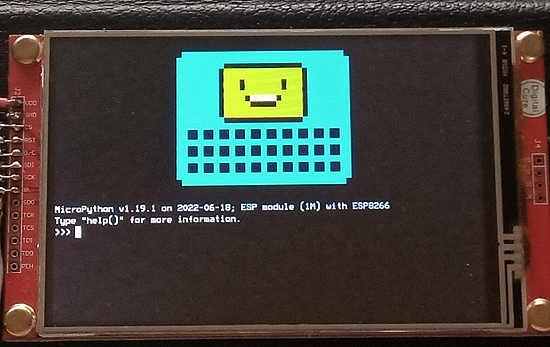](https://github.com/ncrawforth/VT2040)

VT2040 is a portable serial terminal, based on an RP2040 dev board, with a Gherkin keyboard and an ILI9488 480x320 LCD screen. The prototype gets about 18 hours out of 3 AA batteries and runs MicroPython - [GitHub](https://github.com/ncrawforth/VT2040).

## News from around the web!

[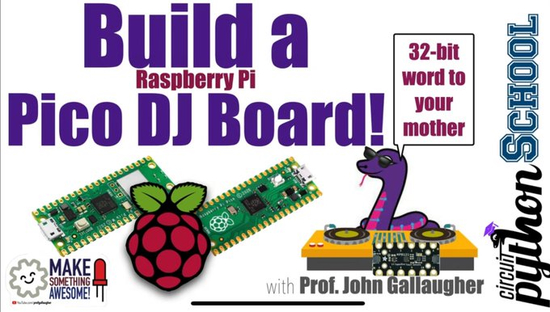](https://twitter.com/gallaugher/status/1630958177599516673)

Build a Raspberry Pi Pico powered DJ Board with CircuitPython - [Twitter](https://twitter.com/gallaugher/status/1630958177599516673).

[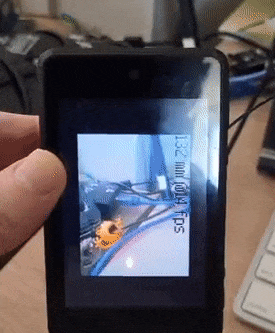](https://twitter.com/Kongduino/status/1632579590152679424)

Using a VL53L0X sensor with a camera to visualize distance - [Twitter](https://twitter.com/Kongduino/status/1632579590152679424).

[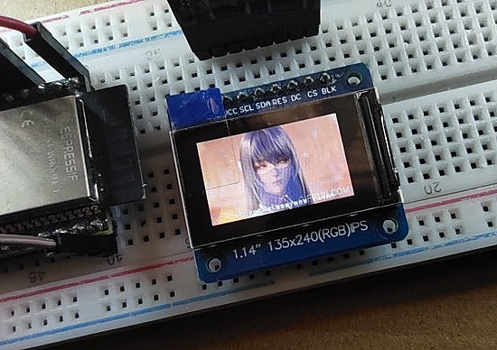](https://twitter.com/KcCoxxect/status/1631906443002773505)

Another user kicking the tires on 8.1.0beta0 using animated GIFs in CircuitPython running on  an ESP32-S3 - [Twitter](https://twitter.com/KcCoxxect/status/1631906443002773505).

Displaying images of Nixie tubes displaying digits on an LCD display with MicroPython - [Twitter](https://twitter.com/PassgateTech/status/1631668394343944195).

[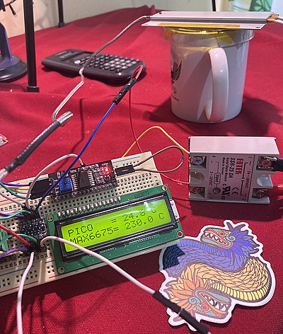](https://twitter.com/capis/status/1632063162471030786)

A prototype PID temperature controller using a Raspberry Pi Pico and CircuitPython - [Twitter](https://twitter.com/capis/status/1632063162471030786).

[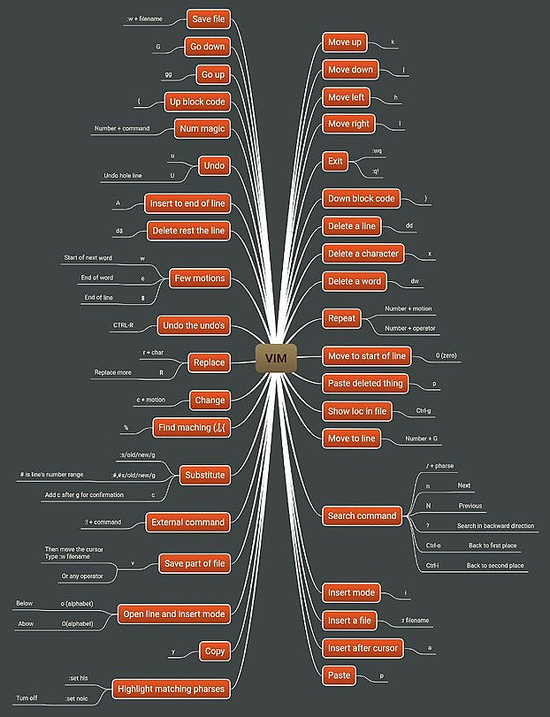](https://pbs.twimg.com/media/FprxH3MaIAA7BYm?format=jpg&name=large)

A Vim cheat sheet - [Twitter](https://twitter.com/hackinarticles/status/1628879390154055680).

[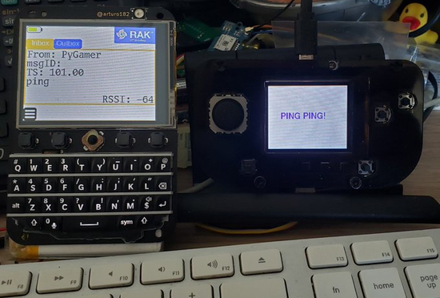](https://twitter.com/Kongduino/status/1630738162791378950)

Sending LoRa data on an Adafruit PyGamer with a custom menu system in CircuitPython - [Twitter Thread](https://twitter.com/Kongduino/status/1630738162791378950).

[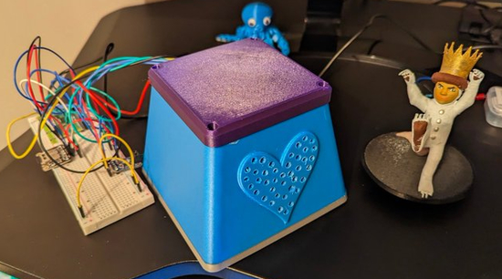](https://twitter.com/recursecenter/status/1631406391385571330)

The Momobox is a DIY MP3 player for a toddler! It’s made with a Raspberry Pi and 3D printed components, and runs on CircuitPython. Blair is building it for his daughter, with special Momies — figurines that play different songs when you put them on the box with a magnet - [Twitter](https://twitter.com/recursecenter/status/1631406391385571330).

[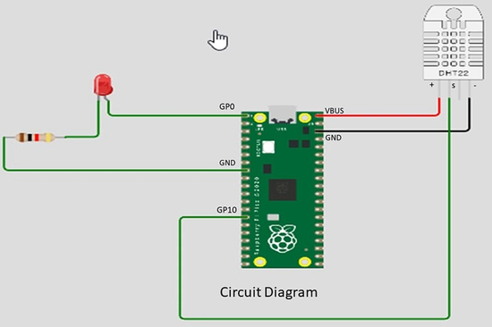](https://www.youtube.com/watch?v=T-Vz1yjzMfU)

Raspberry Pi Pico-W and DHT11 using Thonny IDE and MicroPython - [YouTube](https://www.youtube.com/watch?v=T-Vz1yjzMfU).

ESP32 ESP8266 SMTP client send sensor readings via Email using MicroPython - [Microcontrollers Lab](https://microcontrollerslab.com/esp32-esp8266-smtp-client-send-sensor-readings-email-micropython/#more-38035).

[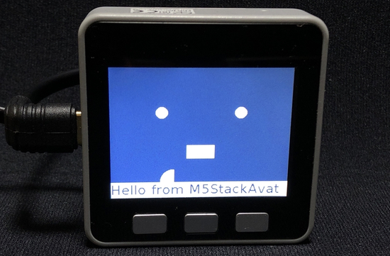](https://blog.akanumahiroaki.com/entry/2018/11/24/223000)

A MicroPython version of M5Stack Avatar. Make cute M5Stack avatars - [Tech Blog by Akanuma Hiroaki](https://blog.akanumahiroaki.com/entry/2018/11/24/223000).

microdot is “The impossibly small web framework for Python and MicroPython”. It is a minimalistic Python web framework inspired by Flask, and designed to run on systems with limited resources such as microcontrollers. It runs on standard Python and on MicroPython - [GitHub](https://github.com/miguelgrinberg/microdot).

[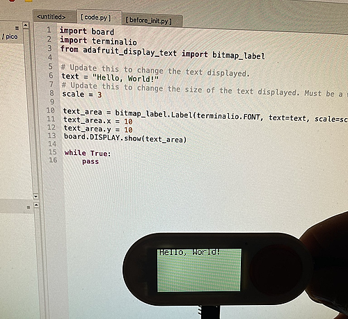](https://twitter.com/titimoby/status/1630330198619987969)

> I’m on my way for my first port of CircuitPython for Lilygo9 T-embed S3 board. Special shout-out to my CALM community which support me and of course the Adafruit
 community - [Twitter](https://twitter.com/titimoby/status/1630330198619987969).

30 Days Of Python coding challenge - [GitHub](https://github.com/Asabeneh/30-Days-Of-Python).

[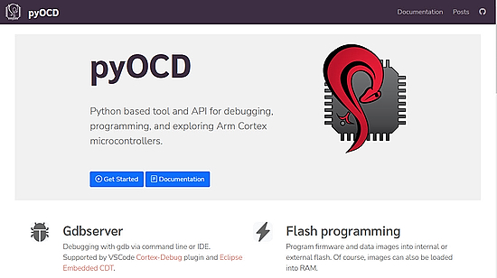](https://mcuoneclipse.com/2023/02/05/debugging-embedded-targets-with-pyocd-and-eclipse/)

Debugging Embedded Targets with pyOCD and Eclipse - [MCU on Eclipse](https://mcuoneclipse.com/2023/02/05/debugging-embedded-targets-with-pyocd-and-eclipse/).

Brompton Bicycles CEO talking about their homegrown factory floor automation using Python and Raspberry Pi  - [Mastodon](https://chaos.social/@moreentropy/109967342409352426) and [YouTube](https://www.youtube.com/watch?v=MBXYZ7vHmXw).

PyDev of the Week: Janos Gabler on [Mouse vs Python](https://www.blog.pythonlibrary.org/2023/03/06/pydev-of-the-week-janos-gabler/)

CircuitPython Weekly Meeting for March 6, 2023 ([notes](https://github.com/adafruit/adafruit-circuitpython-weekly-meeting/blob/main/2023/2023-03-06.md)) [on YouTube](https://youtu.be/x37FIinQ-gA).

#ICYDNCI What was the most popular, most clicked link, in [last week's newsletter](https://www.adafruitdaily.com/2023/02/28/python-on-microcontrollers-newsletter-using-ai-to-program-pong-circuitpython-8-0-3-is-out-and-much-more-circuitpython-python-micropython-thepsf-raspberry_pi/)? [OpenSPICE: A Portable Python Circuit Simulator](https://hackaday.com/2023/02/14/openspice-a-portable-python-circuit-simulator/).

## Coming Soon

An RP2040-based Feather with a USB host port. The port is a bit-banged 'full-speed' USB Host implementation using TinyUSB - [Twitter](https://twitter.com/adafruit/status/1632366421022744581).

[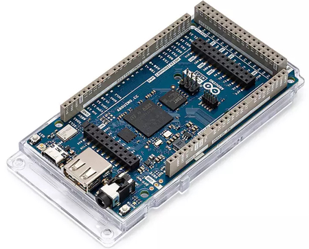](https://www.cnx-software.com/2023/03/03/arduino-giga-r1-wifi-board-stm32h7-mcu-up-to-76-i-o-pins/)

Arduino GIGA R1 WiFi board launches with STM32H7 MCU, up to 76 I/O pins, running Arduino and MicroPython - [CNX Software](https://www.cnx-software.com/2023/03/03/arduino-giga-r1-wifi-board-stm32h7-mcu-up-to-76-i-o-pins/).

[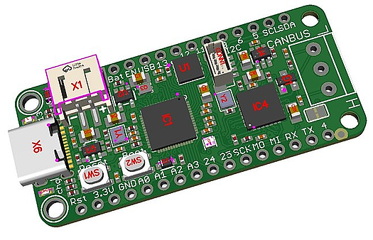](https://twitter.com/adafruit/status/1632043019414167552?s=20)

The RP2040 CAN Feather is another Adafruit RP2040 'Bones' board, following up on the DVI, RFM/LoRa, and E-Ink boards shown last week. This time there is an [MCP25625](https://digikey.com/en/products/detail/microchip-technology/MCP25625T-E-ML/4860099) on there - this is basically an [MCP2515](https://digikey.com/en/products/detail/microchip-technology/MCP2515-I-ST/593002) + [MCP2551](https://digikey.com/en/products/detail/microchip-technology/MCP2551T-I-SN/509535) all-in-one chip. The extra GPIO are for control and IRQ pins, and share the main SPI port - [Twitter](https://twitter.com/adafruit/status/1632043019414167552?s=20).

## New Boards Supported by CircuitPython

The number of supported microcontrollers and Single Board Computers (SBC) grows every week. This section outlines which boards have been included in CircuitPython or added to [CircuitPython.org](https://circuitpython.org/).

This week, there were five new boards added!

- [T-Embed](https://circuitpython.org/board/lilygo_tembed_esp32s3/)
- [Espruino Bangle.js v2](https://circuitpython.org/board/espruino_banglejs2/)
- [ESP32-LyraT](https://circuitpython.org/board/espressif_esp32_lyrat/)
- [COSMO-Pico](https://circuitpython.org/board/cosmo_pico/)
- [Adafruit HUZZAH32 Breakout](https://circuitpython.org/board/adafruit_huzzah32_breakout/)

*Note: For non-Adafruit boards, please use the support forums of the board manufacturer for assistance, as Adafruit does not have the hardware to assist in troubleshooting.*

Looking to add a new board to CircuitPython? It's highly encouraged! Adafruit has four guides to help you do so:

- [How to Add a New Board to CircuitPython](https://learn.adafruit.com/how-to-add-a-new-board-to-circuitpython/overview)
- [How to add a New Board to the circuitpython.org website](https://learn.adafruit.com/how-to-add-a-new-board-to-the-circuitpython-org-website)
- [Adding a Single Board Computer to PlatformDetect for Blinka](https://learn.adafruit.com/adding-a-single-board-computer-to-platformdetect-for-blinka)
- [Adding a Single Board Computer to Blinka](https://learn.adafruit.com/adding-a-single-board-computer-to-blinka)

## New Learn Guides!

[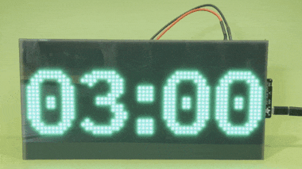](https://learn.adafruit.com/guides/latest)

[Matrix Portal M4 Boxing Interval Timer](https://learn.adafruit.com/matrix-portal-m4-boxing-interval-timer) from [Trevor Beaton](https://learn.adafruit.com/u/Seekwill)

[SNES Mouse to USB HID with CircuitPython](https://learn.adafruit.com/snes-mouse-to-usb-hid-with-circuitpython) from [Jeff Epler](https://learn.adafruit.com/u/jepler)

[CircuitPython Safe Mode](https://learn.adafruit.com/circuitpython-safe-mode) from [Dan Halbert](https://learn.adafruit.com/u/danhalbert)

## CircuitPython Libraries!

CircuitPython support for hardware continues to grow. We are adding support for new sensors and breakouts all the time, as well as improving on the drivers we already have. As we add more libraries and update current ones, you can keep up with all the changes right here!

For the latest libraries, download the [Adafruit CircuitPython Library Bundle](https://circuitpython.org/libraries). For the latest community contributed libraries, download the [CircuitPython Community Bundle](https://github.com/adafruit/CircuitPython_Community_Bundle/releases).

If you'd like to contribute, CircuitPython libraries are a great place to start. Have an idea for a new driver? File an issue on [CircuitPython](https://github.com/adafruit/circuitpython/issues)! Have you written a library you'd like to make available? Submit it to the [CircuitPython Community Bundle](https://github.com/adafruit/CircuitPython_Community_Bundle). Interested in helping with current libraries? Check out the [CircuitPython.org Contributing page](https://circuitpython.org/contributing). We've included open pull requests and issues from the libraries, and details about repo-level issues that need to be addressed. We have a guide on [contributing to CircuitPython with Git and GitHub](https://learn.adafruit.com/contribute-to-circuitpython-with-git-and-github) if you need help getting started. You can also find us in the #circuitpython channels on the [Adafruit Discord](https://adafru.it/discord).

You can check out this [list of all the Adafruit CircuitPython libraries and drivers available](https://github.com/adafruit/Adafruit_CircuitPython_Bundle/blob/master/circuitpython_library_list.md). 

The current number of CircuitPython libraries is **368**!

**New Libraries!**

Here's this week's new CircuitPython libraries:

* [adafruit/Adafruit_CircuitPython_SPD1656](https://github.com/adafruit/Adafruit_CircuitPython_SPD1656)

**Updated Libraries!**

Here's this week's updated CircuitPython libraries:

* [adafruit/Adafruit_CircuitPython_MiniMQTT](https://github.com/adafruit/Adafruit_CircuitPython_MiniMQTT)
* [adafruit/Adafruit_CircuitPython_framebuf](https://github.com/adafruit/Adafruit_CircuitPython_framebuf)
* [adafruit/Adafruit_CircuitPython_SPD1656](https://github.com/adafruit/Adafruit_CircuitPython_SPD1656)
* [adafruit/Adafruit_CircuitPython_HTTPServer](https://github.com/adafruit/Adafruit_CircuitPython_HTTPServer)
* [adafruit/Adafruit_CircuitPython_MPL3115A2](https://github.com/adafruit/Adafruit_CircuitPython_MPL3115A2)
* [furbrain/CircuitPython_mag_cal](https://github.com/furbrain/CircuitPython_mag_cal)

**Library Statistics**

Adafruit_CircuitPython_Bundle downloads for the past week:

* adafruit-circuitpython-bundle-8.x-mpy: 3048
* adafruit-circuitpython-bundle-7.x-mpy: 2124
* adafruit-circuitpython-bundle-py: 1833
* adafruit-circuitpython-bundle: 360
* adafruit-circuitpython-bundle-examples: 193

Adafruit CircuitPython Library Piwheels downloads:

| Library                                                | Last Month   | Total |    
|:-------                                                |:--------:    |:-----:|    
| Adafruit-Blinka                                        | 8488         | 516789 |   
| Adafruit_CircuitPython_BusDevice                       | 6919         | 329682 |   
| Adafruit_CircuitPython_Typing                          | 6531         | 82377 |    
| Adafruit_CircuitPython_Requests                        | 6529         | 28140 |    
| Adafruit_CircuitPython_Register                        | 1535         | 89099 |    
| Adafruit_CircuitPython_framebuf                        | 1012         | 51905 |    
| Adafruit_CircuitPython_DHT                             | 993          | 64695 |    
| Adafruit_CircuitPython_Pixelbuf                        | 990          | 25577 |    
| Adafruit_CircuitPython_NeoPixel                        | 932          | 70625 |    
| Adafruit_CircuitPython_SSD1306                         | 922          | 42756 |    
| Adafruit_CircuitPython_ADS1x15                         | 743          | 40942 |    

## What’s the team up to this week?

What is the team up to this week? Let’s check in!

**Dan**

I released CircuitPython 8.1.0-beta.0 on Tuesday; it's our first beta for 8.1.0. The release includes support for **safemode.py**, which I documented in a new Learn Guide: [CircuitPython Safe Mode](https://learn.adafruit.com/circuitpython-safe-mode).

I'm continuing to look at new and old issues for the 8.x.x releases of CircuitPython.

**Melissa**

This past week, I wrote a library to merge binary files at different offsets for use in flashing with esptool. This allows for [the WipperSnapper Firmware Uploader](https://adafruit.github.io/WipperSnapper_Firmware_Uploader/) to be able to generate downloadable images for flashing later in case users have trouble using the built-in flashing tool.

The CircuitPython Installer I have been working for quite a while was merged in as well. This tool requires a Chrome browser. This is a tool for [ESP32-based boards on circuitpython.org](https://circuitpython.org/downloads?mcufamilies=esp32s3&mcufamilies=esp32s2&mcufamilies=esp32c3&mcufamilies=esp32) A few follow-up bug fixes were needed, but the tool is ready for testing. It allows for easily flashing CircuitPython and boot loaders using Web Serial and the File System Access APIs right from the circuitpython.org website. This is especially useful for ESP32 boards because there is no native USB and thus no CIRCUITPY drive. For boards without a CIRCUITPY drive, normally the WiFi settings need to be configured via the REPL, however the installer handles all of this for you.

**Tim**

I worked on some additional examples and fixes in two new 7 color eink libraries. I tested some proposed fixes for UART usage of the PN532 NFC card reader. Lastly I've begun updating example code for the displayio API changes that the now stable 8.0.0 brought.

**Jeff**

I published a guide for the Floppy FeatherWing. It includes a CircuitPython example for reading raw flux from a floppy disk.

I have a guide in the works using CircuitPython to adapt the SNES "Mario Paint" mouse to a modern PC using CircuitPython. Watch the New Guides section to find out when that's released *(it's released - Ed.)*

**Scott**

This week has been a whirlwind. The Bangle.js 2 and pulseio.PWMOut fix PRs were merged in. I've kept working on analyzing performance of CircuitPython on the iMX RT. I got SWO working for debug messages and have been experimenting with generating full function traces. I've learned that `_veneer` functions are used to call code on flash from tightly couple memory (TCM) or vice versa.

There have been some seemingly random crashes that I'm digging into. The iMX reads code directly from flash and sometimes we're writing to the same flash. Any mistakes in the code around this sharing could lead to mysterious crashes. In theory, function tracing should help but it isn't stable on its own yet. So, I've been digging deep into CP on the iMX and not doing much concrete. However, the things I'm learning should help us get CP rock solid on the iMX (and make it easier to debug new issues).

**Liz**

This week I worked on some product guides. I updated the [I2C/SPI LCD Backpack guide](https://learn.adafruit.com/i2c-spi-lcd-backpack) for the new STEMMA QT version. I also updated the [ATtiny Breakouts guide](https://learn.adafruit.com/adafruit-attiny817-seesaw) for the new ATtiny816 and ATtiny1616 versions in the shop. I added a page on how to reprogram the boards with a UPDI programmer, which I think will be helpful for folks.

I have also been making slow but steady progress on the robot lyre project. The CAD design has proven to be very challenging, but I think I've finally gotten it. [I posted up a demo](https://mastodon.social/@blitzcitydiy/109951007615302014) plucking one note repeatedly and hopefully I can get a full demo setup and running in the next week.

## Upcoming events!

Unlock the Power of MicroPython on an Arduino: Join a Live Webinar March 9, 2023 - [Elector](https://elektor.clickmeeting.com/arduino-micropython-webinar-with-sebastian-romero/register)

A Munich RISC-V Meetup, one day after the doors of Embedded World close on March 17th. RISC-V enthusiasts will get together in Munich, Bavaria - [RISCV.org](https://riscv.org/event/munich-risc-v-meetup/)

The next MicroPython Meetup in Melbourne will be on March 22nd – [Meetup](https://www.meetup.com/MicroPython-Meetup/). 

Hackaday Berlin 2023 is scheduled for Saturday, March 25 - [Adafruit Blog](https://blog.adafruit.com/2023/02/08/hackaday-berlin-2023/) and [announcement](https://hackaday.com/2023/02/07/come-join-us-for-hackaday-berlin/).

PyCon US 2023 will be April 19-17, 2023, again in Salt Lake City, Utah USA - [PyCon US 2023](https://us.pycon.org/2023/).

**Send Your Events In**

If you know of virtual events or upcoming events, please let us know via email to cpnews(at)adafruit(dot)com.

## Latest releases

CircuitPython's stable release is [8.0.3](https://github.com/adafruit/circuitpython/releases/latest) and its unstable release is [8.1.0 Beta 0](https://github.com/adafruit/circuitpython/releases). New to CircuitPython? Start with our [Welcome to CircuitPython Guide](https://learn.adafruit.com/welcome-to-circuitpython).

[20230306](https://github.com/adafruit/Adafruit_CircuitPython_Bundle/releases/latest) is the latest CircuitPython library bundle.

[v1.19.1](https://micropython.org/download) is the latest MicroPython release. Documentation for it is [here](http://docs.micropython.org/en/latest/pyboard/).

[3.11.2](https://www.python.org/downloads/) is the latest Python release. The latest pre-release version is [3.12.0a5](https://www.python.org/download/pre-releases/).

[3,423 Stars](https://github.com/adafruit/circuitpython/stargazers) Like CircuitPython? [Star it on GitHub!](https://github.com/adafruit/circuitpython)

## Call for help -- Translating CircuitPython is now easier than ever!

[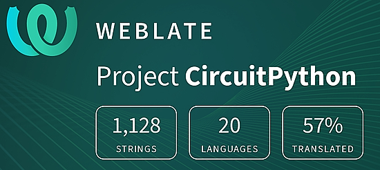](https://hosted.weblate.org/engage/circuitpython/)

One important feature of CircuitPython is translated control and error messages. With the help of fellow open source project [Weblate](https://weblate.org/), we're making it even easier to add or improve translations. 

Sign in with an existing account such as GitHub, Google or Facebook and start contributing through a simple web interface. No forks or pull requests needed! As always, if you run into trouble join us on [Discord](https://adafru.it/discord), we're here to help.

## jobs.adafruit.com - Find a dream job, find great candidates!

[jobs.adafruit.com](https://jobs.adafruit.com/) has returned and folks are posting their skills (including CircuitPython) and companies are looking for talented makers to join their companies - from Digi-Key, to Hackaday, Micro Center, Raspberry Pi and more.

**Job of the Week**

Lead Firmware Engineer - Golioth (Remote) - [Adafruit Jobs Board](https://jobs.adafruit.com/job/lead-firmware-engineer-2/).

## 36,878 thanks!

The Adafruit Discord community, where we do all our CircuitPython development in the open, reached over 36,878 humans - thank you!  Adafruit believes Discord offers a unique way for Python on hardware folks to connect. Join today at [https://adafru.it/discord](https://adafru.it/discord).

## ICYMI - In case you missed it

Python on hardware is the Adafruit Python video-newsletter-podcast! The news comes from the Python community, Discord, Adafruit communities and more and is broadcast on ASK an ENGINEER Wednesdays. The complete Python on Hardware weekly videocast [playlist is here](https://www.youtube.com/playlist?list=PLjF7R1fz_OOXRMjM7Sm0J2Xt6H81TdDev). The video podcast is on [iTunes](https://itunes.apple.com/us/podcast/python-on-hardware/id1451685192?mt=2), [YouTube](http://adafru.it/pohepisodes), [IGTV (Instagram TV](https://www.instagram.com/adafruit/channel/)), and [XML](https://itunes.apple.com/us/podcast/python-on-hardware/id1451685192?mt=2).

[The weekly community chat on Adafruit Discord server CircuitPython channel - Audio / Podcast edition](https://itunes.apple.com/us/podcast/circuitpython-weekly-meeting/id1451685016) - Audio from the Discord chat space for CircuitPython, meetings are usually Mondays at 2pm ET, this is the audio version on [iTunes](https://itunes.apple.com/us/podcast/circuitpython-weekly-meeting/id1451685016), Pocket Casts, [Spotify](https://adafru.it/spotify), and [XML feed](https://adafruit-podcasts.s3.amazonaws.com/circuitpython_weekly_meeting/audio-podcast.xml).

## Codecademy "Learn Hardware Programming with CircuitPython"

Codecademy, an online interactive learning platform used by more than 45 million people, has teamed up with Adafruit to create a coding course, “Learn Hardware Programming with CircuitPython”. The course is now available in the [Codecademy catalog](https://www.codecademy.com/learn/learn-circuitpython?utm_source=adafruit&utm_medium=partners&utm_campaign=circuitplayground&utm_content=pythononhardwarenewsletter).

## Contribute!

The CircuitPython Weekly Newsletter is a CircuitPython community-run newsletter emailed every Tuesday. The complete [archives are here](https://www.adafruitdaily.com/category/circuitpython/). It highlights the latest CircuitPython related news from around the web including Python and MicroPython developments. To contribute, edit next week's draft [on GitHub](https://github.com/adafruit/circuitpython-weekly-newsletter/tree/gh-pages/_drafts) and [submit a pull request](https://help.github.com/articles/editing-files-in-your-repository/) with the changes. You may also tag your information on Twitter with #CircuitPython. 

Join the Adafruit [Discord](https://adafru.it/discord) or [post to the forum](https://forums.adafruit.com/viewforum.php?f=60) if you have questions.
